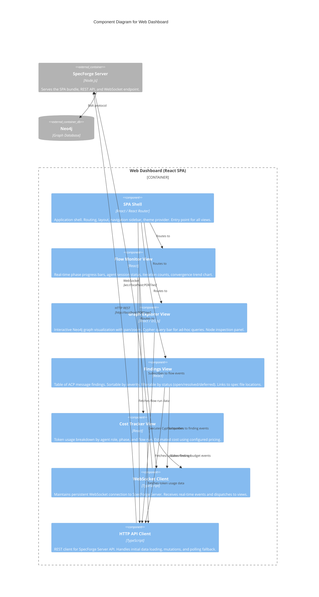

# C3: Web Dashboard Components

**Scope:** Internal component decomposition of the Web Dashboard container -- a React SPA served at `localhost:PORT` by the SpecForge Server. The Web Dashboard is a **read-only (with limited mutations)** client — it observes system state with limited mutations for feedback injection and flow control, but cannot spawn agent sessions.

**Elements:**

- SPA Shell (routing, layout, theme)
- Flow Monitor View (real-time phase progress, agent activity, convergence metrics)
- Graph Explorer View (interactive Neo4j visualization, Cypher query bar)
- Findings View (ACP message findings, severity filtering, status management)
- Cost Tracker View (token usage per agent/phase/flow, cost estimation)
- WebSocket Client (real-time event streaming from SpecForge Server)
- HTTP API Client (REST communication with SpecForge Server)

---

## Mermaid Diagram



### ASCII Representation

```
┌─────────────────────────────────────────────────────────────────────────────┐
│                       Web Dashboard (React SPA)                              │
│                                                                             │
│  ┌───────────────────────────────────────────────────────────────────────┐  │
│  │                        SPA Shell                                      │  │
│  │          React Router  |  Layout  |  Navigation  |  Theme             │  │
│  └────┬──────────┬──────────┬──────────┬─────────────────────────────────┘  │
│       │          │          │          │                                     │
│       ▼          ▼          ▼          ▼                                     │
│  ┌──────────┐ ┌──────────┐ ┌──────────┐ ┌──────────┐                       │
│  │  Flow    │ │  Graph   │ │ Findings │ │  Cost    │                       │
│  │ Monitor  │ │ Explorer │ │  View    │ │ Tracker  │                       │
│  │  View    │ │  View    │ │          │ │  View    │                       │
│  │          │ │          │ │ severity │ │          │                       │
│  │ progress │ │ Cypher   │ │ filter   │ │ tokens   │                       │
│  │ bars     │ │ query    │ │ status   │ │ per role │                       │
│  │ agents   │ │ bar      │ │ mgmt     │ │ per phase│                       │
│  │ converge │ │ node     │ │ spec     │ │ cost est │                       │
│  │ chart    │ │ inspect  │ │ links    │ │          │                       │
│  └────┬─────┘ └────┬─────┘ └────┬─────┘ └────┬─────┘                       │
│       │            │            │            │                              │
│       ▼            ▼            ▼            ▼                              │
│  ┌─────────────────────────────────────────────────────────────────────┐    │
│  │              Communication Layer                                    │    │
│  │                                                                     │    │
│  │  ┌─────────────────────┐     ┌─────────────────────┐               │    │
│  │  │  WebSocket Client   │     │  HTTP API Client    │               │    │
│  │  │                     │     │                     │               │    │
│  │  │  real-time events:  │     │  REST endpoints:    │               │    │
│  │  │  phase-started      │     │  GET /api/flows     │               │    │
│  │  │  phase-completed    │     │  GET /api/findings  │               │    │
│  │  │  finding-added      │     │  GET /api/graph     │               │    │
│  │  │  agent-spawned      │     │  GET /api/costs     │               │    │
│  │  │  budget-warning     │     │  POST /api/cypher   │               │    │
│  │  │  flow-completed     │     │  PATCH /api/finding │               │    │
│  │  └──────────┬──────────┘     └──────────┬──────────┘               │    │
│  └─────────────┼────────────────────────────┼─────────────────────────┘    │
│                │                            │                              │
└────────────────┼────────────────────────────┼──────────────────────────────┘
                 │ WebSocket                  │ HTTP REST
                 ▼                            ▼
        ┌─────────────────────────────────────────────┐
        │            SpecForge Server (Node.js)        │
        │                                              │
        │  REST API  |  WebSocket Endpoint  |  SPA     │
        │  Flow Engine  |  ACP Protocol Layer  |  Analytics    │
        └──────────────────────┬───────────────────────┘
                               │
                               ▼
                     ┌──────────────────┐
                     │      Neo4j       │
                     │   (Bolt)         │
                     └──────────────────┘
```

## Component Descriptions

| Component           | Responsibility                                                                                                                                                                                                                               |
| ------------------- | -------------------------------------------------------------------------------------------------------------------------------------------------------------------------------------------------------------------------------------------- |
| SPA Shell           | Application shell providing routing, layout, navigation sidebar, and theme. Served as a static bundle by the SpecForge Server. Entry point for all dashboard views                                                                           |
| Flow Monitor View   | Displays active and recent flow runs with phase-by-phase progress bars, agent session status indicators, iteration counts, and a convergence trend chart                                                                                     |
| Graph Explorer View | Interactive visualization of the Neo4j knowledge graph. Supports pan/zoom navigation, a Cypher query bar for ad-hoc queries, and a node inspection panel for viewing properties                                                              |
| Findings View       | Table of ACP message findings sortable by severity and filterable by status (open, resolved, deferred). Each finding links to its source spec file location                                                                                  |
| Cost Tracker View   | Dashboard showing token consumption breakdown by agent role, phase, and flow run. Includes estimated cost computed from configured pricing rates                                                                                             |
| WebSocket Client    | Maintains a persistent WebSocket connection to the SpecForge Server. Receives real-time event streams (phase-started, phase-completed, finding-added, agent-spawned, budget-warning, flow-completed) and dispatches them to subscribed views |
| HTTP API Client     | REST client for the SpecForge Server API. Handles initial data loading on view mount, mutation requests (e.g., updating finding status), and serves as a polling fallback when WebSocket is unavailable                                      |

## Cross-References

- Parent container: [c2-containers.md](./c2-containers.md)
- Server components: [c3-server.md](./c3-server.md)
- Dashboard decision: [../decisions/ADR-010-web-dashboard-vscode-over-desktop.md](../decisions/ADR-010-web-dashboard-vscode-over-desktop.md)
- Superseded desktop app: [../decisions/ADR-002-tauri-over-electron.md](../decisions/ADR-002-tauri-over-electron.md)
- Behavioral specs: [../behaviors/BEH-SF-133-web-dashboard.md](../behaviors/BEH-SF-133-web-dashboard.md)
- Flow types: [../types/flow.md](../types/flow.md)
