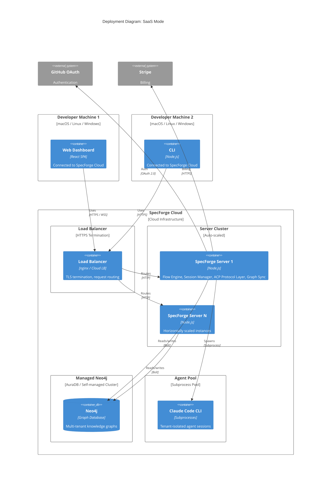

# Deployment: SaaS Mode

**Scope:** SaaS (cloud-hosted) deployment topology. Fully managed infrastructure with multi-tenant isolation.

**Elements:**

- Infrastructure: Developer Machines (clients), SpecForge Cloud (managed infrastructure)
- Client Containers: Web Dashboard (browser), VS Code Extension, CLI
- Cloud Containers: Load Balancer, SpecForge Server cluster, Managed Neo4j, Agent Pool
- External Services: GitHub OAuth, Stripe
- Mode-switched adapters: Cloud OAuth, Stripe Billing, Cloud Marketplace, CloudNeo4j Graph Store

---

## Mermaid Diagram



### ASCII Representation

```
  +------------------+   +------------------+   +------------------+
  | Developer Machine |   | Developer Machine |   | Developer Machine |
  |        1          |   |        2          |   |        N          |
  |                   |   |                   |   |                   |
  | +--+  +--+  +--+ |   | +--+  +--+  +--+ |   | +--+  +--+  +--+ |
  | |Web| |VS | |CLI| |   | |Web| |VS | |CLI| |   | |Web| |VS | |CLI| |
  | |Dsh| |Cod | |   | |   | |Dsh| |Cod | |   | |   | |Dsh| |Cod | |   | |
  | +--+--+--+--+--+ |   | +--+--+--+--+--+ |   | +--+--+--+--+--+ |
  +--------+----------+   +--------+----------+   +--------+----------+
           |                       |                       |
           | HTTPS / WSS           | HTTPS                 | HTTPS / WSS
           |                       |                       |
           +-----------+-----------+-----------+-----------+
                       |       Internet        |
                       v                       v
  +------------------------------------------------------------------------+
  |                        SpecForge Cloud                                  |
  |                                                                        |
  |  +------------------------------------------------------------------+  |
  |  |                    Load Balancer                                  |  |
  |  |              TLS termination, request routing                     |  |
  |  +----------------------+-------------------------------------------+  |
  |                         |                                              |
  |                    +----+----+                                         |
  |                    v         v                                         |
  |  +-------------------+  +-------------------+                         |
  |  | SpecForge Server  |  | SpecForge Server  |   (auto-scaled)        |
  |  |       #1          |  |       #N          |                         |
  |  |                   |  |                   |                         |
  |  | Flow Engine       |  | Flow Engine       |                         |
  |  | Session Mgr       |  | Session Mgr       |                         |
  |  | ACP Protocol Layer|  | ACP Protocol Layer|                         |
  |  | Graph Sync        |  | Graph Sync        |                         |
  |  | NLQ + Analytics   |  | NLQ + Analytics   |                         |
  |  | Cloud OAuth       |  | Cloud OAuth       |                         |
  |  |                   |  |                   |                         |
  |  | Adapters:         |  | Adapters:         |                         |
  |  |  GraphStore ->    |  |  GraphStore ->    |                         |
  |  |   CloudNeo4j      |  |   CloudNeo4j      |                         |
  |  |  Auth -> OAuth    |  |  Auth -> OAuth    |                         |
  |  |  Billing -> Stripe|  |  Billing -> Stripe|                         |
  |  |  Marketplace ->   |  |  Marketplace ->   |                         |
  |  |   CloudMarketplace|  |   CloudMarketplace|                         |
  |  +--------+----------+  +--------+----------+                         |
  |           |                      |                                     |
  |      Bolt |                      | Bolt                                |
  |           v                      v                                     |
  |  +----------------------------------------------+                     |
  |  |           Managed Neo4j                       |                     |
  |  |        (AuraDB / Cluster)                     |                     |
  |  |                                               |                     |
  |  |  Multi-tenant knowledge graphs                |                     |
  |  |  Tenant isolation via graph namespaces        |                     |
  |  +----------------------------------------------+                     |
  |                                                                        |
  |  +----------------------------------------------+                     |
  |  |            Agent Pool                         |                     |
  |  |     (Claude Code CLI subprocesses)            |                     |
  |  |                                               |                     |
  |  |  Tenant-isolated agent sessions               |                     |
  |  +----------------------------------------------+                     |
  |                                                                        |
  +------------------------------------------------------------------------+
                       |
          +------------+------------------------+
          |                                     |
          v                                     v
    +--------------+                   +--------------+
    | GitHub OAuth |                   |    Stripe    |
    |              |                   |              |
    | (OAuth 2.0)  |                   |   (HTTPS)    |
    +--------------+                   +--------------+
```

## Mode-Switched Adapters (SaaS)

| Port            | Adapter           | Behavior                                                                          |
| --------------- | ----------------- | --------------------------------------------------------------------------------- |
| GraphStorePort  | CloudNeo4jAdapter | Connects to managed Neo4j cluster (AuraDB). Tenant isolation via graph namespaces |
| AuthPort        | CloudOAuth        | GitHub OAuth 2.0 authentication. SSO for organization members                     |
| BillingPort     | StripeBilling     | Stripe-based subscription management. Usage metering and limits                   |
| MarketplacePort | CloudMarketplace  | Cloud-hosted flow template and plugin marketplace                                 |

## Characteristics

| Property         | Value                                       |
| ---------------- | ------------------------------------------- |
| Network required | Internet (HTTPS everywhere)                 |
| Authentication   | GitHub OAuth 2.0 (SSO)                      |
| Data location    | Cloud-managed infrastructure                |
| Max users        | Subscription-tier dependent                 |
| Neo4j edition    | AuraDB or self-managed Enterprise cluster   |
| Scaling          | Horizontal auto-scaling of server instances |
| Tenant isolation | Graph namespaces + process isolation        |
| Billing          | Stripe subscriptions with usage metering    |

> **Session Affinity (M25):** In SaaS mode, SpecForge servers are stateless. Session state is persisted in Redis. Any server instance can handle any request for any session. Load balancers use round-robin; there is no sticky session requirement.

## Multi-Tenancy Model

| Layer           | Isolation Mechanism                                                             |
| --------------- | ------------------------------------------------------------------------------- |
| Knowledge Graph | Neo4j graph namespaces per tenant. No cross-tenant queries possible             |
| Agent Sessions  | Subprocess isolation. Each tenant's agents run in dedicated processes           |
| Flow Runs       | Scoped to tenant's project graph. Cross-tenant data inaccessible                |
| API Access      | OAuth tokens scoped to tenant. Server enforces tenant boundary on every request |

## Key Differences from Solo Mode

| Aspect          | Solo                     | SaaS                         |
| --------------- | ------------------------ | ---------------------------- |
| Server location | Local machine            | Cloud (managed by SpecForge) |
| Neo4j           | Local Community instance | Managed AuraDB cluster       |
| Auth            | None (NoOp)              | GitHub OAuth 2.0             |
| Billing         | None                     | Stripe subscriptions         |
| Scaling         | Single instance          | Auto-scaling                 |
| Marketplace     | Local filesystem         | Cloud-hosted                 |
| Multi-tenancy   | Single user              | Multi-tenant isolated        |

## Cross-References

- Container architecture: [c2-containers.md](./c2-containers.md)
- Server internals: [c3-server.md](./c3-server.md)
- Web dashboard: [c3-web-dashboard.md](./c3-web-dashboard.md)
- VS Code extension: [c3-vscode-extension.md](./c3-vscode-extension.md)
- Port registry: [ports-and-adapters.md](./ports-and-adapters.md)
- Solo deployment: [deployment-solo.md](./deployment-solo.md)
- GxP plugin: [../plugins/PLG-gxp.md](../plugins/PLG-gxp.md)

---

## Session Affinity

> **Session affinity (M28):** SaaS mode uses consistent hashing on `sessionId` for WebSocket routing. On server crash, the client reconnects and the new server restores session state from `SessionStateManager` (Redis-backed). No sticky sessions required; all servers can serve any session.

---

> **Database migration (M36):** Schema migrations use versioned Cypher scripts executed during server startup. Backup: daily Neo4j dump. Point-in-time recovery: transaction log replay.
