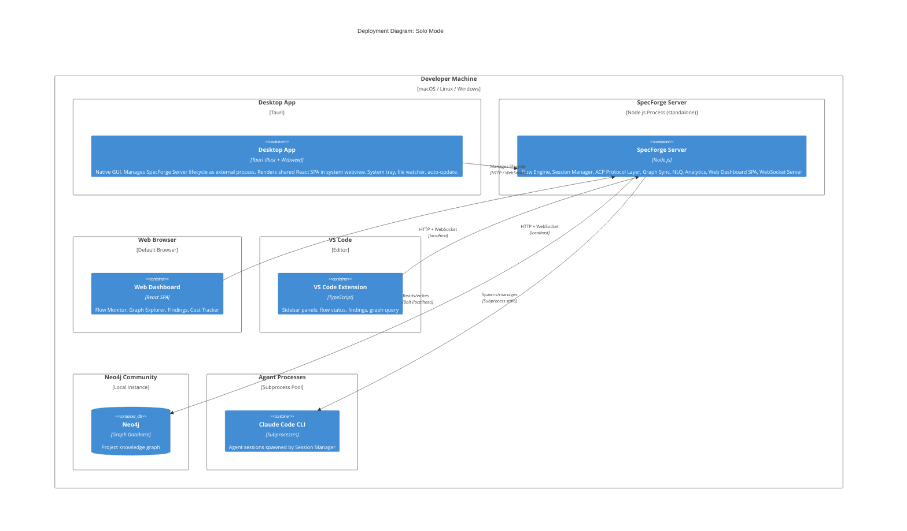

# Deployment: Solo Mode

**Scope:** Solo (self-hosted) deployment topology. Everything runs on a single developer machine.

**Elements:**

- Infrastructure: Developer Machine
- Containers: Desktop App (Tauri, manages SpecForge Server lifecycle), SpecForge Server (standalone process with bundled Web Dashboard SPA), Local Neo4j instance
- Clients: Desktop App (primary), Web Dashboard (browser), VS Code Extension, CLI
- Mode-switched adapters: NoOp Auth, NoOp Billing, LocalFiles Marketplace, LocalNeo4j Graph Store

---

## Mermaid Diagram



### ASCII Representation

```
+-----------------------------------------------------------------------------+
|                         Developer Machine                                    |
|                      (macOS / Linux / Windows)                               |
|                                                                              |
|  +-----------------------------------------------------------------------+   |
|  |                   SpecForge Server (Node.js)                          |   |
|  |                                                                       |   |
|  |  Flow Engine | Session Mgr | ACP Protocol Layer                       |   |
|  |  Graph Sync  | NLQ Engine  | Analytics                                |   |
|  |  Web Dashboard SPA | WebSocket Server                                 |   |
|  |                                                                       |   |
|  |  Adapters:                                                            |   |
|  |    GraphStorePort -> LocalNeo4jAdapter                                |   |
|  |    AuthPort       -> NoOpAuth                                         |   |
|  |    BillingPort    -> NoOpBilling                                      |   |
|  |    MarketplacePort-> LocalFilesAdapter                                |   |
|  +--------+---------------------------+---------------------------------+   |
|            |                          |                                     |
|    Bolt    |                          | Subprocess stdio                    |
|  (localhost)|                          |                                     |
|            v                          v                                     |
|  +----------------------+    +--------------------------+                   |
|  |   Neo4j Community    |    |   Agent Processes         |                   |
|  |   (local instance)   |    |   (Claude Code CLI)       |                   |
|  |                      |    |                           |                   |
|  |   Project knowledge  |    |   Spawned per agent       |                   |
|  |   graph              |    |   session, isolated        |                   |
|  +----------------------+    +--------------------------+                   |
|                                                                             |
|  HTTP + WebSocket (localhost)                                               |
|  +----------+---------+---------+                                          |
|  |          |         |         |                                          |
|  v          v         v         v                                          |
| +--------+ +------+ +------+ +------+                                     |
| |Desktop | | Web  | | VS   | | CLI  |                                     |
| |App     | |Dash- | | Code | |      |                                     |
| |(Tauri) | |board | | Ext  | |      |                                     |
| |manages | |      | |      | |      |                                     |
| |server  | |      | |      | |      |                                     |
| +--------+ +------+ +------+ +------+                                     |
|                                                                             |
+-----------------------------------------------------------------------------+
```

## Mode-Switched Adapters (Solo)

| Port            | Adapter           | Behavior                                                      |
| --------------- | ----------------- | ------------------------------------------------------------- |
| GraphStorePort  | LocalNeo4jAdapter | Connects to Neo4j Community on localhost (Bolt)               |
| AuthPort        | NoOpAuth          | No authentication. Single-user mode, all operations permitted |
| BillingPort     | NoOpBilling       | No billing. All features available without subscription       |
| MarketplacePort | LocalFilesAdapter | Flow templates loaded from local filesystem                   |

> **Security (M46):** In solo mode, credentials are stored in the OS keychain where available (macOS Keychain, Windows Credential Manager, Linux Secret Service). Plaintext fallback to `.specforge/credentials.json` only when no keychain is available.

## Characteristics

| Property         | Value                                                                                                                                                                                                                    |
| ---------------- | ------------------------------------------------------------------------------------------------------------------------------------------------------------------------------------------------------------------------ |
| Network required | Outbound only (Claude Code CLI manages its own network access)                                                                                                                                                           |
| Authentication   | None (NoOp)                                                                                                                                                                                                              |
| Data location    | All data on local disk                                                                                                                                                                                                   |
| Max users        | 1                                                                                                                                                                                                                        |
| Neo4j edition    | Community (free)                                                                                                                                                                                                         |
| Installation     | Desktop App installer (.dmg/.msi/.AppImage) or `npm install -g specforge` (CLI). Desktop App bundles the server binary and manages it as an external process; CLI can also start the server via `specforge server start` |

## Cross-References

- Container architecture: [c2-containers.md](./c2-containers.md)
- Desktop app: [c3-desktop-app.md](./c3-desktop-app.md)
- Web dashboard: [c3-web-dashboard.md](./c3-web-dashboard.md)
- VS Code extension: [c3-vscode-extension.md](./c3-vscode-extension.md)
- Server internals: [c3-server.md](./c3-server.md)
- Port registry: [ports-and-adapters.md](./ports-and-adapters.md)
- SaaS deployment: [deployment-saas.md](./deployment-saas.md)
- Desktop app decision: [../decisions/ADR-016-desktop-app-primary-client.md](../decisions/ADR-016-desktop-app-primary-client.md)
