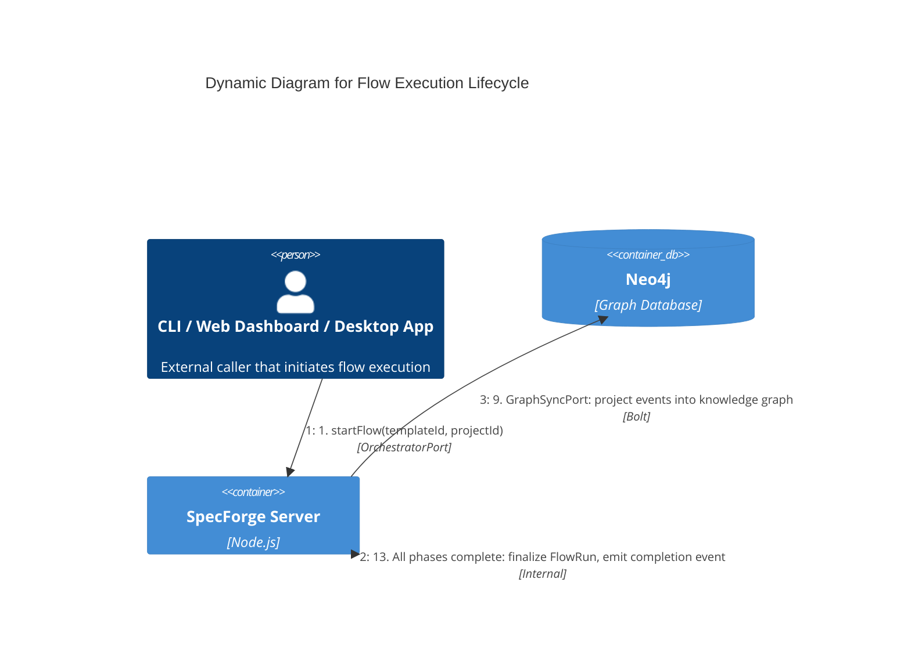

# Dynamic: Flow Execution

**Scope:** Runtime sequence from `startFlow()` invocation through phase execution to flow completion.

**Elements:**

- OrchestratorPort (external caller)
- Flow Engine (phase scheduling, convergence)
- Scheduler (phase ordering, iteration management)
- Session Manager (agent lifecycle)
- ACPClient (creates agent runs via ACP protocol)
- ACP Messages (append-only session history)
- GraphSyncPort (event-driven Neo4j sync)
- Convergence Check (phase completion evaluation)

---

## Mermaid Diagram



### ASCII Representation

```
  Caller                Flow Engine       Scheduler       Session Mgr      ACPClient        ACP Messages    Graph Sync
    │                       │                │                │                │                │                │
    │  1. startFlow()       │                │                │                │                │                │
    │──────────────────────▶│                │                │                │                │                │
    │                       │                │                │                │                │                │
    │                       │ 2. resolve     │                │                │                │                │
    │                       │    template,   │                │                │                │                │
    │                       │    create      │                │                │                │                │
    │                       │    FlowRun     │                │                │                │                │
    │                       │                │                │                │                │                │
    │                       │ 3. selectPhase │                │                │                │                │
    │                       │───────────────▶│                │                │                │                │
    │                       │                │                │                │                │                │
    │                       │◀───────────────│                │                │                │                │
    │                       │  phase config  │                │                │                │                │
    │                       │                │                │                │                │                │
    │                       │ 4. spawnAgents(phase)           │                │                │                │
    │                       │────────────────────────────────▶│                │                │                │
    │                       │                │                │                │                │                │
    │                       │                │                │ 5. assemble    │                │                │
    │                       │                │                │    context     │                │                │
    │                       │                │                │                │                │                │
    │                       │                │                │ 6. bootstrap   │                │                │
    │                       │                │                │───────────────▶│                │                │
    │                       │                │                │                │                │                │
    │                       │                │                │                │ 7. execute     │                │
    │                       │                │                │                │    (docs,      │                │
    │                       │                │                │                │     findings,  │                │
    │                       │                │                │                │     messages)  │                │
    │                       │                │                │                │                │                │
    │                       │                │                │                │ 8. append      │                │
    │                       │                │                │                │───────────────▶│                │
    │                       │                │                │                │                │                │
    │                       │                │                │                │                │ 9. sync        │
    │                       │                │                │                │                │───────────────▶│
    │                       │                │                │                │                │            (Neo4j)
    │                       │                │                │                │                │                │
    │                       │ 10. evaluate convergence        │                │                │                │
    │                       │─────────────────────────────────────────────────────────────────▶│                │
    │                       │                │                │                │                │                │
    │                       │◄──────────────────────────────────────────────── converged?      │                │
    │                       │                │                │                │                │                │
    │                       │  11. NOT converged: loop ───────────────────────────────────────▶│ (back to 4)   │
    │                       │  12. CONVERGED: next phase ────▶│ (back to 3)   │                │                │
    │                       │                │                │                │                │                │
    │                       │ 13. All phases complete          │                │                │                │
    │                       │     finalize FlowRun             │                │                │                │
    │◀──────────────────────│                │                │                │                │                │
    │  completion event     │                │                │                │                │                │
```

## Step-by-Step Description

| Step | Actor              | Action                                                                                                                                                                                        | Output                    |
| ---- | ------------------ | --------------------------------------------------------------------------------------------------------------------------------------------------------------------------------------------- | ------------------------- |
| 1    | Caller             | Invokes `startFlow(templateId, projectId)` via OrchestratorPort                                                                                                                               | Flow execution request    |
| 2    | Flow Engine        | Resolves flow template, creates a new FlowRun node in the graph                                                                                                                               | FlowRun record            |
| 2.5  | Flow Engine        | Validates all role-tool bindings via `TemplateService.validateCapabilities()`. Fail-fast on capability errors ([INV-SF-21](../invariants/INV-SF-21-flow-definition-capability-validation.md)) | FlowValidationResult      |
| 3    | Scheduler          | Selects the next phase based on ordering and completion status                                                                                                                                | Phase configuration       |
| 4    | Session Manager    | Spawns agent sessions for the current phase as isolated subprocesses                                                                                                                          | Agent processes           |
| 5    | Composition Engine | Assembles session context by querying graph, ranking chunks, trimming to budget                                                                                                               | Context payload           |
| 6    | ACPClient          | Creates run with context and tool definitions as input messages                                                                                                                               | Running agent (ACP run)   |
| 7    | Agent              | Produces documents, findings, and messages as ACP output messages                                                                                                                             | ACP message artifacts     |
| 8    | ACP Messages       | Receives and appends output to the per-flow-run session history                                                                                                                               | Persisted messages        |
| 9    | Graph Sync         | Projects ACP message events into the Neo4j knowledge graph                                                                                                                                    | Updated graph             |
| 10   | Convergence Check  | Evaluates phase completion criteria against current state                                                                                                                                     | Converged / Not converged |
| 11   | Flow Engine        | If not converged and iterations remain, loops back to step 4                                                                                                                                  | Next iteration            |
| 12   | Flow Engine        | If converged, advances to next phase (step 3)                                                                                                                                                 | Phase transition          |
| 13   | Flow Engine        | When all phases complete, finalizes FlowRun and emits completion event                                                                                                                        | Done                      |

## Key Invariants

- **Append-only session history:** ACP messages are never mutated or deleted during a flow run
- **Sync-on-write:** Every ACP message append triggers an immediate graph sync
- **Phase isolation:** Agents within a phase share an ACP session but run as isolated ACP runs
- **Convergence gating:** A phase cannot advance until convergence criteria are met or max iterations exhausted
- **Idempotent graph sync:** Re-syncing the same event produces the same graph state

## Cross-References

- Server components: [c3-server.md](./c3-server.md)
- Session composition pipeline: [dynamic-session-composition.md](./dynamic-session-composition.md)
- Flow orchestration decision: [../decisions/ADR-007-flow-based-orchestration.md](../decisions/ADR-007-flow-based-orchestration.md)
- ACP protocol decision: [../decisions/ADR-018-acp-agent-protocol.md](../decisions/ADR-018-acp-agent-protocol.md)
- ACP protocol layer: [c3-acp-layer.md](./c3-acp-layer.md)
- Persistent sessions decision: [../decisions/ADR-006-persistent-agent-sessions.md](../decisions/ADR-006-persistent-agent-sessions.md)
- Behavioral specs: [../behaviors/BEH-SF-057-flow-execution.md](../behaviors/BEH-SF-057-flow-execution.md)
- Type definitions: [../types/flow.md](../types/flow.md)
