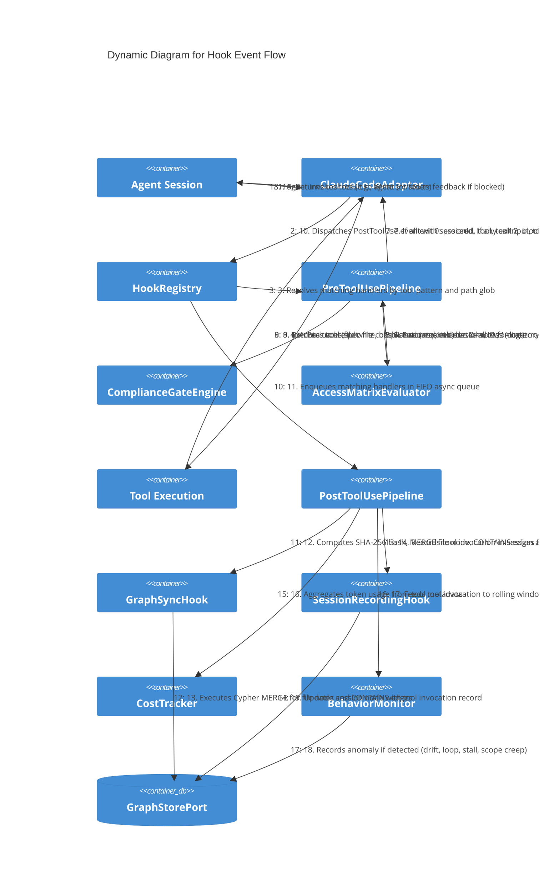

# Dynamic — Hook Event Flow

**Level:** Dynamic
**Scope:** Runtime interaction sequence for a single tool invocation through the hook pipeline
**Parent:** [c3-hooks.md](./c3-hooks.md) — Hooks subsystem

---

## Overview

This diagram traces the lifecycle of a single agent tool invocation through the complete hook pipeline: event dispatch by ClaudeCodeAdapter, PreToolUse synchronous compliance gates (with exit code semantics), tool execution, PostToolUse async dispatch, and the FIFO handler queue processing graph sync, audit, cost tracking, and behavior monitoring hooks.

---

## Interaction Diagram



---

## Step-by-Step Narrative

### Phase 1 — PreToolUse Gate (Steps 1-7)

1. The **agent session** invokes a tool (e.g., `Write` to `src/foo.ts`).
2. The **ClaudeCodeAdapter** intercepts the invocation and dispatches a `PreToolUse` hook event with `sessionId`, `tool` name, and `toolInput` (target path, content).
3. The **HookRegistry** resolves all matching handlers by matching the tool name against `toolPattern` globs and the target path against `pathGlob`.
4. The **PreToolUsePipeline** executes handlers synchronously in registration order. The **ComplianceGateEngine** validates: (a) spec file writes have required sections, (b) requirement IDs follow `BEH-SF-NNN` format, (c) traceability annotations reference existing graph nodes. In GxP mode: blocks destructive git ops.
5. The **AccessMatrixEvaluator** checks: (a) directory is writable for the role, (b) command is allowed, (c) trust tier permits the action, (d) file is within task assignment scope.
6. Each handler returns an exit code: `0` = allow (tool proceeds), `1` = error (logged, tool proceeds), `2` = block (tool rejected).
7. If all handlers return 0: the tool proceeds. If any handler returns 2: the pipeline short-circuits, the tool is blocked, and stderr feedback is delivered to the agent explaining the violation.

### Phase 2 — Tool Execution (Steps 8-9)

8. The tool executes (file write, bash command, etc.).
9. The tool result is captured.

### Phase 3 — PostToolUse Async Dispatch (Steps 10-19)

10. The **ClaudeCodeAdapter** dispatches a `PostToolUse` event with the full tool result.
11. The **HookRegistry** enqueues all matching handlers into the FIFO async queue. Handlers never block the agent — the result is returned immediately (step 19).
12. **GraphSyncHook** (BEH-SF-165): Computes SHA-256 hash of the written file. Issues Cypher `MERGE` for the file node with updated hash. Extracts requirement IDs via regex (`BEH-SF-\d{3}`, `INV-SF-\d+`, `ADR-\d{3}`) and creates `CONTAINS` edges. Idempotent.
13. Graph mutations are persisted to Neo4j.
14. **SessionRecordingHook** (BEH-SF-168): Records the tool invocation as an audit trail entry on the session node.
15. Session node is updated in the graph.
16. **CostTracker** (BEH-SF-175): Aggregates token usage from any LLM calls within the tool execution. Updates session, phase, and flow-level totals.
17. **BehaviorMonitor** (BEH-SF-167): Adds the tool invocation to the rolling window (last 20 invocations). Checks for: role drift (wrong tool for role), loops (same file 3+ times), stalls (5+ reads with no artifact), scope creep (out-of-bounds access).
18. If an anomaly is detected, it is recorded as a graph node and triggers a `Notification` event and potential trust tier demotion.
19. The tool result (or stderr feedback if blocked) is returned to the agent session.

---

## ASCII Sequence Fallback

```
Agent       Adapter     Registry    PrePipeline  Compliance  AccessMatrix  Tool     PostPipeline  GraphSync  Audit    Cost     BehaviorMon  GraphStore
  |            |            |            |            |            |          |            |            |         |        |            |           |
  |--1.tool--->|            |            |            |            |          |            |            |         |        |            |           |
  |            |--2.pre---->|            |            |            |          |            |            |         |        |            |           |
  |            |            |--3.match-->|            |            |          |            |            |         |        |            |           |
  |            |            |            |--4.check-->|            |          |            |            |         |        |            |           |
  |            |            |            |--5.check-->|            |          |            |            |         |        |            |           |
  |            |            |            |<--6.code---|            |          |            |            |         |        |            |           |
  |            |<--7.gate---|            |            |            |          |            |            |         |        |            |           |
  |            |--8.exec--->|            |            |            |--------->|            |            |         |        |            |           |
  |            |<--9.result-|            |            |            |          |            |            |         |        |            |           |
  |            |--10.post-->|            |            |            |          |            |            |         |        |            |           |
  |            |            |--11.enq--->|            |            |          |            |            |         |        |            |           |
  |            |            |            |            |            |          |--12.sync-->|            |         |        |            |           |
  |            |            |            |            |            |          |            |--13.merge->|         |        |            |---------->|
  |            |            |            |            |            |          |--14.audit->|            |-------->|        |            |           |
  |            |            |            |            |            |          |            |            |         |--15.-->|            |---------->|
  |            |            |            |            |            |          |--16.cost-->|            |         |        |----------->|           |
  |            |            |            |            |            |          |--17.beh--->|            |         |        |            |---------->|
  |<-19.result-|            |            |            |            |          |            |            |         |        |            |           |
```

---

## References

- [Hook Pipeline Behaviors](../behaviors/BEH-SF-161-hook-pipeline.md) — BEH-SF-161 through BEH-SF-168
- [Permission Governance Behaviors](../behaviors/BEH-SF-201-permission-governance.md) — BEH-SF-201 through BEH-SF-208
- [Hook Types](../types/hooks.md) — HookEvent, HookPipeline, HookHandler, ComplianceGateResult
- [ADR-011](../decisions/ADR-011-hooks-as-event-bus.md) — Hooks as Event Bus
- [C3 Hooks](./c3-hooks.md) — Hook subsystem component definitions
- [C3 Permission Governance](./c3-permission-governance.md) — Permission components
- [INV-SF-12](../invariants/INV-SF-12-hook-pipeline-ordering.md) — Hook Pipeline Invariant
