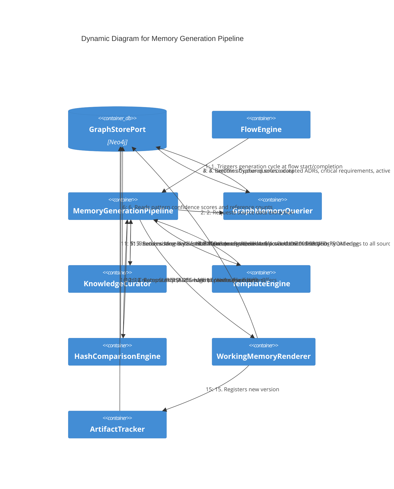

# Dynamic — Memory Generation Pipeline

**Level:** Dynamic
**Scope:** Runtime interaction sequence for generating CLAUDE.md and `.claude/rules/` files from the knowledge graph
**Parent:** [c3-memory-generation.md](./c3-memory-generation.md) — Memory Generation subsystem

---

## Overview

This diagram traces the full memory generation pipeline from trigger through to file write, showing how graph data is queried, curated, rendered, hash-compared, and written as CLAUDE.md and rule files. The sequence fires at flow start (to build agent context) and flow completion (to capture discovered knowledge).

---

## Interaction Diagram



---

## Step-by-Step Narrative

### Phase 1 — Graph Query (Steps 1-4)

1. **FlowEngine** triggers the `MemoryGenerationPipeline` at flow start (for agent context) or flow completion (for knowledge capture).
2. The pipeline delegates to **GraphMemoryQuerier** to extract source data.
3. The querier executes targeted Cypher queries against Neo4j:
   - Accepted ADRs: `MATCH (a:ADR {status: 'accepted'}) RETURN a.title, a.decision`
   - Critical requirements: `MATCH (r:Requirement {priority: 'critical'}) RETURN r`
   - Active invariants: `MATCH (i:Invariant {status: 'active'}) RETURN i.description`
   - Port API signatures: `MATCH (p:Port) RETURN p.name, p.signature`
4. Neo4j returns structured results.

### Phase 2 — Curation (Steps 5-7)

5. The pipeline sends all source data to the **KnowledgeCurator**.
6. The curator reads `KnowledgePattern` confidence scores and reference counts from the graph. It merges duplicates, ranks by priority (invariants > ADRs > requirements > port APIs), applies recency and reference-count weighting.
7. The curator returns a `MemoryCurationResult` with content pruned to the 200-line limit.

### Phase 3 — Rendering (Steps 8-9)

8. The pipeline passes curated data to the **TemplateEngine**.
9. The template engine renders markdown sections with priority ordering. For CLAUDE.md: project rules, invariants, critical ADR summaries, requirement highlights, port API signatures. For `.claude/rules/`: one file per behavior with path-scoped annotations.

### Phase 4 — Hash Comparison (Steps 10-12)

10. The pipeline computes a SHA-256 hash of the rendered content.
11. The **HashComparisonEngine** reads the existing `RenderedArtifact` node's `contentHash` from the graph.
12. If hashes match: skip the write (no changes). If hashes differ: proceed to write.

### Phase 5 — File Write and Tracking (Steps 13-16)

13. The **WorkingMemoryRenderer** writes the file to disk (CLAUDE.md or `.claude/rules/{slug}.md`).
14. The renderer creates a `RenderedArtifact` graph node with all required fields (`artifactId`, `targetPath`, `contentHash`, `generatedAt`, `sourceQuery`, `sourceNodeIds`, `templateId`) and `DERIVED_FROM` edges to all source graph nodes.
15. The renderer notifies the **ArtifactTracker** of the new version.
16. The tracker creates a `SUPERSEDES` edge from the new version to the previous version, maintaining the version chain.

---

## ASCII Sequence Fallback

```
FlowEngine       Pipeline        Querier         GraphStore      Curator         Template        Hasher          Renderer        Tracker
    |                |               |               |               |               |               |               |               |
    |--1.trigger---->|               |               |               |               |               |               |               |
    |                |--2.extract--->|               |               |               |               |               |               |
    |                |               |--3.cypher---->|               |               |               |               |               |
    |                |               |<--4.data------|               |               |               |               |               |
    |                |--5.curate---->|               |               |               |               |               |               |
    |                |               |               |<--6.scores----|               |               |               |               |
    |                |<--7.result----|               |               |               |               |               |               |
    |                |--8.render---->|               |               |               |               |               |               |
    |                |               |               |               |<--9.markdown--|               |               |               |
    |                |--10.hash----->|               |               |               |               |               |               |
    |                |               |               |<--11.read-----|               |               |               |               |
    |                |<--12.decide---|               |               |               |               |               |               |
    |                |--13.write---->|               |               |               |               |               |               |
    |                |               |               |<--14.node-----|               |               |               |               |
    |                |               |               |               |               |               |--15.track---->|               |
    |                |               |               |<--16.edge-----|               |               |               |               |
```

---

## References

- [Memory Generation Behaviors](../behaviors/BEH-SF-177-memory-generation.md) — BEH-SF-177 through BEH-SF-184
- [Memory Types](../types/memory.md) — RenderedArtifact, MemoryCurationResult, KnowledgePattern
- [ADR-013](../decisions/ADR-013-dual-memory-architecture.md) — Dual Memory Architecture
- [C3 Memory Generation](./c3-memory-generation.md) — Component definitions
