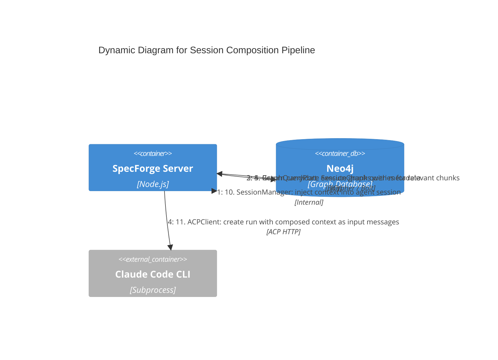

# Dynamic: Session Composition

**Scope:** The session context assembly pipeline -- from graph query through ranking and budget trimming to agent bootstrapping.

**Elements:**

- Composition Engine (pipeline orchestrator)
- SkillRegistry (3-source skill resolution per agent role)
- GraphQueryPort (knowledge graph queries)
- Ranking Engine (relevance scoring, deduplication)
- Budget Manager (token budget enforcement, skill/chunk split)
- Session Manager (context injection)
- ACPClient (creates run with composed context as input messages)

---

## Mermaid Diagram



### ASCII Representation

```
  Session Mgr     Composition Engine   SkillRegistry   GraphQueryPort   Ranking Engine  Budget Mgr   AgentPort
      |                   |                  |                |                |              |            |
      | 1. request        |                  |                |                |              |            |
      |   context for     |                  |                |                |              |            |
      |   agent session   |                  |                |                |              |            |
      |-------------------->                  |                |                |              |            |
      |                   |                  |                |                |              |            |
      |                   | 2. determine     |                |                |              |            |
      |                   |    query strategy|                |                |              |            |
      |                   |    (role + flow  |                |                |              |            |
      |                   |     context)     |                |                |              |            |
      |                   |                  |                |                |              |            |
      |                   | 3. resolve skills|                |                |              |            |
      |                   |------------------>                |                |              |            |
      |                   |                  | (load 3 srcs,  |                |              |            |
      |                   |                  |  filter, dedup,|                |              |            |
      |                   |                  |  trim)         |                |              |            |
      |                   | ResolvedSkillSet |                |                |              |            |
      |                   |<------------------|                |                |              |            |
      |                   |                  |                |                |              |            |
      |                   | 4. query graph   |                |                |              |            |
      |                   |---------------------------------------->           |              |            |
      |                   |                  |                |                |              |            |
      |                   |                  |                |--(Cypher)--> Neo4j            |            |
      |                   |                  |                |<--(results)- Neo4j            |            |
      |                   |                  |                |                |              |            |
      |                   | 5. candidate     |                |                |              |            |
      |                   |<----------------------------------------|           |              |            |
      |                   |    SessionChunks |                |                |              |            |
      |                   |                  |                |                |              |            |
      |                   | 6. score by relevance            |                |              |            |
      |                   |------------------------------------------------------->          |            |
      |                   |                  |                |                |              |            |
      |                   | 7. deduplicate   |                |                |              |            |
      |                   |                  |                |                | (internal)   |            |
      |                   |                  |                |                |              |            |
      |                   | 8. ranked chunks |                |                |              |            |
      |                   |<-------------------------------------------------------|          |            |
      |                   |                  |                |                |              |            |
      |                   | 9. trim to remaining budget       |                |              |            |
      |                   |    (total - skill tokens)         |                |              |            |
      |                   |------------------------------------------------------------------>|            |
      |                   |                  |                |                |              |            |
      |                   | 10. trimmed ctx  |                |                |              |            |
      |                   |<------------------------------------------------------------------|            |
      |                   |                  |                |                |              |            |
      | 11. assembled     |                  |                |                |              |            |
      |    context        |                  |                |                |              |            |
      |    (role+skills+  |                  |                |                |              |            |
      |     chunks+tools) |                  |                |                |              |            |
      |<--------------------|                  |                |                |              |            |
      |                   |                  |                |                |              |            |
      | 12. inject context + bootstrap agent |                |                |              |            |
      |----------------------------------------------------------------------------------------->         |
      |                   |                  |                |                |              |  (Claude   |
      |                   |                  |                |                |              |   running) |
```

## Pipeline Stages

| Stage | Component          | Input                                 | Output                  | Description                                                                                                            |
| ----- | ------------------ | ------------------------------------- | ----------------------- | ---------------------------------------------------------------------------------------------------------------------- |
| 1     | Session Manager    | Agent session config                  | Context request         | Triggers composition when an agent session needs bootstrapping                                                         |
| 2     | Composition Engine | Agent role + flow context             | Query strategy          | Determines what graph queries to run based on agent role and current flow state                                        |
| 3     | SkillRegistry      | Agent role + scope + token budget     | ResolvedSkillSet        | Resolves skills from 3 sources (builtin, graph, project), filters by role + scope, deduplicates, trims to skill budget |
| 4     | GraphQueryPort     | Cypher queries                        | Raw results             | Executes graph traversals to find relevant SessionChunks, specs, findings                                              |
| 5     | GraphQueryPort     | Query results                         | Candidate chunks        | Returns SessionChunk nodes with metadata (content, embedding, source links)                                            |
| 6     | Ranking Engine     | Candidate chunks                      | Scored chunks           | Scores each chunk by relevance to the current task using embedding similarity + heuristics                             |
| 7     | Ranking Engine     | Scored chunks                         | Deduplicated chunks     | Removes overlapping or redundant chunks to maximize information density                                                |
| 8     | Budget Manager     | Ranked chunks + remaining token limit | Trimmed chunks          | Greedily selects top-ranked chunks that fit within the remaining budget (total minus skill tokens)                     |
| 9     | Composition Engine | Skills + trimmed chunks               | Session context payload | Assembles the final context: role prompt + resolved skills + ranked chunks + tool definitions                          |
| 10    | Session Manager    | Context payload                       | Configured session      | Injects composed context into the agent session configuration                                                          |
| 11    | ACPClient          | Configured session                    | Running agent (ACP run) | Creates an ACP run with composed context as input messages                                                             |

## Query Strategy by Agent Role

The Composition Engine selects different graph query strategies depending on the agent's role (8 consolidated roles):

| Agent Role           | Query Focus                                              | Graph Traversal Pattern                                         | Skill Bundles                                    |
| -------------------- | -------------------------------------------------------- | --------------------------------------------------------------- | ------------------------------------------------ |
| spec-author          | Existing specs + requirements + prior authoring sessions | `(Project)-[:CONTAINS]->(SpecFile)-[:CONTAINS]->(Requirement)`  | spec-authoring, architecture, visual, compliance |
| reviewer             | Findings + coverage gaps + architectural patterns        | `(FlowRun)-[:CONTAINS]->(Finding)` + uncovered requirements     | spec-authoring, compliance                       |
| codebase-analyzer    | Source files + dependencies + topology                   | `(Project)-[:CONTAINS]->(SpecFile)` + code structure traversals | coding-standards, architecture                   |
| task-decomposer      | Requirements + dependency chains                         | `(Requirement)-[:DEPENDS_ON]->(Requirement)` multi-hop          | spec-authoring, architecture                     |
| dev-agent            | Tasks + test coverage + implementation patterns          | `(Requirement)-[:TRACES_TO]->(Task)` + code/test coverage       | coding-standards                                 |
| coverage-agent       | Full traceability chain                                  | `(Requirement)` where not `(Finding)-[:COVERS]->(Requirement)`  | spec-authoring, compliance                       |
| discovery-agent      | Prior research notes + existing specs                    | `(SessionChunk)` filtered by topic relevance                    | spec-authoring                                   |
| feedback-synthesizer | All findings from current flow run                       | `(FlowRun)-[:CONTAINS]->(Finding)` scoped to current run        | spec-authoring                                   |

## Key Invariants

- **Token budget is hard limit:** The Budget Manager never exceeds the configured token limit
- **Ranking is deterministic:** Given the same inputs, ranking produces the same output ordering
- **Deduplication preserves higher-scored:** When chunks overlap, the higher-relevance chunk is kept
- **Context is read-only:** The composition pipeline never modifies the knowledge graph
- **Chunks are immutable:** SessionChunks are append-only; once created, their content never changes
- **Skill budget is carved first:** The skill token budget is allocated before chunk ranking; unused skill budget is returned to chunk budget
- **Skill resolution is deterministic:** Given the same inputs and graph state, skill resolution produces the same output

## Cross-References

- Server components: [c3-server.md](./c3-server.md)
- Knowledge graph schema: [c3-knowledge-graph.md](./c3-knowledge-graph.md)
- Flow execution (calls this pipeline): [dynamic-flow-execution.md](./dynamic-flow-execution.md)
- Compositional sessions decision: [../decisions/ADR-009-compositional-sessions.md](../decisions/ADR-009-compositional-sessions.md)
- Graph-first decision: [../decisions/ADR-005-graph-first-architecture.md](../decisions/ADR-005-graph-first-architecture.md)
- Skill registry architecture: [../decisions/ADR-025-skill-registry-architecture.md](../decisions/ADR-025-skill-registry-architecture.md)
- Skill registry components: [c3-skill-registry.md](./c3-skill-registry.md)
- Skill registry behaviors: [../behaviors/BEH-SF-558-skill-registry.md](../behaviors/BEH-SF-558-skill-registry.md)
- Behavioral specs: [../behaviors/BEH-SF-009-session-materialization.md](../behaviors/BEH-SF-009-session-materialization.md)
- Type definitions: [../types/agent.md](../types/agent.md)
- Skill types: [../types/skill.md](../types/skill.md)
