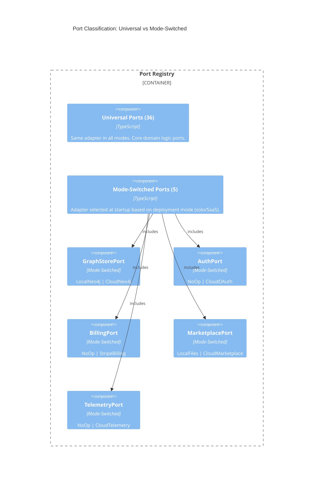

# Ports and Adapters

**Scope:** Complete port registry with adapter mapping across all deployment modes. Universal ports (available in all modes) and mode-switched ports (adapter varies by deployment mode).

**Elements:**

- Universal Ports: 36 ports available in all deployment modes
- Mode-Switched Ports: 5 ports with adapters selected at startup based on deployment mode
- Adapter selection logic
- Port classification diagram
- Package layering

---

## Port Classification Diagram



### ASCII Representation

```
┌─────────────────────────────────────────────────────────────────────────────┐
│                            Port Registry                                    │
│                                                                             │
│  ┌───────────────────────────────────────────────────────────────────────┐  │
│  │                     Universal Ports (36)                               │  │
│  │                                                                       │  │
│  │  Same adapter implementation across all deployment modes.             │  │
│  │  These ports handle core domain logic that does not vary              │  │
│  │  between solo and SaaS deployments.                                   │  │
│  │                                                                       │  │
│  │  OrchestratorPort     ACPAgentPort         MessageExchangePort         │  │
│  │  FlowEnginePort       SessionManagerPort  CompositionPort             │  │
│  │  SchedulerPort        ConvergencePort     NLQPort                     │  │
│  │  AnalyticsPort        GraphQueryPort      GraphMutationPort           │  │
│  │  EventBusPort         LoggerPort          ConfigPort                  │  │
│  │  CachePort            FileSystemPort      TemplatePort                │  │
│  │  ValidationPort       SerializerPort      MetricsPort                 │  │
│  │  HealthCheckPort      ACPServerPort       AgentBackendPort            │  │
│  │  ImportAdapterPort    ExportAdapterPort   GraphSyncPort               │  │
│  │  ToolRegistryPort     SessionSnapshotStorePort  TestRunnerPort       │  │
│  │  ImportRegistryPort   ExportRegistryPort                             │  │
│  │  ConnectionManagerPort  AgentRegistryPort                            │  │
│  │  McpProxyPort          PermissionPolicyPort                         │  │
│  └───────────────────────────────────────────────────────────────────────┘  │
│                                                                             │
│  ┌───────────────────────────────────────────────────────────────────────┐  │
│  │                   Mode-Switched Ports (5)                              │  │
│  │                                                                       │  │
│  │  Adapter selected at startup based on SPECFORGE_MODE env variable.    │  │
│  │                                                                       │  │
│  │  ┌─────────────────┐     Solo               SaaS                     │  │
│  │  │ GraphStorePort  │ -> LocalNeo4j          CloudNeo4j               │  │
│  │  ├─────────────────┤                                                  │  │
│  │  │ AuthPort        │ -> NoOpAuth            CloudOAuth               │  │
│  │  ├─────────────────┤                                                  │  │
│  │  │ BillingPort     │ -> NoOpBilling         StripeBilling            │  │
│  │  ├─────────────────┤                                                  │  │
│  │  │ MarketplacePort │ -> LocalFiles          CloudMarketplace         │  │
│  │  ├─────────────────┤                                                  │  │
│  │  │ TelemetryPort   │ -> NoOpTelemetry       CloudTelemetry           │  │
│  │  └─────────────────┘                                                  │  │
│  └───────────────────────────────────────────────────────────────────────┘  │
│                                                                             │
└─────────────────────────────────────────────────────────────────────────────┘
```

## Port vs Service Naming Convention

> **Convention (C20):** Ports define the boundary contract (`*Port`), e.g., `GraphQueryPort`. Services define the implementation interface (`*Service`), e.g., `GraphQueryService`. Every Port has exactly one Service interface defined in [types/ports.md](../types/ports.md). Port names are used in the registry and architecture diagrams; Service names are used in type definitions and code.

### Naming Convention

- **Port types** use the `*Port` suffix (e.g., `GraphStorePort`, `AuthPort`) — these are the abstract interface types
- **Service interfaces** use the `*Service` suffix (e.g., `GraphStoreService`, `AuthService`) — these are the runtime service contracts that implement port capabilities
- **Adapter implementations** use descriptive names (e.g., `LocalNeo4jAdapter`, `CloudOAuthAdapter`) — these are concrete implementations of service interfaces

## Universal Ports (36)

These ports have the same adapter implementation regardless of deployment mode.

| #   | Port                     | Category            | Direction | Description                                                                                                                                                                                                                                                       |
| --- | ------------------------ | ------------------- | --------- | ----------------------------------------------------------------------------------------------------------------------------------------------------------------------------------------------------------------------------------------------------------------- |
| 1   | OrchestratorPort         | flow/orchestrator   | inbound   | Entry point for flow execution. Accepts `startFlow`, `pauseFlow`, `cancelFlow` commands                                                                                                                                                                           |
| 2   | FlowEnginePort           | flow/engine         | internal  | Phase scheduling and flow lifecycle management                                                                                                                                                                                                                    |
| 3   | SchedulerPort            | flow/scheduler      | internal  | Phase ordering, iteration counting, next-phase selection                                                                                                                                                                                                          |
| 4   | ConvergencePort          | flow/convergence    | internal  | Evaluates convergence criteria for phase completion                                                                                                                                                                                                               |
| 5   | SessionManagerPort       | session/manager     | internal  | Agent session lifecycle: spawn, pause, resume, cancel, snapshot                                                                                                                                                                                                   |
| 6   | ACPAgentPort             | acp/agent           | outbound  | ACP client — creates runs, polls/streams results, manages sessions                                                                                                                                                                                                |
| 7   | CompositionPort          | session/composition | internal  | Session context assembly pipeline orchestration                                                                                                                                                                                                                   |
| 8   | MessageExchangePort      | acp/messaging       | internal  | ACP message-based inter-agent communication: post messages, get history, get artifacts                                                                                                                                                                            |
| 9   | GraphQueryPort           | graph/query         | outbound  | Read-only graph traversals and Cypher query execution                                                                                                                                                                                                             |
| 10  | GraphMutationPort        | graph/mutation      | outbound  | Write operations on the knowledge graph                                                                                                                                                                                                                           |
| 11  | NLQPort                  | nlq/engine          | internal  | Natural language to Cypher translation and execution                                                                                                                                                                                                              |
| 12  | AnalyticsPort            | analytics/engine    | internal  | Flow metrics, quality trends, cost tracking                                                                                                                                                                                                                       |
| 13  | EventBusPort             | infra/events        | internal  | Internal event publication and subscription                                                                                                                                                                                                                       |
| 14  | LoggerPort               | infra/logger        | outbound  | Structured logging output                                                                                                                                                                                                                                         |
| 15  | ConfigPort               | infra/config        | inbound   | Configuration loading and validation                                                                                                                                                                                                                              |
| 16  | CachePort                | infra/cache         | internal  | In-memory caching for graph queries and computed results                                                                                                                                                                                                          |
| 17  | FileSystemPort           | infra/filesystem    | outbound  | File read/write operations (specs, templates, exports)                                                                                                                                                                                                            |
| 18  | TemplatePort             | flow/template       | internal  | Flow template loading, validation, and instantiation                                                                                                                                                                                                              |
| 19  | ValidationPort           | infra/validation    | internal  | Input validation for commands and data                                                                                                                                                                                                                            |
| 20  | SerializerPort           | infra/serializer    | internal  | Serialization/deserialization of domain objects                                                                                                                                                                                                                   |
| 21  | MetricsPort              | infra/metrics       | outbound  | Runtime metrics collection (latency, throughput, errors)                                                                                                                                                                                                          |
| 22  | HealthCheckPort          | infra/health        | inbound   | Liveness and readiness probes                                                                                                                                                                                                                                     |
| 23  | ACPServerPort            | acp/server          | inbound   | ACP server — registers agents, exposes `GET /agents` and run endpoints. Behaviors: [BEH-SF-209–218](../behaviors/BEH-SF-209-acp-server.md)                                                                                                                        |
| 24  | AgentBackendPort         | agent/backend       | outbound  | Execution engine behind ACP handlers. Default: `ClaudeCodeBackend` wrapping `claude -p`. Behaviors: [BEH-SF-239–248](../behaviors/BEH-SF-239-agent-backend.md). Reference: [references/claude-code/agent-sdk.md](../references/claude-code/agent-sdk.md)          |
| 25  | ImportAdapterPort        | import/adapter      | inbound   | Pluggable import formats (markdown, OpenAPI, etc.)                                                                                                                                                                                                                |
| 26  | ExportAdapterPort        | export/adapter      | outbound  | Pluggable export formats (markdown, etc.)                                                                                                                                                                                                                         |
| 27  | GraphSyncPort            | graph/sync          | internal  | Projects ACP messages and session artifacts into the knowledge graph. Subscribes to ACP message events via EventBusPort and translates to graph mutations. Behaviors: [BEH-SF-001–015](../behaviors/BEH-SF-001-graph-operations.md)                               |
| 28  | ToolRegistryPort         | agent/tools         | internal  | Resolves permitted tools for a given agent role and manages tool registrations. Behaviors: [BEH-SF-076–090](../behaviors/BEH-SF-081-tool-isolation.md)                                                                                                            |
| 29  | SessionSnapshotStorePort | session/snapshot    | outbound  | Persistence for session snapshots: save, load, delete. Behaviors: [BEH-SF-031–045](../behaviors/BEH-SF-025-agent-sessions.md)                                                                                                                                     |
| 30  | TestRunnerPort           | agent/testing       | outbound  | Executes test suites and returns results. Used by verification phase. Behaviors: [BEH-SF-046–060](../behaviors/BEH-SF-057-flow-execution.md)                                                                                                                      |
| 31  | ImportRegistryPort       | import/registry     | internal  | Registry of pluggable import format adapters. Resolves adapter by format name. Behaviors: [BEH-SF-121–135](../behaviors/BEH-SF-127-import-export.md)                                                                                                              |
| 32  | ExportRegistryPort       | export/registry     | internal  | Registry of pluggable export format adapters. Resolves adapter by format name. Behaviors: [BEH-SF-121–135](../behaviors/BEH-SF-127-import-export.md)                                                                                                              |
| 33  | ConnectionManagerPort    | agent/connection    | internal  | Agent subprocess lifecycle, connection pooling. Separates live subprocess link from session state. See [ADR-019](../decisions/ADR-019-zed-inspired-architecture.md)                                                                                               |
| 34  | AgentRegistryPort        | agent/registry      | internal  | Unified agent role resolution (builtin, template, marketplace). See [ADR-019](../decisions/ADR-019-zed-inspired-architecture.md)                                                                                                                                  |
| 35  | McpProxyPort             | mcp/proxy           | outbound  | MCP proxy for routing stdio-to-backend. Exposes MCP servers to agent subprocesses. See [ADR-023](../decisions/ADR-023-session-resilience-mcp-integration.md). Behaviors: [BEH-SF-520–527](../behaviors/BEH-SF-520-session-resilience.md)                          |
| 36  | PermissionPolicyPort     | permission/policy   | internal  | Dedicated permission policy evaluation decoupled from ACP layer. Deny-by-default with priority-based resolution. See [ADR-024](../decisions/ADR-024-permission-policy-architecture.md). Behaviors: [BEH-SF-528–535](../behaviors/BEH-SF-528-permission-policy.md) |

## Mode-Switched Ports (5)

These ports select their adapter at startup based on the `SPECFORGE_MODE` environment variable.

| #   | Port            | Category           | Solo Adapter      | SaaS Adapter            |
| --- | --------------- | ------------------ | ----------------- | ----------------------- |
| 1   | GraphStorePort  | graph/store        | LocalNeo4jAdapter | CloudNeo4jAdapter       |
| 2   | AuthPort        | auth/provider      | NoOpAuth          | CloudOAuth              |
| 3   | BillingPort     | billing/provider   | NoOpBilling       | StripeBilling           |
| 4   | MarketplacePort | marketplace/store  | LocalFilesAdapter | CloudMarketplaceAdapter |
| 5   | TelemetryPort   | telemetry/provider | NoOpTelemetry     | CloudTelemetryAdapter   |

## Adapter Selection Logic

```
┌──────────────────────────────────────────────────────────┐
│                  Startup Sequence                         │
│                                                          │
│  1. Read SPECFORGE_MODE from environment                 │
│     ├─ "solo"                                            │
│     └─ "saas"  (default if unset)                        │
│                                                          │
│  2. For each mode-switched port:                         │
│     ├─ Look up adapter in mode->adapter mapping          │
│     ├─ Instantiate adapter with mode-specific config     │
│     └─ Register adapter in Port Registry                 │
│                                                          │
│  3. For each universal port:                             │
│     ├─ Instantiate the single adapter                    │
│     └─ Register adapter in Port Registry                 │
│                                                          │
│  4. Validate all ports are bound                         │
│     └─ Fail startup if any port is unbound               │
│                                                          │
└──────────────────────────────────────────────────────────┘
```

## Adapter Detail: Mode-Switched

### GraphStorePort

| Adapter           | Mode | Connection                         | Notes                                            |
| ----------------- | ---- | ---------------------------------- | ------------------------------------------------ |
| LocalNeo4jAdapter | Solo | `bolt://localhost:7687`            | Direct Bolt connection, single instance          |
| CloudNeo4jAdapter | SaaS | `bolt+s://<cluster>.neo4j.io:7687` | AuraDB managed cluster, tenant-scoped namespaces |

### AuthPort

| Adapter    | Mode | Mechanism               | Notes                                    |
| ---------- | ---- | ----------------------- | ---------------------------------------- |
| NoOpAuth   | Solo | None                    | All operations permitted, no identity    |
| CloudOAuth | SaaS | GitHub/Google OAuth 2.0 | SSO, org membership synced from provider |

### BillingPort

| Adapter       | Mode | Mechanism  | Notes                                                  |
| ------------- | ---- | ---------- | ------------------------------------------------------ |
| NoOpBilling   | Solo | None       | All features available, no metering                    |
| StripeBilling | SaaS | Stripe API | Subscription tiers, usage metering, payment processing |

### MarketplacePort

| Adapter                 | Mode | Mechanism        | Notes                                                |
| ----------------------- | ---- | ---------------- | ---------------------------------------------------- |
| LocalFilesAdapter       | Solo | Local filesystem | Templates read from `~/.specforge/templates/`        |
| CloudMarketplaceAdapter | SaaS | Cloud API        | Hosted template registry with versioning and ratings |

### TelemetryPort

| Adapter               | Mode | Mechanism      | Notes                                           |
| --------------------- | ---- | -------------- | ----------------------------------------------- |
| NoOpTelemetry         | Solo | None           | No telemetry data collected                     |
| CloudTelemetryAdapter | SaaS | Cloud endpoint | Anonymous usage metrics for service improvement |

## Port Layer Classification

Ports are organized into 5 architectural layers, ordered from lowest-level protocol handling to highest-level user surface:

| Layer | Name          | Ports                                                                                                                                                                                                            | Description                                         |
| ----- | ------------- | ---------------------------------------------------------------------------------------------------------------------------------------------------------------------------------------------------------------- | --------------------------------------------------- |
| 1     | Protocol      | MessageExchangePort, SerializerPort, ValidationPort                                                                                                                                                              | ACP message types, wire format                      |
| 2     | Connection    | ConnectionManagerPort, AgentBackendPort, McpProxyPort                                                                                                                                                            | Backend connection management and MCP proxy routing |
| 3     | Session       | SessionManagerPort, GraphStorePort, GraphSyncPort, SessionSnapshotStorePort, CachePort                                                                                                                           | Session and graph data management                   |
| 4     | Orchestration | OrchestratorPort, FlowEnginePort, SchedulerPort, ConvergencePort, CompositionPort, HookPipelinePort, CostOptimizerPort, MemoryPort, DynamicRoleFactoryPort, MCPManagerPort, PermissionPort, PermissionPolicyPort | Flow execution and agent coordination               |
| 5     | Surface       | CLIPort, DashboardPort, VSCodePort, DesktopPort, TelemetryPort, AnalyticsPort, BillingPort, AuthPort, MarketplacePort, ConfigPort, HealthCheckPort                                                               | User-facing and operational                         |

**Dependency rule:** Ports in layer N may depend on ports in layers 1..N-1 but MUST NOT depend on ports in layers N+1+.

---

## Package Layering

SpecForge organizes its implementation into 5 layered packages with strict downward-only dependency rules. See [ADR-019](../decisions/ADR-019-zed-inspired-architecture.md).

| Layer | Package                  | Owns                                                              | Can Import From          |
| ----- | ------------------------ | ----------------------------------------------------------------- | ------------------------ |
| 1     | @specforge/protocol      | ACP types, FlowUpdate, Side pattern, JSON-RPC                     | (leaf — no dependencies) |
| 2     | @specforge/connection    | Subprocess lifecycle, ConnectionManager, capability negotiation   | protocol                 |
| 3     | @specforge/session       | Thread state, message history, chunks, materialization, GraphSync | protocol, connection     |
| 4     | @specforge/orchestration | FlowEngine, phases, convergence, scheduling, cost, AgentRegistry  | session, connection      |
| 5     | @specforge/surface       | CLI, Desktop App, Web Dashboard, VS Code Extension                | orchestration            |

**Rule:** No upward imports. `@specforge/session` cannot import from `@specforge/orchestration`. `@specforge/connection` cannot import from `@specforge/session`. Enforced by ESLint import restrictions.

```
┌─────────────────────────────────────────────────────────────────┐
│  Layer 5: @specforge/surface                                    │
│  CLI, Desktop App, Web Dashboard, VS Code Extension             │
│                          │                                      │
│                          ▼                                      │
│  Layer 4: @specforge/orchestration                              │
│  FlowEngine, phases, convergence, scheduling, cost, registry    │
│                      │       │                                  │
│                      ▼       ▼                                  │
│  Layer 3: @specforge/session     Layer 2: @specforge/connection │
│  Thread state, history,          Subprocess lifecycle,          │
│  chunks, GraphSync               ConnectionManager              │
│              │       │                      │                   │
│              ▼       ▼                      ▼                   │
│  Layer 1: @specforge/protocol                                   │
│  ACP types, FlowUpdate, Side pattern, JSON-RPC                  │
│  (leaf — no dependencies)                                       │
└─────────────────────────────────────────────────────────────────┘
```

---

## Cross-References

- Server components (consumes ports): [c3-server.md](./c3-server.md)
- Solo deployment (adapter set): [deployment-solo.md](./deployment-solo.md)
- SaaS deployment (adapter set): [deployment-saas.md](./deployment-saas.md)
- hex-di port API: [../decisions/ADR-001-hexdi-as-di-foundation.md](../decisions/ADR-001-hexdi-as-di-foundation.md)
- Type definitions: [../types/ports.md](../types/ports.md)
- Behavioral specs: [../behaviors/BEH-SF-095-deployment-modes.md](../behaviors/BEH-SF-095-deployment-modes.md)
- ACP Protocol Layer: [c3-acp-layer.md](./c3-acp-layer.md) — ACP server, client, handler registry, backend
- Agent Backend behaviors: [../behaviors/BEH-SF-239-agent-backend.md](../behaviors/BEH-SF-239-agent-backend.md) (BEH-SF-239–248)
- ACP Server behaviors: [../behaviors/BEH-SF-209-acp-server.md](../behaviors/BEH-SF-209-acp-server.md) (BEH-SF-209–218)
- ACP decision: [../decisions/ADR-018-acp-agent-protocol.md](../decisions/ADR-018-acp-agent-protocol.md)
- Claude Code reference: [../references/claude-code/](../references/claude-code/)
