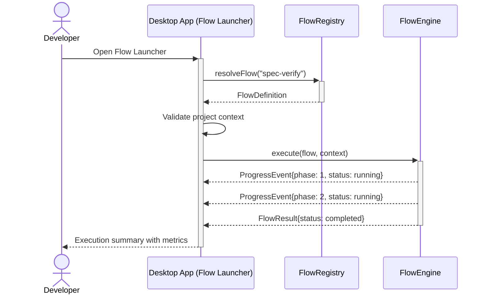
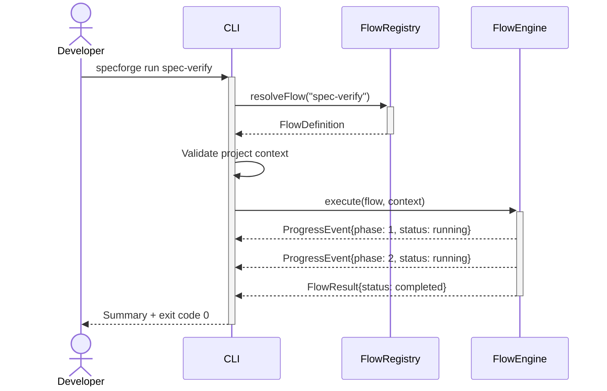

# Run a Predefined Flow

## Use Case

A developer opens the Flow Launcher in the desktop app to execute one of the built-in flows (e.g., `spec-verify`, `code-review`, `drift-check`) against their current project. They invoke the flow by name from the CLI, and the system resolves the flow definition, validates inputs, and begins execution with default parameters. The same operation is accessible via CLI (`specforge flows list`) for scripted/CI workflows.

## Interaction Flow

### Desktop App

```text
┌───────────┐ ┌─────────────────┐ ┌────────────┐ ┌────────────┐
│ Developer │ │   Desktop App   │ │FlowRegistry│ │ FlowEngine │
└─────┬─────┘ └────────┬────────┘ └─────┬──────┘ └─────┬──────┘
      │           │           │              │
      │ Open Flow       │              │
      │──────────►│           │              │
      │           │ resolveFlow("spec-verify")│
      │           │──────────►│              │
      │           │ FlowDefinition           │
      │           │◄──────────│              │
      │           │           │              │
      │           │ Validate project context  │
      │           │──┐        │              │
      │           │◄─┘        │              │
      │           │           │              │
      │           │ execute(flow, context)    │
      │           │──────────────────────────►│
      │           │ ProgressEvent{phase: 1}  │
      │           │◄─────────────────────────│
      │           │ ProgressEvent{phase: 2}  │
      │           │◄─────────────────────────│
      │           │ FlowResult{completed}    │
      │           │◄─────────────────────────│
      │           │           │              │
      │ Summary shown │              │
      │◄──────────│           │              │
      │           │           │              │
```



### CLI

```text
┌───────────┐ ┌─────┐ ┌────────────┐ ┌────────────┐
│ Developer │ │ CLI │ │FlowRegistry│ │ FlowEngine │
└─────┬─────┘ └──┬──┘ └─────┬──────┘ └─────┬──────┘
      │           │           │              │
      │ run spec-verify       │              │
      │──────────►│           │              │
      │           │ resolveFlow("spec-verify")│
      │           │──────────►│              │
      │           │ FlowDefinition           │
      │           │◄──────────│              │
      │           │           │              │
      │           │ Validate project context  │
      │           │──┐        │              │
      │           │◄─┘        │              │
      │           │           │              │
      │           │ execute(flow, context)    │
      │           │──────────────────────────►│
      │           │ ProgressEvent{phase: 1}  │
      │           │◄─────────────────────────│
      │           │ ProgressEvent{phase: 2}  │
      │           │◄─────────────────────────│
      │           │ FlowResult{completed}    │
      │           │◄─────────────────────────│
      │           │           │              │
      │ Summary + exit code 0 │              │
      │◄──────────│           │              │
      │           │           │              │
```



## Steps

1. Open the Flow Launcher in the desktop app
2. Select a flow by name (e.g., `specforge run spec-verify`)
3. System resolves the flow definition from the registry (BEH-SF-049)
4. System validates project context and required inputs
5. Flow execution begins, streaming progress to the terminal (BEH-SF-057)
6. CLI displays phase transitions and convergence status (BEH-SF-113)
7. Flow completes and outputs summary with exit code

## Traceability

| Behavior   | Feature     | Role in this capability                           |
| ---------- | ----------- | ------------------------------------------------- |
| BEH-SF-049 | FEAT-SF-004 | Resolves predefined flow definition from registry |
| BEH-SF-057 | FEAT-SF-004 | Executes flow phases and manages convergence      |
| BEH-SF-113 | FEAT-SF-009 | CLI command parsing and progress output           |
