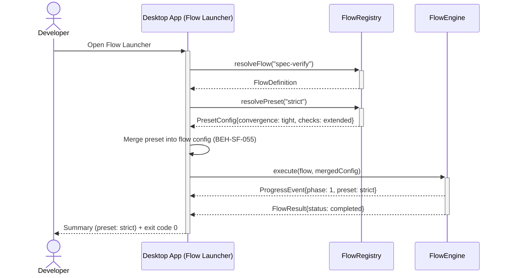
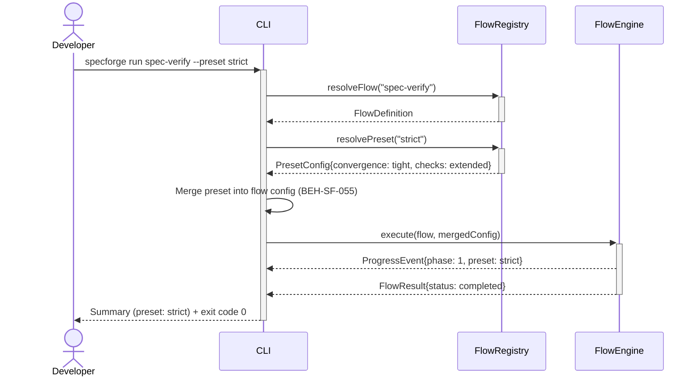

# Run a Flow with Preset

## Use Case

A developer opens the Flow Launcher in the desktop app to run a flow with a named preset that overrides default parameters. Presets allow teams to share curated configurations without modifying flow definitions. The same operation is accessible via CLI (`specforge flows presets <flow-name>`) for scripted/CI workflows.

## Interaction Flow

### Desktop App

```text
┌───────────┐ ┌─────────────────┐ ┌────────────┐ ┌────────────┐
│ Developer │ │   Desktop App   │ │FlowRegistry│ │ FlowEngine │
└─────┬─────┘ └────────┬────────┘ └─────┬──────┘ └─────┬──────┘
      │           │           │              │
      │ Open Flow --preset strict      │
      │──────────►│           │              │
      │           │ resolveFlow("spec-verify")│
      │           │──────────►│              │
      │           │ FlowDefinition           │
      │           │◄──────────│              │
      │           │ resolvePreset("strict")  │
      │           │──────────►│              │
      │           │ PresetConfig             │
      │           │◄──────────│              │
      │           │           │              │
      │           │ Merge preset into config  │
      │           │──┐        │              │
      │           │◄─┘        │              │
      │           │           │              │
      │           │ execute(flow, mergedConfig)
      │           │──────────────────────────►│
      │           │ ProgressEvent{phase: 1}  │
      │           │◄─────────────────────────│
      │           │ FlowResult{completed}    │
      │           │◄─────────────────────────│
      │           │           │              │
      │ Summary (preset: strict) + exit 0    │
      │◄──────────│           │              │
      │           │           │              │
```



### CLI

```text
┌───────────┐ ┌─────┐ ┌────────────┐ ┌────────────┐
│ Developer │ │ CLI │ │FlowRegistry│ │ FlowEngine │
└─────┬─────┘ └──┬──┘ └─────┬──────┘ └─────┬──────┘
      │           │           │              │
      │ run spec-verify --preset strict      │
      │──────────►│           │              │
      │           │ resolveFlow("spec-verify")│
      │           │──────────►│              │
      │           │ FlowDefinition           │
      │           │◄──────────│              │
      │           │ resolvePreset("strict")  │
      │           │──────────►│              │
      │           │ PresetConfig             │
      │           │◄──────────│              │
      │           │           │              │
      │           │ Merge preset into config  │
      │           │──┐        │              │
      │           │◄─┘        │              │
      │           │           │              │
      │           │ execute(flow, mergedConfig)
      │           │──────────────────────────►│
      │           │ ProgressEvent{phase: 1}  │
      │           │◄─────────────────────────│
      │           │ FlowResult{completed}    │
      │           │◄─────────────────────────│
      │           │           │              │
      │ Summary (preset: strict) + exit 0    │
      │◄──────────│           │              │
      │           │           │              │
```



## Steps

1. Open the Flow Launcher in the desktop app
2. Run the flow with the preset: `specforge run spec-verify --preset strict`
3. System resolves the flow definition and merges preset parameters (BEH-SF-055)
4. Merged configuration is validated against the flow's input schema
5. Flow execution begins with preset-adjusted parameters (BEH-SF-057)
6. CLI displays preset name in the run header for traceability (BEH-SF-113)
7. Flow completes; results reflect preset-driven behavior

## Traceability

| Behavior   | Feature     | Role in this capability                          |
| ---------- | ----------- | ------------------------------------------------ |
| BEH-SF-049 | FEAT-SF-004 | Resolves base flow definition                    |
| BEH-SF-055 | FEAT-SF-027 | Merges preset parameters into flow configuration |
| BEH-SF-057 | FEAT-SF-004 | Executes flow with merged parameters             |
| BEH-SF-113 | FEAT-SF-009 | CLI invocation and progress display              |
