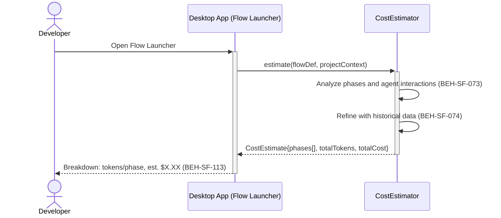
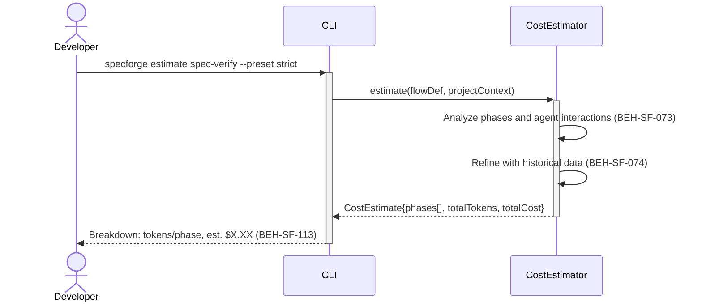

# Estimate Flow Cost Before Execution

## Use Case

A developer opens the Flow Launcher in the desktop app to see an estimated cost breakdown. The system analyzes the flow definition, project size, and historical data to produce a token and dollar estimate. This enables informed decisions about whether to proceed, switch to a cheaper model routing, or adjust scope. The same operation is accessible via CLI (`specforge estimate <flow-name> [--preset <name>]`) for scripted/CI workflows.

## Interaction Flow

### Desktop App

```text
┌───────────┐ ┌─────────────────┐ ┌───────────────┐
│ Developer │ │   Desktop App   │ │ CostEstimator │
└─────┬─────┘ └────────┬────────┘ └──────┬────────┘
      │           │           │
      │ estimate spec-verify --preset strict
      │──────────►│           │
      │           │ estimate(flowDef, ctx)
      │           │──────────►│
      │           │           │ Analyze phases
      │           │           │──┐
      │           │           │◄─┘
      │           │           │ Refine w/ history
      │           │           │──┐
      │           │           │◄─┘
      │           │ CostEstimate{phases[],
      │           │   totalTokens, totalCost}
      │           │◄──────────│
      │           │           │
      │ Breakdown: tokens/phase, est. $X.XX
      │◄──────────│           │
      │           │           │
```



### CLI

```text
┌───────────┐ ┌─────┐ ┌───────────────┐
│ Developer │ │ CLI │ │ CostEstimator │
└─────┬─────┘ └──┬──┘ └──────┬────────┘
      │           │           │
      │ estimate spec-verify --preset strict
      │──────────►│           │
      │           │ estimate(flowDef, ctx)
      │           │──────────►│
      │           │           │ Analyze phases
      │           │           │──┐
      │           │           │◄─┘
      │           │           │ Refine w/ history
      │           │           │──┐
      │           │           │◄─┘
      │           │ CostEstimate{phases[],
      │           │   totalTokens, totalCost}
      │           │◄──────────│
      │           │           │
      │ Breakdown: tokens/phase, est. $X.XX
      │◄──────────│           │
      │           │           │
```



## Steps

1. Open the Flow Launcher in the desktop app
2. System analyzes flow phases, expected agent interactions, and project graph size
3. Token budget engine produces per-phase estimates (BEH-SF-073)
4. Historical data from previous runs refines the estimate (BEH-SF-074)
5. CLI displays breakdown: tokens per phase, estimated cost, model allocation (BEH-SF-113)
6. Developer decides to proceed, adjust, or cancel

## Traceability

| Behavior   | Feature     | Role in this capability                        |
| ---------- | ----------- | ---------------------------------------------- |
| BEH-SF-073 | FEAT-SF-010 | Token budget calculation and zone allocation   |
| BEH-SF-074 | FEAT-SF-010 | Historical cost data for estimation refinement |
| BEH-SF-113 | FEAT-SF-009 | CLI command and formatted output               |
