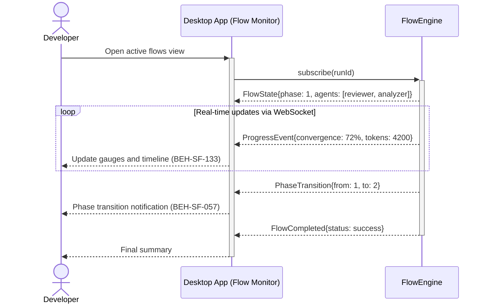

# Monitor a Running Flow in Real-Time

## Use Case

A developer opens the Flow Monitor in the desktop app to observe its progress in real. The dashboard and desktop app provide a live view with WebSocket-driven updates, enabling passive monitoring without blocking on a terminal.

## Interaction Flow

```text
┌───────────┐ ┌───────────┐ ┌────────────┐
│ Developer │ │ Desktop App │ │ FlowEngine │
└─────┬─────┘ └─────┬─────┘ └─────┬──────┘
      │              │              │
      │ Open active flows view      │
      │─────────────►│              │
      │              │ subscribe(runId)
      │              │─────────────►│
      │              │ FlowState{phase: 1,
      │              │  agents: [...]}
      │              │◄─────────────│
      │              │              │
      │      ┌───── loop: WebSocket updates ─────┐
      │      │       │              │             │
      │      │       │ ProgressEvent│             │
      │      │       │◄─────────────│             │
      │      │ Update gauges        │             │
      │◄─────│───────│              │             │
      │      └───────────────────────────────────┘
      │              │              │
      │              │ PhaseTransition{1→2}
      │              │◄─────────────│
      │ Phase transition            │
      │◄─────────────│              │
      │              │ FlowCompleted│
      │              │◄─────────────│
      │ Final summary│              │
      │◄─────────────│              │
      │              │              │
```



## Steps

1. Open the desktop app
2. Navigate to the active flows view
3. Select the running flow to open its detail panel (BEH-SF-133)
4. Observe real-time updates: current phase, active agents, iteration count
5. View convergence metrics and token usage gauges (BEH-SF-057)
6. Desktop app shows native notifications on phase transitions (BEH-SF-273)
7. Optionally intervene (pause, inject feedback) from the monitoring view

## Traceability

| Behavior   | Feature     | Role in this capability                              |
| ---------- | ----------- | ---------------------------------------------------- |
| BEH-SF-057 | FEAT-SF-004 | Flow execution state and convergence metrics         |
| BEH-SF-133 | FEAT-SF-007 | Dashboard real-time flow view with WebSocket updates |
| BEH-SF-273 | FEAT-SF-006 | Desktop app native monitoring and notifications      |
