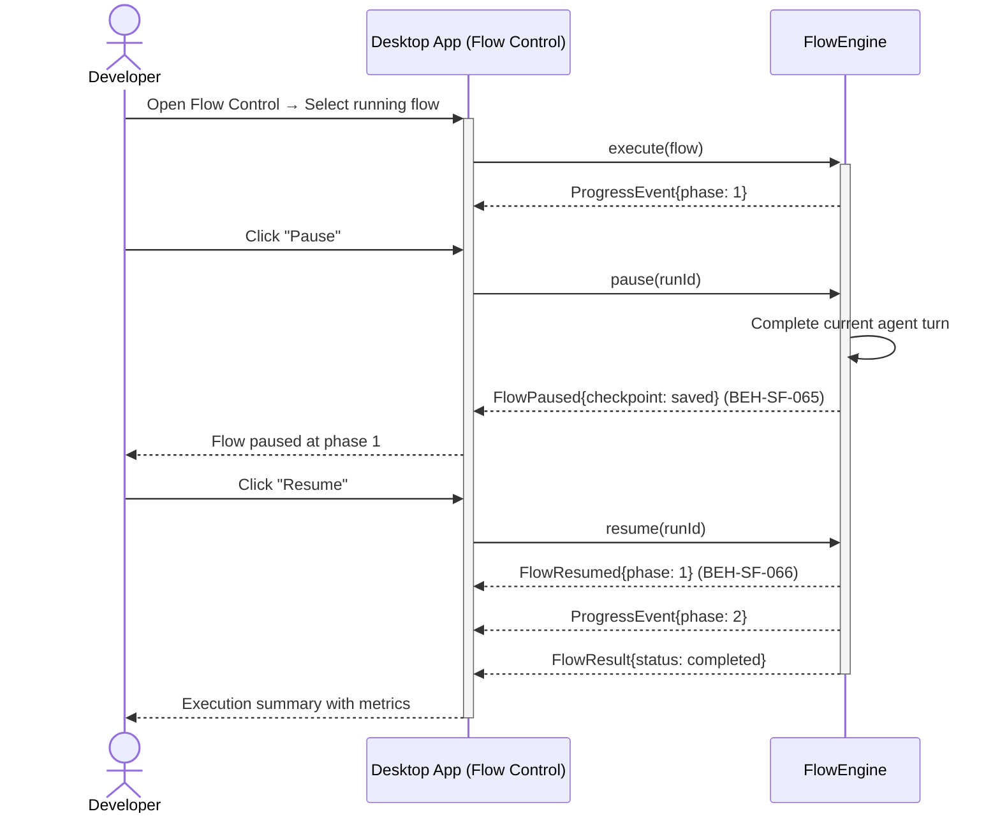
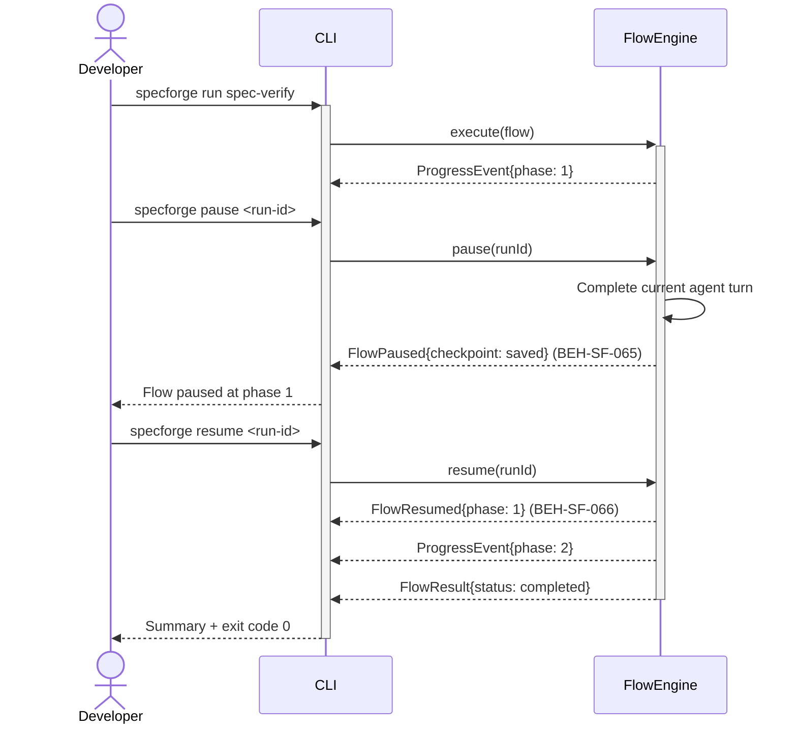
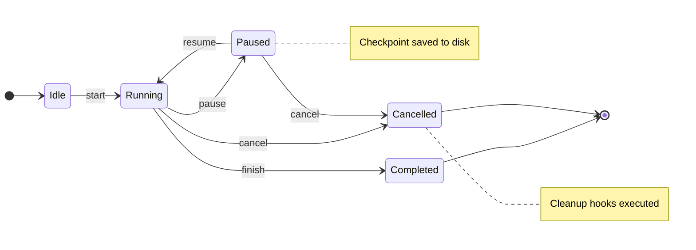

# Pause, Resume, and Cancel a Flow

## Use Case

A developer opens the Flow Control in the desktop app to interrupt a running flow. The system supports graceful pause (completing the current agent turn), resume (continuing from the paused state), and cancel (terminating with cleanup). The same operation is accessible via CLI (`specforge pause <run-id>`) for scripted/CI workflows.

## Interaction Flow

### Desktop App

```text
┌───────────┐ ┌─────────────────┐ ┌────────────┐
│ Developer │ │   Desktop App   │ │ FlowEngine │
└─────┬─────┘ └────────┬────────┘ └─────┬──────┘
      │           │           │
      │ Open Flow       │
      │──────────►│           │
      │           │ execute(flow)
      │           │──────────►│
      │           │ ProgressEvent{phase: 1}
      │           │◄──────────│
      │           │           │
      │ Click        │
      │──────────►│           │
      │           │ pause(runId)
      │           │──────────►│
      │           │           │ Complete agent turn
      │           │           │──┐
      │           │           │◄─┘
      │           │ FlowPaused{checkpoint}
      │           │◄──────────│
      │ Paused at phase 1     │
      │◄──────────│           │
      │           │           │
      │ Click       │
      │──────────►│           │
      │           │ resume(runId)
      │           │──────────►│
      │           │ FlowResumed{phase: 1}
      │           │◄──────────│
      │           │ ProgressEvent{phase: 2}
      │           │◄──────────│
      │           │ FlowResult{completed}
      │           │◄──────────│
      │           │           │
      │ Summary shown │
      │◄──────────│           │
      │           │           │
```



### CLI

```text
┌───────────┐ ┌─────┐ ┌────────────┐
│ Developer │ │ CLI │ │ FlowEngine │
└─────┬─────┘ └──┬──┘ └─────┬──────┘
      │           │           │
      │ run spec-verify       │
      │──────────►│           │
      │           │ execute(flow)
      │           │──────────►│
      │           │ ProgressEvent{phase: 1}
      │           │◄──────────│
      │           │           │
      │ pause <run-id>        │
      │──────────►│           │
      │           │ pause(runId)
      │           │──────────►│
      │           │           │ Complete agent turn
      │           │           │──┐
      │           │           │◄─┘
      │           │ FlowPaused{checkpoint}
      │           │◄──────────│
      │ Paused at phase 1     │
      │◄──────────│           │
      │           │           │
      │ resume <run-id>       │
      │──────────►│           │
      │           │ resume(runId)
      │           │──────────►│
      │           │ FlowResumed{phase: 1}
      │           │◄──────────│
      │           │ ProgressEvent{phase: 2}
      │           │◄──────────│
      │           │ FlowResult{completed}
      │           │◄──────────│
      │           │           │
      │ Summary + exit code 0 │
      │◄──────────│           │
      │           │           │
```



## Steps

1. Open the Flow Control in the desktop app
2. System completes the current agent turn and checkpoints state (BEH-SF-065)
3. Flow enters `paused` state; agents are suspended
4. Resume: `specforge resume <run-id>` to continue from checkpoint
5. System restores state and resumes from the paused phase (BEH-SF-066)
6. Cancel: `specforge cancel <run-id>` to terminate
7. System runs cleanup hooks and records partial results (BEH-SF-113)

## State Model

```text
                    ┌─────────────────────────────────────────┐
                    │                                         │
                    │  start     pause       cancel           │
           [*]────►Idle────►Running────►Paused────►Cancelled──►[*]
                            │    │       │                     │
                            │    │       │ resume              │
                            │    │       └──►Running           │
                            │    │                             │
                            │    │ finish                      │
                            │    └──►Completed─────────────────►[*]
                            │         cancel
                            └──────►Cancelled

           Notes: Paused → Checkpoint saved to disk
                  Cancelled → Cleanup hooks executed
```



## Traceability

| Behavior   | Feature     | Role in this capability                 |
| ---------- | ----------- | --------------------------------------- |
| BEH-SF-065 | FEAT-SF-004 | Graceful pause with state checkpointing |
| BEH-SF-066 | FEAT-SF-004 | Resume from checkpointed state          |
| BEH-SF-113 | FEAT-SF-009 | CLI commands for pause/resume/cancel    |
