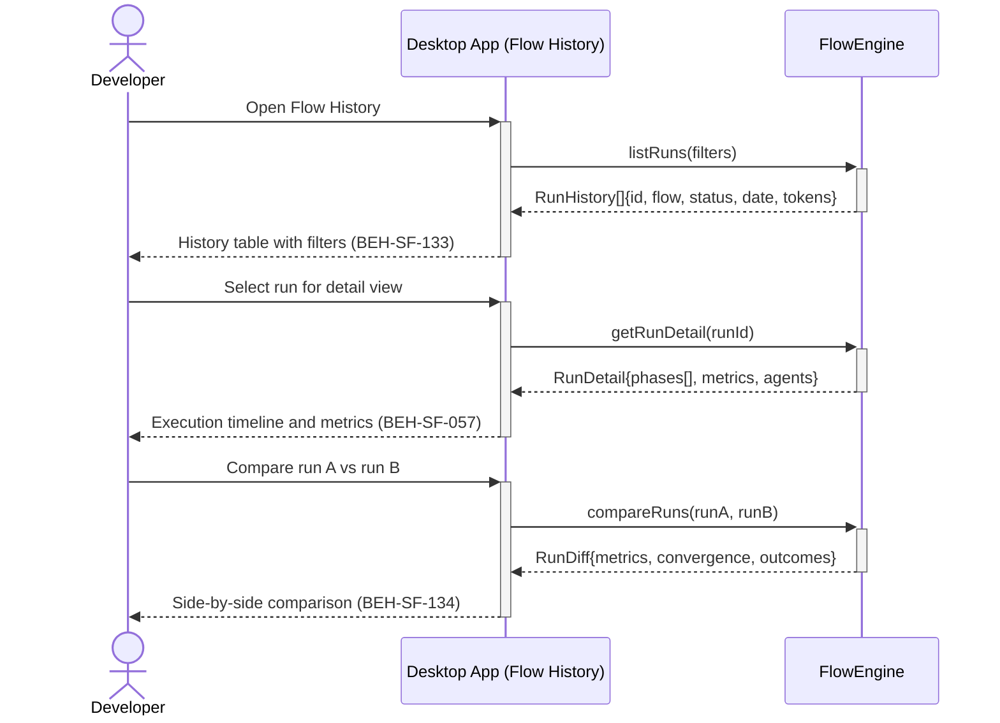

# View Flow History and Compare Runs

## Use Case

A developer opens the Flow History in the desktop app to review past flow executions to understand trends, identify regressions, or compare two runs side-by-side. The dashboard provides a history view with filtering, sorting, and a diff mode that highlights differences in convergence metrics, token usage, and outcomes between selected runs.

## Interaction Flow

```text
┌───────────┐ ┌───────────┐ ┌────────────┐
│ Developer │ │ Desktop App │ │ FlowEngine │
└─────┬─────┘ └─────┬─────┘ └─────┬──────┘
      │              │              │
      │ Open Flow History           │
      │─────────────►│              │
      │              │ listRuns(filters)
      │              │─────────────►│
      │              │ RunHistory[] │
      │              │◄─────────────│
      │ History table│              │
      │◄─────────────│              │
      │              │              │
      │ Select run for detail       │
      │─────────────►│              │
      │              │ getRunDetail(runId)
      │              │─────────────►│
      │              │ RunDetail    │
      │              │◄─────────────│
      │ Timeline + metrics          │
      │◄─────────────│              │
      │              │              │
      │ Compare run A vs run B      │
      │─────────────►│              │
      │              │ compareRuns(A, B)
      │              │─────────────►│
      │              │ RunDiff      │
      │              │◄─────────────│
      │ Side-by-side comparison     │
      │◄─────────────│              │
      │              │              │
```



## Steps

1. Open the Flow History in the desktop app
2. Browse completed runs with filters (flow type, date range, status) (BEH-SF-133)
3. Select a run to view its detailed execution timeline
4. View per-phase metrics, agent interactions, and convergence data (BEH-SF-057)
5. Select two runs and activate Compare mode (BEH-SF-134)
6. Desktop app highlights differences in metrics, duration, and outcomes
7. Export comparison as a report if needed

## Traceability

| Behavior   | Feature     | Role in this capability                 |
| ---------- | ----------- | --------------------------------------- |
| BEH-SF-057 | FEAT-SF-004 | Flow execution data and metrics storage |
| BEH-SF-133 | FEAT-SF-007 | Dashboard history view and filtering    |
| BEH-SF-134 | FEAT-SF-007 | Dashboard comparison and diff rendering |
