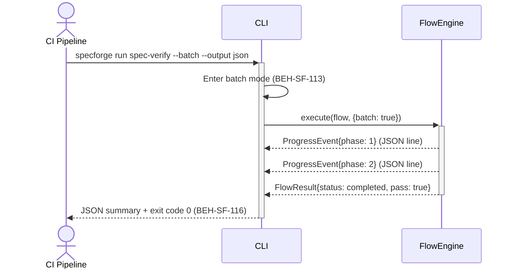

# Run a Batch Flow in CI

## Use Case

A DevOps engineer configures a CI pipeline to run SpecForge flows as part of the build process. The CLI operates in non-interactive batch mode, streaming structured output (JSON lines) suitable for CI log parsing, and exits with appropriate codes for pass/fail gating.

## Interaction Flow

```text
┌─────────────┐ ┌─────┐ ┌────────────┐
│ CI Pipeline │ │ CLI │ │ FlowEngine │
└──────┬──────┘ └──┬──┘ └─────┬──────┘
       │           │           │
       │ run spec-verify --batch --output json
       │──────────►│           │
       │           │ Enter batch mode
       │           │──┐        │
       │           │◄─┘        │
       │           │ execute(flow, {batch})
       │           │──────────►│
       │           │ ProgressEvent{phase: 1}
       │           │◄──────────│  (JSON line)
       │           │ ProgressEvent{phase: 2}
       │           │◄──────────│  (JSON line)
       │           │ FlowResult{completed}
       │           │◄──────────│
       │           │           │
       │ JSON summary + exit code 0
       │◄──────────│           │
       │           │           │
```



## Steps

1. Add SpecForge CLI to the CI environment
2. Configure the pipeline step: `specforge run spec-verify --batch --output json`
3. CLI enters batch mode: no interactive prompts, structured output (BEH-SF-113)
4. Flow executes with CI-appropriate defaults (BEH-SF-057)
5. Results are streamed as JSON lines for pipeline parsing (BEH-SF-116)
6. CLI exits with code 0 (pass) or non-zero (fail) for gate decisions
7. CI pipeline uses exit code to block or allow merge

## Traceability

| Behavior   | Feature     | Role in this capability              |
| ---------- | ----------- | ------------------------------------ |
| BEH-SF-057 | FEAT-SF-004 | Flow execution in batch context      |
| BEH-SF-113 | FEAT-SF-009 | CLI batch mode and structured output |
| BEH-SF-116 | FEAT-SF-029 | CI gate integration and exit codes   |
