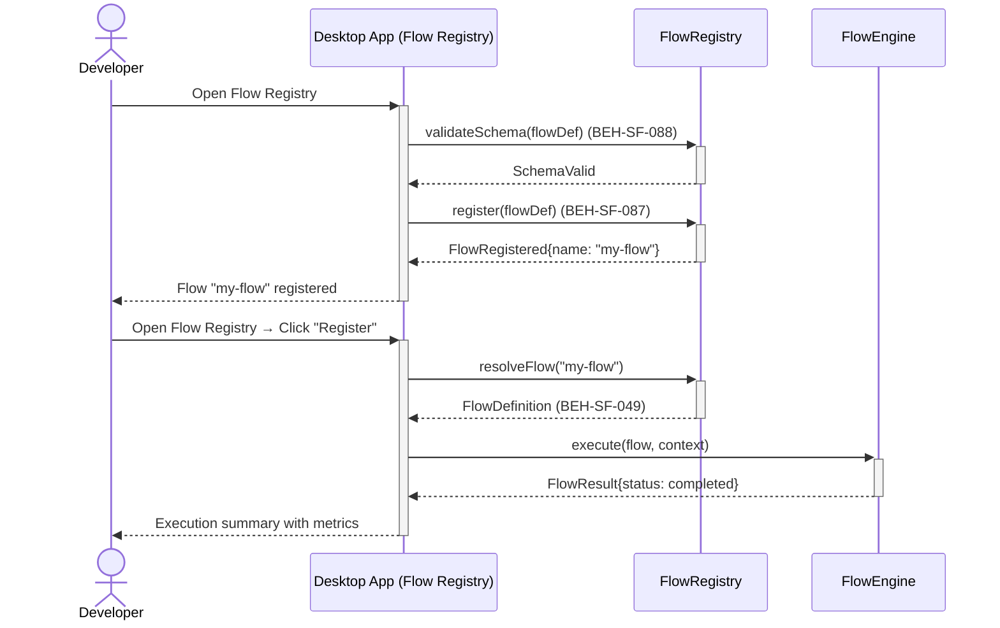
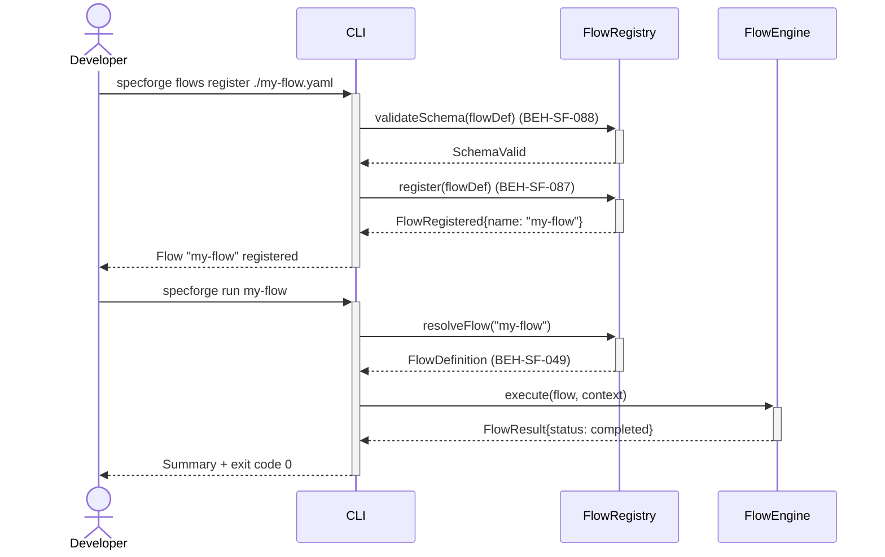

# Register and Run a Custom Flow

## Use Case

A developer opens the Flow Registry in the desktop app. They register the flow with SpecForge's hook pipeline, making it available alongside predefined flows. The same operation is accessible via CLI (`specforge flows register ./my-flow.yaml`) for scripted/CI workflows.

## Interaction Flow

### Desktop App

```text
┌───────────┐ ┌─────────────────┐ ┌────────────┐ ┌────────────┐
│ Developer │ │   Desktop App   │ │FlowRegistry│ │ FlowEngine │
└─────┬─────┘ └────────┬────────┘ └─────┬──────┘ └─────┬──────┘
      │           │           │              │
      │ flows register ./my-flow.yaml        │
      │──────────►│           │              │
      │           │ validateSchema(flowDef)  │
      │           │──────────►│              │
      │           │ SchemaValid              │
      │           │◄──────────│              │
      │           │ Open Flow(flowDef)        │
      │           │──────────►│              │
      │           │ FlowRegistered{"my-flow"}│
      │           │◄──────────│              │
      │ Flow "my-flow" registered            │
      │◄──────────│           │              │
      │           │           │              │
      │ run my-flow           │              │
      │──────────►│           │              │
      │           │ resolveFlow("my-flow")   │
      │           │──────────►│              │
      │           │ FlowDefinition           │
      │           │◄──────────│              │
      │           │ execute(flow, context)   │
      │           │──────────────────────────►│
      │           │ FlowResult{completed}    │
      │           │◄─────────────────────────│
      │           │           │              │
      │ Summary shown │              │
      │◄──────────│           │              │
      │           │           │              │
```



### CLI

```text
┌───────────┐ ┌─────┐ ┌────────────┐ ┌────────────┐
│ Developer │ │ CLI │ │FlowRegistry│ │ FlowEngine │
└─────┬─────┘ └──┬──┘ └─────┬──────┘ └─────┬──────┘
      │           │           │              │
      │ flows register ./my-flow.yaml        │
      │──────────►│           │              │
      │           │ validateSchema(flowDef)  │
      │           │──────────►│              │
      │           │ SchemaValid              │
      │           │◄──────────│              │
      │           │ register(flowDef)        │
      │           │──────────►│              │
      │           │ FlowRegistered{"my-flow"}│
      │           │◄──────────│              │
      │ Flow "my-flow" registered            │
      │◄──────────│           │              │
      │           │           │              │
      │ run my-flow           │              │
      │──────────►│           │              │
      │           │ resolveFlow("my-flow")   │
      │           │──────────►│              │
      │           │ FlowDefinition           │
      │           │◄──────────│              │
      │           │ execute(flow, context)   │
      │           │──────────────────────────►│
      │           │ FlowResult{completed}    │
      │           │◄─────────────────────────│
      │           │           │              │
      │ Summary + exit code 0 │              │
      │◄──────────│           │              │
      │           │           │              │
```



## Steps

1. Open the Flow Registry in the desktop app
2. Register the flow: `specforge flows register ./my-flow.yaml` (BEH-SF-087)
3. System validates the flow definition schema (BEH-SF-088)
4. Flow appears in `specforge flows list` output
5. Run the custom flow: `specforge run my-flow`
6. System resolves and executes it identically to predefined flows (BEH-SF-049)
7. Custom flow results are stored in the same history as predefined flows

## Traceability

| Behavior   | Feature     | Role in this capability                         |
| ---------- | ----------- | ----------------------------------------------- |
| BEH-SF-049 | FEAT-SF-004 | Flow definition resolution and registry         |
| BEH-SF-087 | FEAT-SF-011 | Extensibility hook for custom flow registration |
| BEH-SF-088 | FEAT-SF-011 | Schema validation for custom flow definitions   |
