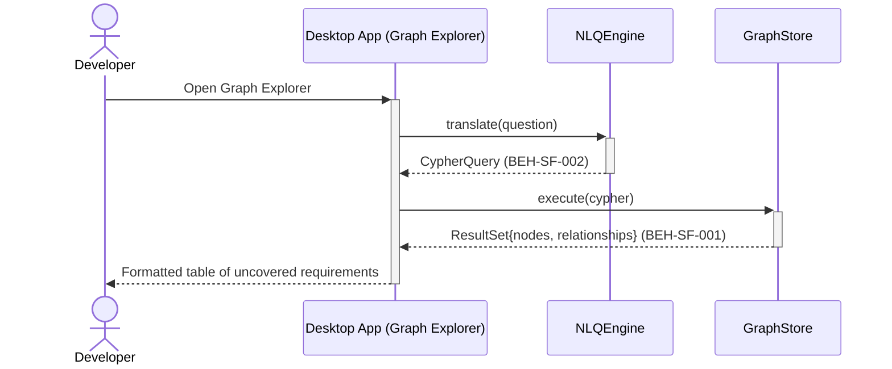
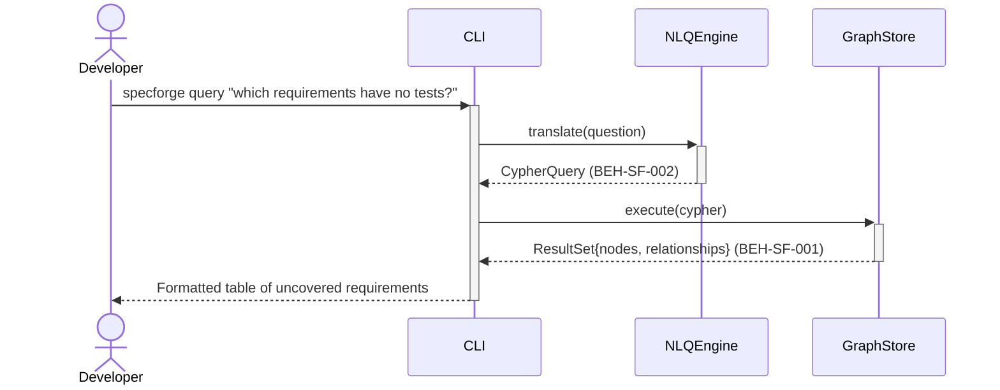

# Query Graph Using Natural Language

## Use Case

A developer opens the Graph Explorer in the desktop app. " or "show me all decisions related to authentication" — and the system translates it into a graph query, executes it against Neo4j, and returns structured results. This lowers the barrier for non-Cypher users to explore the knowledge graph. The same operation is accessible via CLI for scripted/CI workflows.

## Interaction Flow

### Desktop App

```text
┌───────────┐ ┌─────────────────┐ ┌───────────┐ ┌────────────┐
│ Developer │ │   Desktop App   │ │ NLQEngine │ │ GraphStore │
└─────┬─────┘ └────────┬────────┘ └─────┬─────┘ └─────┬──────┘
      │           │           │              │
      │ query "which requirements have no tests?"
      │──────────►│           │              │
      │           │ translate(question)      │
      │           │──────────►│              │
      │           │ CypherQuery              │
      │           │◄──────────│              │
      │           │ execute(cypher)          │
      │           │──────────────────────────►│
      │           │ ResultSet{nodes, rels}   │
      │           │◄─────────────────────────│
      │           │           │              │
      │ Formatted table of uncovered reqs    │
      │◄──────────│           │              │
      │           │           │              │
```



### CLI

```text
┌───────────┐ ┌─────┐ ┌───────────┐ ┌────────────┐
│ Developer │ │ CLI │ │ NLQEngine │ │ GraphStore │
└─────┬─────┘ └──┬──┘ └─────┬─────┘ └─────┬──────┘
      │           │           │              │
      │ query "which requirements have no tests?"
      │──────────►│           │              │
      │           │ translate(question)      │
      │           │──────────►│              │
      │           │ CypherQuery              │
      │           │◄──────────│              │
      │           │ execute(cypher)          │
      │           │──────────────────────────►│
      │           │ ResultSet{nodes, rels}   │
      │           │◄─────────────────────────│
      │           │           │              │
      │ Formatted table of uncovered reqs    │
      │◄──────────│           │              │
      │           │           │              │
```



## Steps

1. Open the Graph Explorer in the desktop app
2. NLQ engine parses the question and generates a Cypher query (BEH-SF-002)
3. Query executes against the knowledge graph (BEH-SF-001)
4. Results are formatted as a table, list, or graph snippet depending on surface
5. VS Code extension renders results inline in the editor panel (BEH-SF-139)
6. User can refine or follow up with additional questions

## Traceability

| Behavior   | Feature     | Role in this capability                  |
| ---------- | ----------- | ---------------------------------------- |
| BEH-SF-001 | FEAT-SF-001 | Graph store query execution              |
| BEH-SF-002 | FEAT-SF-022 | Natural language to Cypher translation   |
| BEH-SF-139 | FEAT-SF-022 | VS Code panel rendering of query results |
