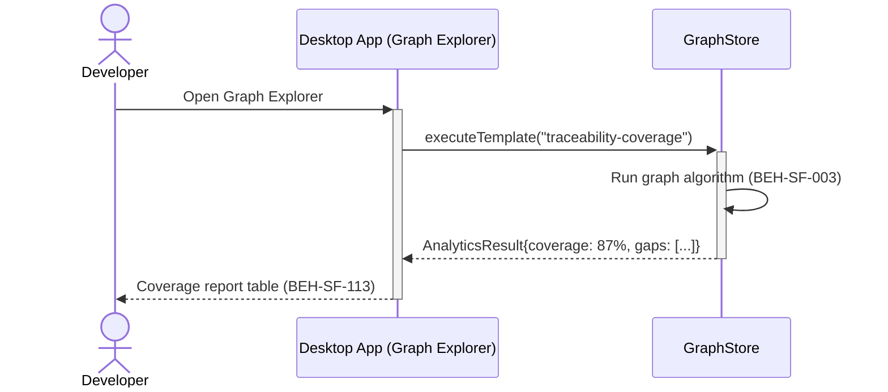
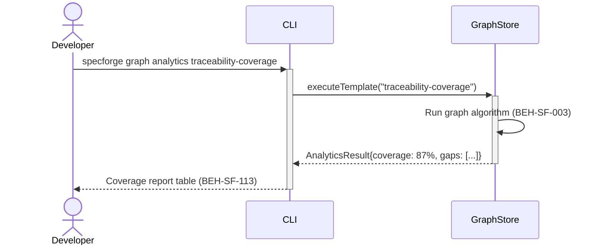

# Run Analytical Graph Queries

## Use Case

A developer opens the Graph Explorer in the desktop app. Unlike ad-hoc Cypher, these are predefined query templates (e.g., `traceability-coverage`, `orphan-requirements`, `dependency-depth`) that return formatted analytical results. The same operation is accessible via CLI (`specforge graph analytics list`) for scripted/CI workflows.

## Interaction Flow

### Desktop App

```text
┌───────────┐ ┌─────────────────┐ ┌────────────┐
│ Developer │ │   Desktop App   │ │ GraphStore │
└─────┬─────┘ └────────┬────────┘ └─────┬──────┘
      │           │           │
      │ graph analytics traceability-coverage
      │──────────►│           │
      │           │ executeTemplate(
      │           │   "traceability-coverage")
      │           │──────────►│
      │           │           │ Run graph algorithm
      │           │           │──┐
      │           │           │◄─┘
      │           │ AnalyticsResult{
      │           │   coverage: 87%, gaps}
      │           │◄──────────│
      │           │           │
      │ Coverage report table │
      │◄──────────│           │
      │           │           │
```



### CLI

```text
┌───────────┐ ┌─────┐ ┌────────────┐
│ Developer │ │ CLI │ │ GraphStore │
└─────┬─────┘ └──┬──┘ └─────┬──────┘
      │           │           │
      │ graph analytics traceability-coverage
      │──────────►│           │
      │           │ executeTemplate(
      │           │   "traceability-coverage")
      │           │──────────►│
      │           │           │ Run graph algorithm
      │           │           │──┐
      │           │           │◄─┘
      │           │ AnalyticsResult{
      │           │   coverage: 87%, gaps}
      │           │◄──────────│
      │           │           │
      │ Coverage report table │
      │◄──────────│           │
      │           │           │
```



## Steps

1. Open the Graph Explorer in the desktop app
2. Run an analytical query: `specforge graph analytics traceability-coverage`
3. System executes the predefined query template against Neo4j (BEH-SF-001)
4. Results are computed with graph algorithms (BEH-SF-003)
5. CLI formats output as table, summary statistics, or exportable report (BEH-SF-113)
6. Developer uses results to identify gaps or prioritize work

## Traceability

| Behavior   | Feature     | Role in this capability                         |
| ---------- | ----------- | ----------------------------------------------- |
| BEH-SF-001 | FEAT-SF-001 | Graph store query execution                     |
| BEH-SF-003 | FEAT-SF-001 | Analytical query templates and graph algorithms |
| BEH-SF-113 | FEAT-SF-009 | CLI command and formatted output                |
