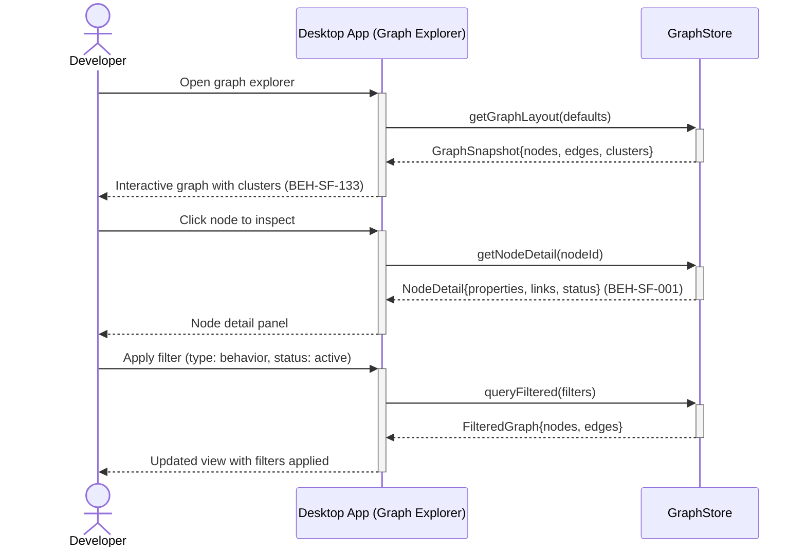

# Explore Graph Visually

## Use Case

A developer opens the Graph Explorer in the desktop app. Nodes represent requirements, decisions, behaviors, and tests; edges show relationships like "traces to", "implements", and "depends on". The visual explorer supports zoom, filter, cluster, and click-to-inspect interactions.

## Interaction Flow

```text
┌───────────┐     ┌───────────┐     ┌────────────┐
│ Developer │     │ Desktop App │     │ GraphStore │
└─────┬─────┘     └─────┬─────┘     └──────┬─────┘
      │ Open graph      │                   │
      │ explorer        │                   │
      │────────────────►│                   │
      │                 │ getGraphLayout()  │
      │                 │──────────────────►│
      │                 │  GraphSnapshot    │
      │                 │◄──────────────────│
      │ Interactive     │                   │
      │ graph (133)     │                   │
      │◄────────────────│                   │
      │                 │                   │
      │ Click node      │                   │
      │────────────────►│                   │
      │                 │ getNodeDetail()   │
      │                 │──────────────────►│
      │                 │  NodeDetail (001) │
      │                 │◄──────────────────│
      │ Node detail     │                   │
      │◄────────────────│                   │
      │                 │                   │
      │ Apply filter    │                   │
      │────────────────►│                   │
      │                 │ queryFiltered()   │
      │                 │──────────────────►│
      │                 │  FilteredGraph    │
      │                 │◄──────────────────│
      │ Updated view    │                   │
      │◄────────────────│                   │
      │                 │                   │
```



## Steps

1. Open the desktop app graph explorer
2. View the default graph layout showing top-level node clusters (BEH-SF-133)
3. Zoom into a cluster to see individual nodes and relationships
4. Click a node to inspect its properties, linked artifacts, and status (BEH-SF-001)
5. Apply filters (by type, status, roadmap phase) to focus the view
6. Desktop app provides hardware-accelerated rendering for large graphs (BEH-SF-273)
7. Save a view as a bookmark for quick access later

## Traceability

| Behavior   | Feature     | Role in this capability                       |
| ---------- | ----------- | --------------------------------------------- |
| BEH-SF-001 | FEAT-SF-001 | Graph data retrieval and traversal            |
| BEH-SF-133 | FEAT-SF-007 | Dashboard graph visualization and interaction |
| BEH-SF-273 | FEAT-SF-006 | Desktop app accelerated graph rendering       |
