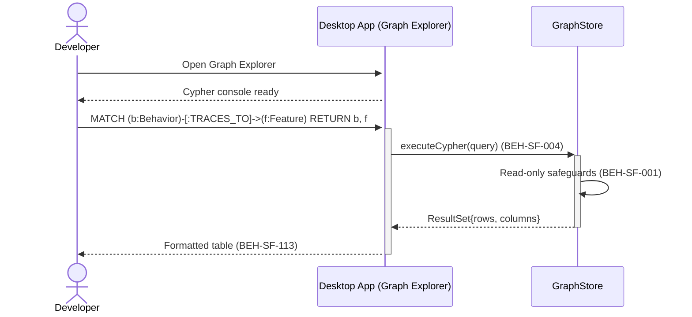
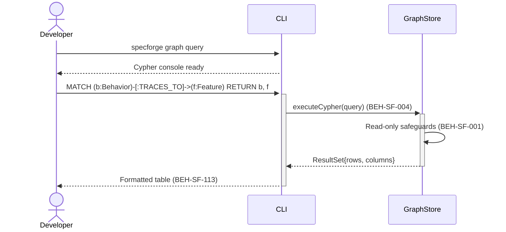

# Run Ad-Hoc Cypher Queries

## Use Case

A developer opens the Graph Explorer in the desktop app. This is the power-user interface for those comfortable with Cypher syntax who need full query flexibility beyond predefined templates and NLQ. The same operation is accessible via CLI (`specforge graph query`) for scripted/CI workflows.

## Interaction Flow

### Desktop App

```text
┌───────────┐     ┌─────────────────┐     ┌────────────┐
│ Developer │     │   Desktop App   │     │ GraphStore │
└─────┬─────┘     └────────┬────────┘     └──────┬─────┘
      │ Open Graph Explorer
```



### CLI

```text
┌───────────┐     ┌─────┐     ┌────────────┐
│ Developer │     │ CLI │     │ GraphStore │
└─────┬─────┘     └──┬──┘     └──────┬─────┘
      │ specforge     │               │
      │ graph query   │               │
      │──────────────►│               │
      │ Cypher console│               │
      │◄──────────────│               │
      │               │               │
      │ MATCH (b:...) │               │
      │──────────────►│               │
      │               │ executeCypher()│
      │               │ (004)         │
      │               │──────────────►│
      │               │               │─┐ Read-only
      │               │               │ │ safeguards
      │               │               │◄┘ (001)
      │               │  ResultSet    │
      │               │◄──────────────│
      │ Formatted     │               │
      │ table (113)   │               │
      │◄──────────────│               │
      │               │               │
```



## Steps

1. Open the Graph Explorer in the desktop app
2. Write a Cypher query (e.g., `MATCH (b:Behavior)-[:TRACES_TO]->(f:Feature) RETURN b, f`)
3. Submit the query for execution (BEH-SF-004)
4. System executes against Neo4j with read-only safeguards (BEH-SF-001)
5. Results render as table in CLI (BEH-SF-113) or interactive graph in VS Code (BEH-SF-139)
6. Query history is saved for reuse

## Traceability

| Behavior   | Feature     | Role in this capability                   |
| ---------- | ----------- | ----------------------------------------- |
| BEH-SF-001 | FEAT-SF-001 | Graph store query execution               |
| BEH-SF-004 | FEAT-SF-001 | Ad-hoc Cypher query handling              |
| BEH-SF-113 | FEAT-SF-009 | CLI Cypher console                        |
| BEH-SF-139 | FEAT-SF-008 | VS Code Cypher panel and result rendering |
