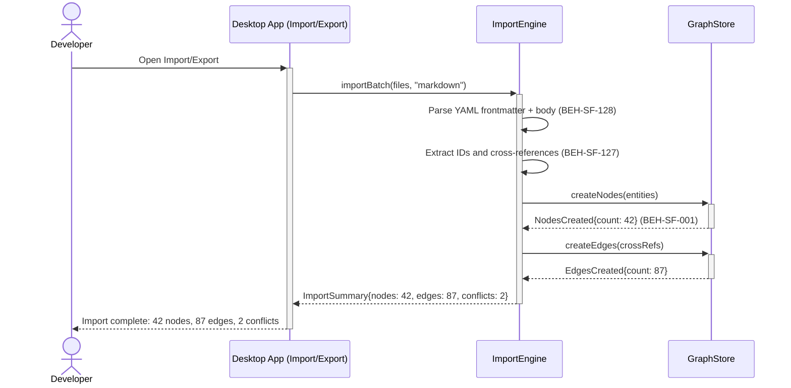
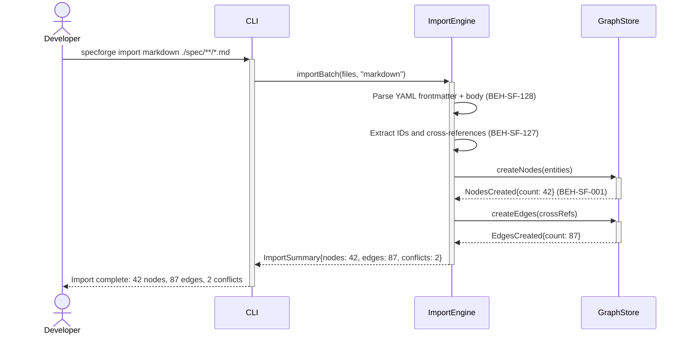

# Import Markdown Specs into Graph

## Use Case

A developer opens the Import/Export in the desktop app. The import adapter parses frontmatter, extracts IDs and cross-references, and creates graph nodes with proper relationships. This bootstraps the graph from legacy filesystem-based specs. The same operation is accessible via CLI (`specforge import markdown ./spec/**/*.md`) for scripted/CI workflows.

## Interaction Flow

### Desktop App

```text
┌───────────┐  ┌─────────────────┐  ┌──────────────┐  ┌────────────┐
│ Developer │  │   Desktop App   │  │ ImportEngine │  │ GraphStore │
└─────┬─────┘  └────────┬────────┘  └──────┬───────┘  └──────┬─────┘
      │ import     │            │                  │
      │ markdown   │            │                  │
      │───────────►│            │                  │
      │            │ importBatch│                  │
      │            │───────────►│                  │
      │            │            │─┐ Parse YAML     │
      │            │            │ │ frontmatter    │
      │            │            │◄┘ (128)          │
      │            │            │─┐ Extract IDs    │
      │            │            │ │ & cross-refs   │
      │            │            │◄┘ (127)          │
      │            │            │ createNodes()    │
      │            │            │─────────────────►│
      │            │            │ NodesCreated (001)│
      │            │            │◄─────────────────│
      │            │            │ createEdges()    │
      │            │            │─────────────────►│
      │            │            │ EdgesCreated     │
      │            │            │◄─────────────────│
      │            │ ImportSummary                  │
      │            │◄───────────│                  │
      │ 42 nodes,  │            │                  │
      │ 87 edges   │            │                  │
      │◄───────────│            │                  │
      │            │            │                  │
```



### CLI

```text
┌───────────┐  ┌─────┐  ┌──────────────┐  ┌────────────┐
│ Developer │  │ CLI │  │ ImportEngine │  │ GraphStore │
└─────┬─────┘  └──┬──┘  └──────┬───────┘  └──────┬─────┘
      │ import     │            │                  │
      │ markdown   │            │                  │
      │───────────►│            │                  │
      │            │ importBatch│                  │
      │            │───────────►│                  │
      │            │            │─┐ Parse YAML     │
      │            │            │ │ frontmatter    │
      │            │            │◄┘ (128)          │
      │            │            │─┐ Extract IDs    │
      │            │            │ │ & cross-refs   │
      │            │            │◄┘ (127)          │
      │            │            │ createNodes()    │
      │            │            │─────────────────►│
      │            │            │ NodesCreated (001)│
      │            │            │◄─────────────────│
      │            │            │ createEdges()    │
      │            │            │─────────────────►│
      │            │            │ EdgesCreated     │
      │            │            │◄─────────────────│
      │            │ ImportSummary                  │
      │            │◄───────────│                  │
      │ 42 nodes,  │            │                  │
      │ 87 edges   │            │                  │
      │◄───────────│            │                  │
      │            │            │                  │
```



## Steps

1. Open the Import/Export in the desktop app
2. Import adapter parses each file's YAML frontmatter and body (BEH-SF-128)
3. Nodes are created for each identified entity (requirement, decision, behavior)
4. Cross-references (e.g., `BEH-SF-057`) are resolved into graph edges (BEH-SF-127)
5. Conflicts with existing graph nodes are reported for resolution
6. Graph is updated with imported content (BEH-SF-001)
7. CLI displays import summary: nodes created, edges created, conflicts

## Traceability

| Behavior   | Feature     | Role in this capability                |
| ---------- | ----------- | -------------------------------------- |
| BEH-SF-127 | FEAT-SF-012 | Import pipeline orchestration          |
| BEH-SF-128 | FEAT-SF-012 | Markdown parsing and entity extraction |
| BEH-SF-001 | FEAT-SF-001 | Graph node and edge creation           |
