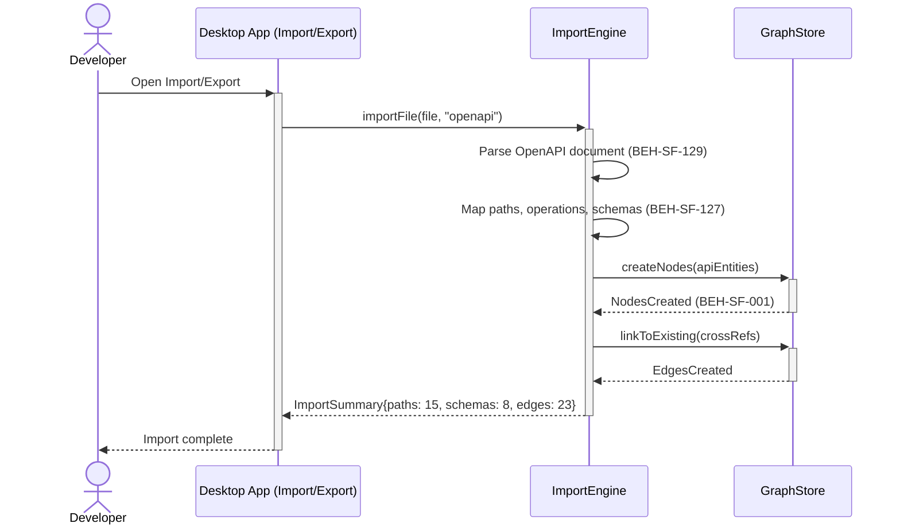
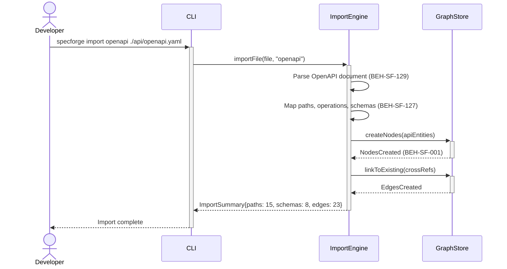

# Import OpenAPI Specs into Graph

## Use Case

A developer opens the Import/Export in the desktop app. This enables graph-based analysis of API contracts alongside requirements and behaviors — for example, finding which requirements are covered by which endpoints. The same operation is accessible via CLI (`specforge import openapi ./api/openapi.yaml`) for scripted/CI workflows.

## Interaction Flow

### Desktop App

```text
┌───────────┐  ┌─────────────────┐  ┌──────────────┐  ┌────────────┐
│ Developer │  │   Desktop App   │  │ ImportEngine │  │ GraphStore │
└─────┬─────┘  └────────┬────────┘  └──────┬───────┘  └──────┬─────┘
      │ import     │            │                  │
      │ openapi    │            │                  │
      │───────────►│            │                  │
      │            │ importFile │                  │
      │            │───────────►│                  │
      │            │            │─┐ Parse OpenAPI  │
      │            │            │ │ doc (129)      │
      │            │            │◄┘                │
      │            │            │─┐ Map paths,     │
      │            │            │ │ schemas (127)  │
      │            │            │◄┘                │
      │            │            │ createNodes()    │
      │            │            │─────────────────►│
      │            │            │ NodesCreated(001)│
      │            │            │◄─────────────────│
      │            │            │ linkToExisting() │
      │            │            │─────────────────►│
      │            │            │ EdgesCreated     │
      │            │            │◄─────────────────│
      │            │ ImportSummary                  │
      │            │◄───────────│                  │
      │ Import     │            │                  │
      │ complete   │            │                  │
      │◄───────────│            │                  │
      │            │            │                  │
```



### CLI

```text
┌───────────┐  ┌─────┐  ┌──────────────┐  ┌────────────┐
│ Developer │  │ CLI │  │ ImportEngine │  │ GraphStore │
└─────┬─────┘  └──┬──┘  └──────┬───────┘  └──────┬─────┘
      │ import     │            │                  │
      │ openapi    │            │                  │
      │───────────►│            │                  │
      │            │ importFile │                  │
      │            │───────────►│                  │
      │            │            │─┐ Parse OpenAPI  │
      │            │            │ │ doc (129)      │
      │            │            │◄┘                │
      │            │            │─┐ Map paths,     │
      │            │            │ │ schemas (127)  │
      │            │            │◄┘                │
      │            │            │ createNodes()    │
      │            │            │─────────────────►│
      │            │            │ NodesCreated(001)│
      │            │            │◄─────────────────│
      │            │            │ linkToExisting() │
      │            │            │─────────────────►│
      │            │            │ EdgesCreated     │
      │            │            │◄─────────────────│
      │            │ ImportSummary                  │
      │            │◄───────────│                  │
      │ Import     │            │                  │
      │ complete   │            │                  │
      │◄───────────│            │                  │
      │            │            │                  │
```



## Steps

1. Open the Import/Export in the desktop app
2. Import adapter parses the OpenAPI document (BEH-SF-129)
3. Nodes are created for paths, operations, schemas, and parameters
4. Relationships link API entities to existing graph nodes where references match (BEH-SF-127)
5. Graph is updated with the imported API model (BEH-SF-001)
6. CLI displays import summary with entity counts and relationship mappings

## Traceability

| Behavior   | Feature     | Role in this capability              |
| ---------- | ----------- | ------------------------------------ |
| BEH-SF-127 | FEAT-SF-012 | Import pipeline orchestration        |
| BEH-SF-129 | FEAT-SF-012 | OpenAPI document parsing             |
| BEH-SF-001 | FEAT-SF-001 | Graph node creation for API entities |
