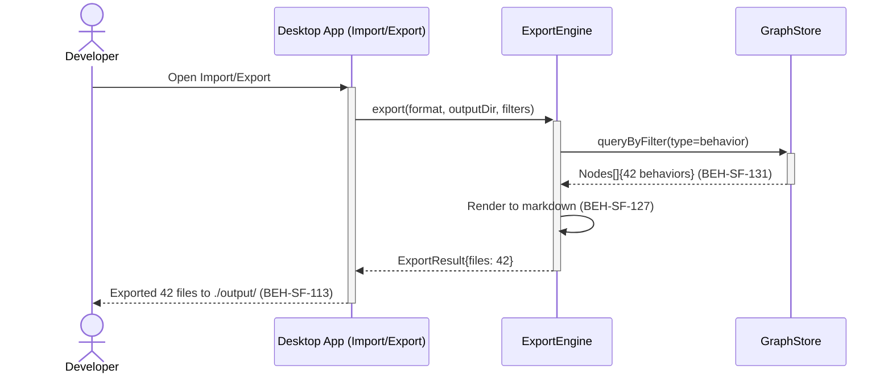
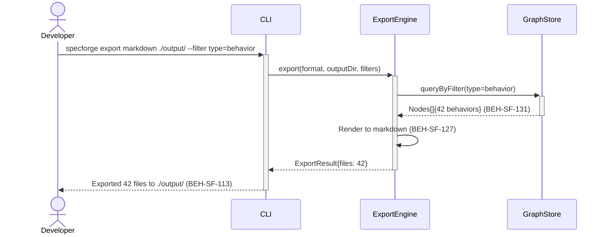

# Export Graph Content to Files

## Use Case

A developer opens the Import/Export in the desktop app. This supports offline review, external tool integration, and version-controlled artifacts. The same operation is accessible via CLI (`specforge export markdown ./output/ --filter type=behavior`) for scripted/CI workflows.

## Interaction Flow

### Desktop App

```text
┌───────────┐  ┌─────────────────┐  ┌──────────────┐  ┌────────────┐
│ Developer │  │   Desktop App   │  │ ExportEngine │  │ GraphStore │
└─────┬─────┘  └────────┬────────┘  └──────┬───────┘  └──────┬─────┘
      │ export     │            │                  │
      │ markdown   │            │                  │
      │───────────►│            │                  │
      │            │ export()   │                  │
      │            │───────────►│                  │
      │            │            │ queryByFilter()  │
      │            │            │─────────────────►│
      │            │            │ 42 behaviors     │
      │            │            │ (131)            │
      │            │            │◄─────────────────│
      │            │            │─┐ Render to      │
      │            │            │ │ markdown (127) │
      │            │            │◄┘                │
      │            │ ExportResult                   │
      │            │◄───────────│                  │
      │ Exported   │            │                  │
      │ 42 files   │            │                  │
      │ (113)      │            │                  │
      │◄───────────│            │                  │
      │            │            │                  │
```



### CLI

```text
┌───────────┐  ┌─────┐  ┌──────────────┐  ┌────────────┐
│ Developer │  │ CLI │  │ ExportEngine │  │ GraphStore │
└─────┬─────┘  └──┬──┘  └──────┬───────┘  └──────┬─────┘
      │ export     │            │                  │
      │ markdown   │            │                  │
      │───────────►│            │                  │
      │            │ export()   │                  │
      │            │───────────►│                  │
      │            │            │ queryByFilter()  │
      │            │            │─────────────────►│
      │            │            │ 42 behaviors     │
      │            │            │ (131)            │
      │            │            │◄─────────────────│
      │            │            │─┐ Render to      │
      │            │            │ │ markdown (127) │
      │            │            │◄┘                │
      │            │ ExportResult                   │
      │            │◄───────────│                  │
      │ Exported   │            │                  │
      │ 42 files   │            │                  │
      │ (113)      │            │                  │
      │◄───────────│            │                  │
      │            │            │                  │
```



## Steps

1. Open the Import/Export in the desktop app
2. System queries the graph for matching nodes (BEH-SF-131)
3. Export adapter renders each node into the target format (BEH-SF-127)
4. Files are written to the specified output directory
5. CLI displays export summary: files created, total nodes exported (BEH-SF-113)
6. Developer can commit exported files to version control

## Traceability

| Behavior   | Feature     | Role in this capability          |
| ---------- | ----------- | -------------------------------- |
| BEH-SF-127 | FEAT-SF-012 | Export pipeline orchestration    |
| BEH-SF-131 | FEAT-SF-012 | Format-specific export rendering |
| BEH-SF-113 | FEAT-SF-012 | CLI export command and output    |
