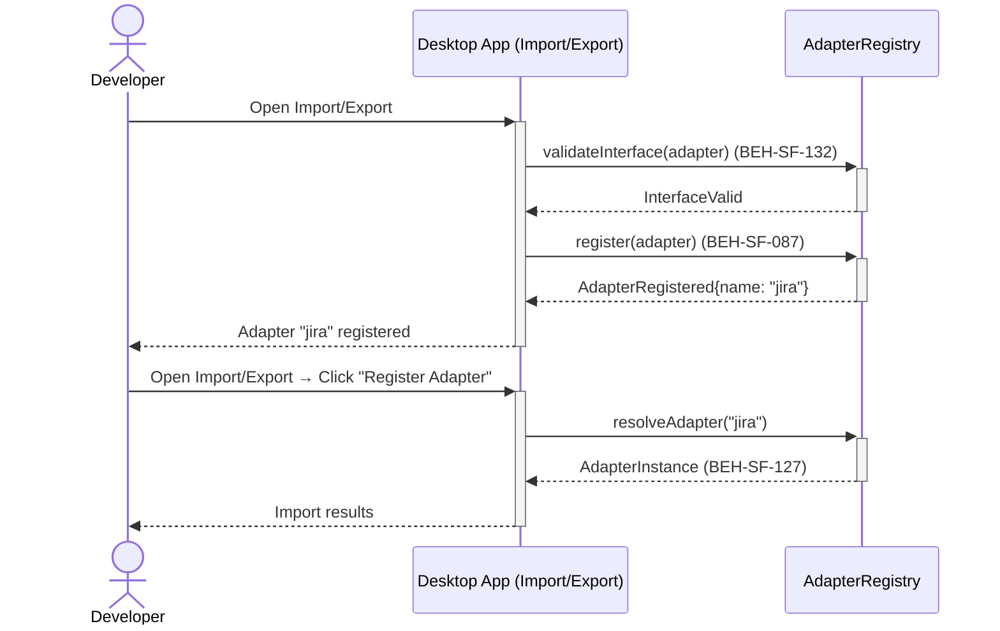
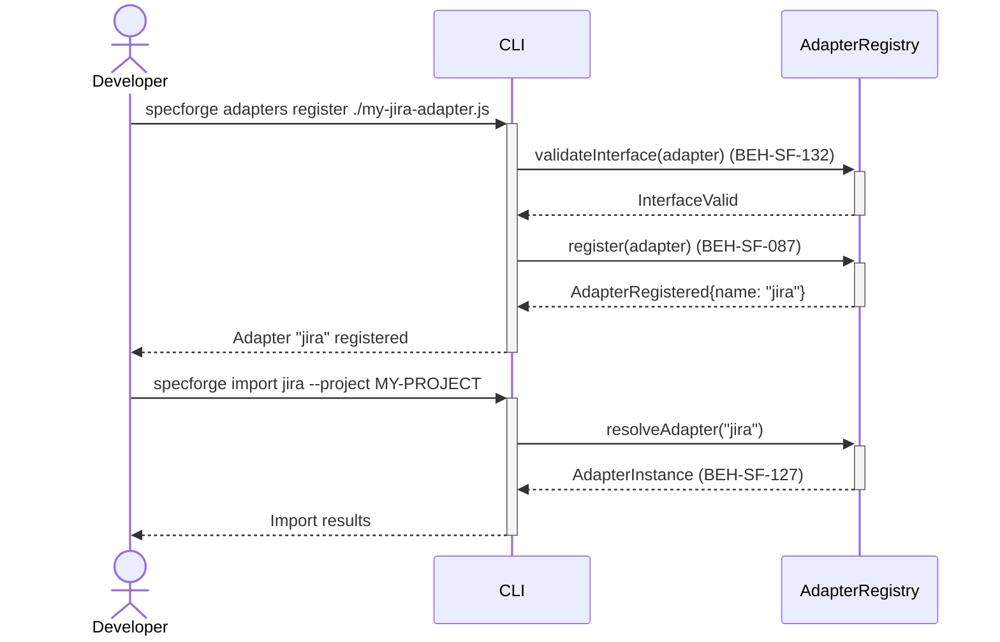

# Register Custom Import/Export Adapters

## Use Case

A developer opens the Import/Export in the desktop app. Custom adapters plug into the same pipeline as built-in ones, enabling seamless integration with team-specific tools. The same operation is accessible via CLI (`specforge adapters register ./my-jira-adapter.js`) for scripted/CI workflows.

## Interaction Flow

### Desktop App

```text
┌───────────┐  ┌─────────────────┐  ┌─────────────────┐
│ Developer │  │   Desktop App   │  │ AdapterRegistry │
└─────┬─────┘  └────────┬────────┘  └────────┬────────┘
      │ adapters   │              │
      │ register   │              │
      │───────────►│              │
      │            │ validate     │
      │            │ Interface()  │
      │            │ (132)        │
      │            │─────────────►│
      │            │ InterfaceValid│
      │            │◄─────────────│
      │            │ register()   │
      │            │ (087)        │
      │            │─────────────►│
      │            │ Registered   │
      │            │◄─────────────│
      │ Adapter    │              │
      │ "jira"     │              │
      │ registered │              │
      │◄───────────│              │
      │            │              │
      │ import jira│              │
      │───────────►│              │
      │            │ resolve      │
      │            │ Adapter()    │
      │            │─────────────►│
      │            │ Instance(127)│
      │            │◄─────────────│
      │ Import     │              │
      │ results    │              │
      │◄───────────│              │
      │            │              │
```



### CLI

```text
┌───────────┐  ┌─────┐  ┌─────────────────┐
│ Developer │  │ CLI │  │ AdapterRegistry │
└─────┬─────┘  └──┬──┘  └────────┬────────┘
      │ adapters   │              │
      │ register   │              │
      │───────────►│              │
      │            │ validate     │
      │            │ Interface()  │
      │            │ (132)        │
      │            │─────────────►│
      │            │ InterfaceValid│
      │            │◄─────────────│
      │            │ register()   │
      │            │ (087)        │
      │            │─────────────►│
      │            │ Registered   │
      │            │◄─────────────│
      │ Adapter    │              │
      │ "jira"     │              │
      │ registered │              │
      │◄───────────│              │
      │            │              │
      │ import jira│              │
      │───────────►│              │
      │            │ resolve      │
      │            │ Adapter()    │
      │            │─────────────►│
      │            │ Instance(127)│
      │            │◄─────────────│
      │ Import     │              │
      │ results    │              │
      │◄───────────│              │
      │            │              │
```



## Steps

1. Open the Import/Export in the desktop app
2. Register the adapter: `specforge adapters register ./my-jira-adapter.js` (BEH-SF-087)
3. System validates the adapter conforms to the required interface (BEH-SF-132)
4. Adapter appears in `specforge import --list-adapters` and `specforge export --list-adapters`
5. Use the adapter: `specforge import jira --project MY-PROJECT` (BEH-SF-127)
6. Custom adapter participates in the standard import/export pipeline

## Traceability

| Behavior   | Feature     | Role in this capability                |
| ---------- | ----------- | -------------------------------------- |
| BEH-SF-127 | FEAT-SF-012 | Import/export pipeline integration     |
| BEH-SF-132 | FEAT-SF-012 | Adapter interface validation           |
| BEH-SF-087 | FEAT-SF-011 | Hook pipeline for adapter registration |
