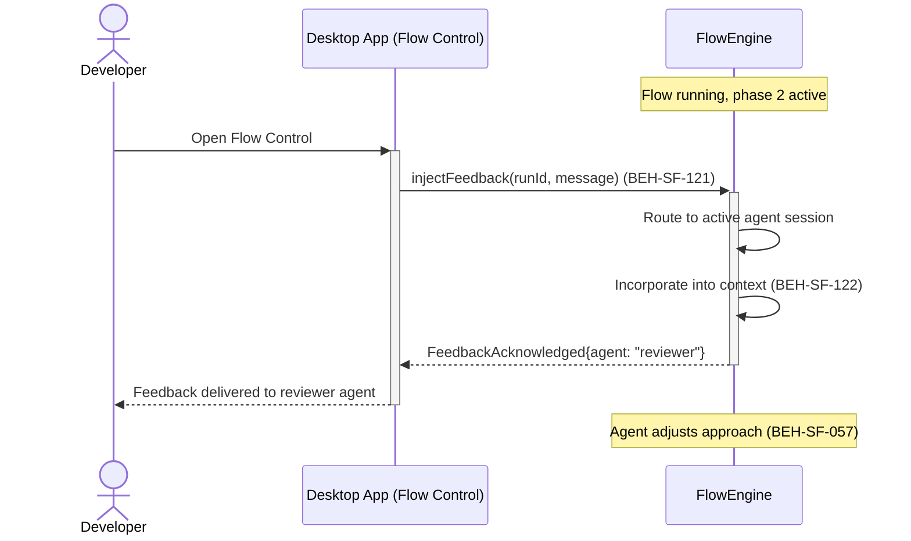
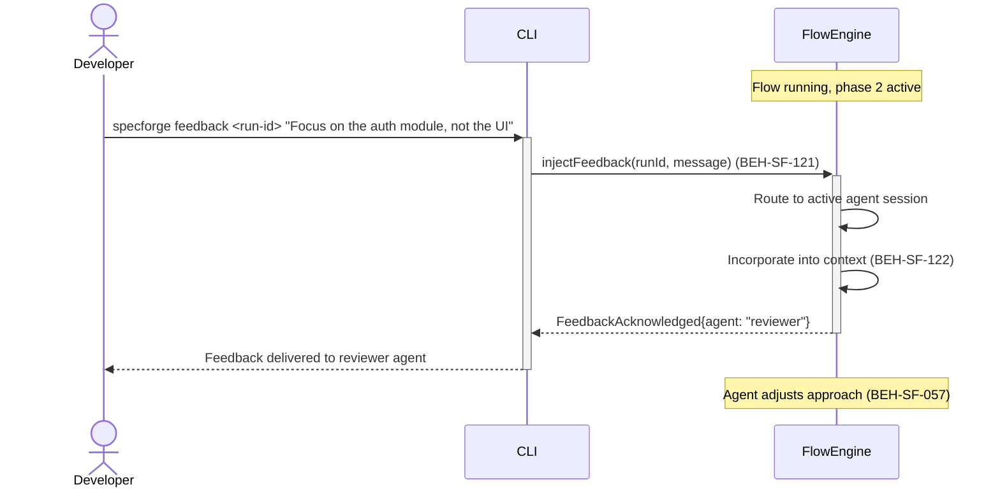

# Inject Feedback into a Running Flow

## Use Case

A developer opens the Flow Control in the desktop app to provide real. The feedback is injected into the active session's context and influences subsequent agent turns. The same operation is accessible via CLI (`specforge feedback <run-id> "Focus on the auth module, not the UI"`) for scripted/CI workflows.

## Interaction Flow

### Desktop App

```text
┌───────────┐  ┌─────────────────┐  ┌────────────┐
│ Developer │  │   Desktop App   │  │ FlowEngine │
└─────┬─────┘  └────────┬────────┘  └──────┬─────┘
      │            │    [Flow running,│
      │            │     phase 2 active]
      │ Open Flow Control
```



### CLI

```text
┌───────────┐  ┌─────┐  ┌────────────┐
│ Developer │  │ CLI │  │ FlowEngine │
└─────┬─────┘  └──┬──┘  └──────┬─────┘
      │            │    [Flow running,│
      │            │     phase 2 active]
      │ specforge  │            │
      │ feedback   │            │
      │───────────►│            │
      │            │ inject     │
      │            │ Feedback() │
      │            │ (121)      │
      │            │───────────►│
      │            │            │─┐ Route to
      │            │            │ │ active agent
      │            │            │◄┘
      │            │            │─┐ Incorporate
      │            │            │ │ into ctx (122)
      │            │            │◄┘
      │            │ Feedback   │
      │            │ Acknowledged│
      │            │◄───────────│
      │ Delivered  │            │
      │ to reviewer│            │
      │◄───────────│            │
      │            │  [Agent adjusts
      │            │   approach (057)]
      │            │            │
```



## Steps

1. Open the Flow Control in the desktop app
2. Inject feedback: `specforge feedback <run-id> "Focus on the auth module, not the UI"`
3. System routes the feedback to the appropriate agent session (BEH-SF-121)
4. Feedback is incorporated into the agent's context for the next turn (BEH-SF-122)
5. Flow execution continues with the adjusted direction (BEH-SF-057)
6. Feedback injection is logged in the session audit trail

## Traceability

| Behavior   | Feature     | Role in this capability                   |
| ---------- | ----------- | ----------------------------------------- |
| BEH-SF-121 | FEAT-SF-018 | Human feedback routing to active sessions |
| BEH-SF-122 | FEAT-SF-018 | Feedback incorporation into agent context |
| BEH-SF-057 | FEAT-SF-004 | Flow execution with adjusted context      |
