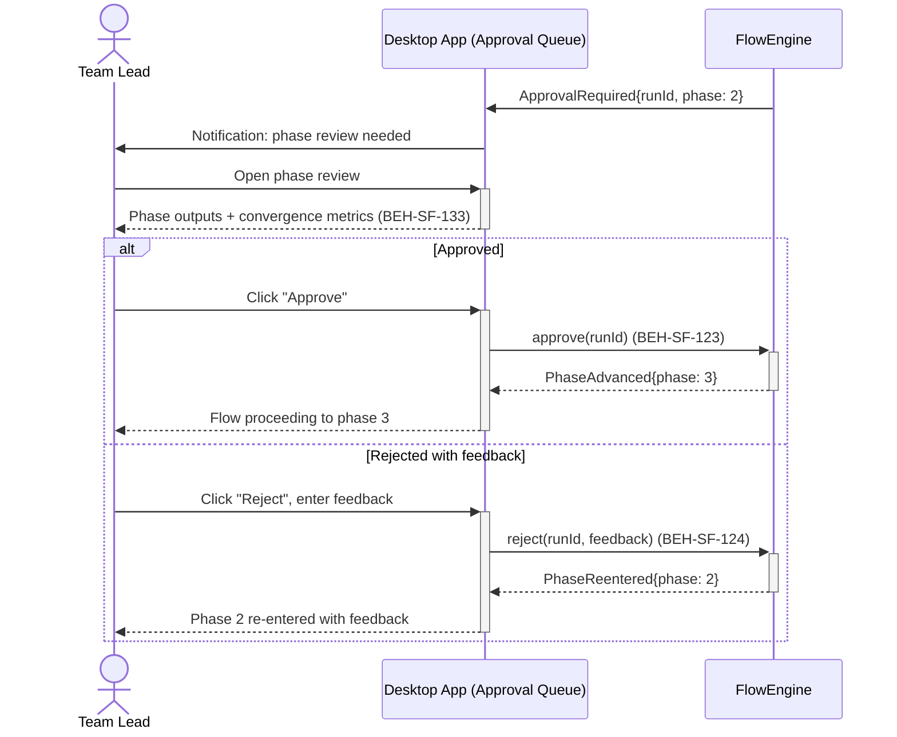
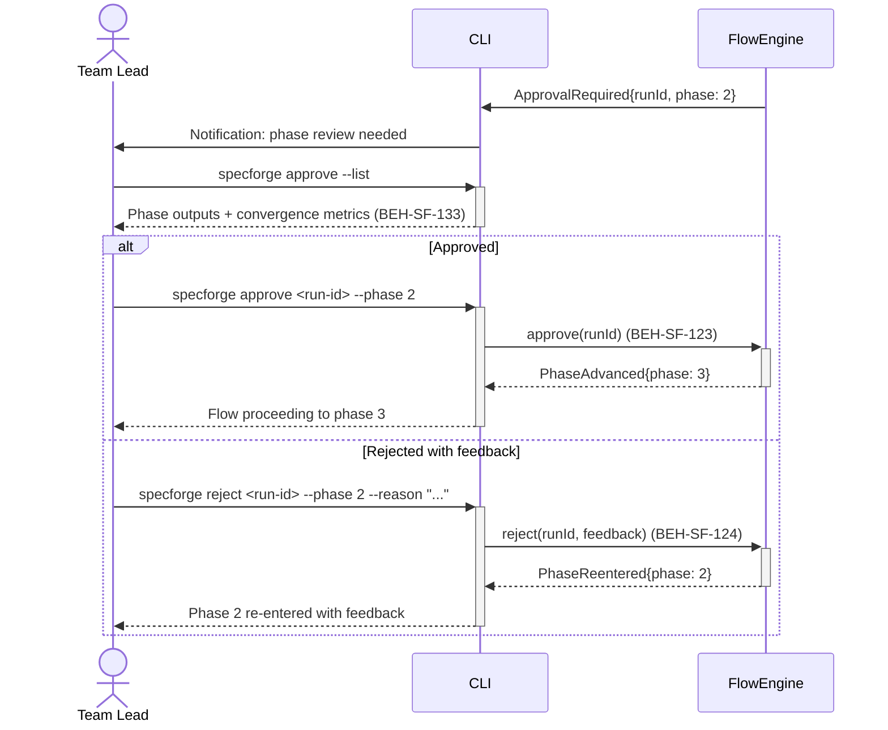
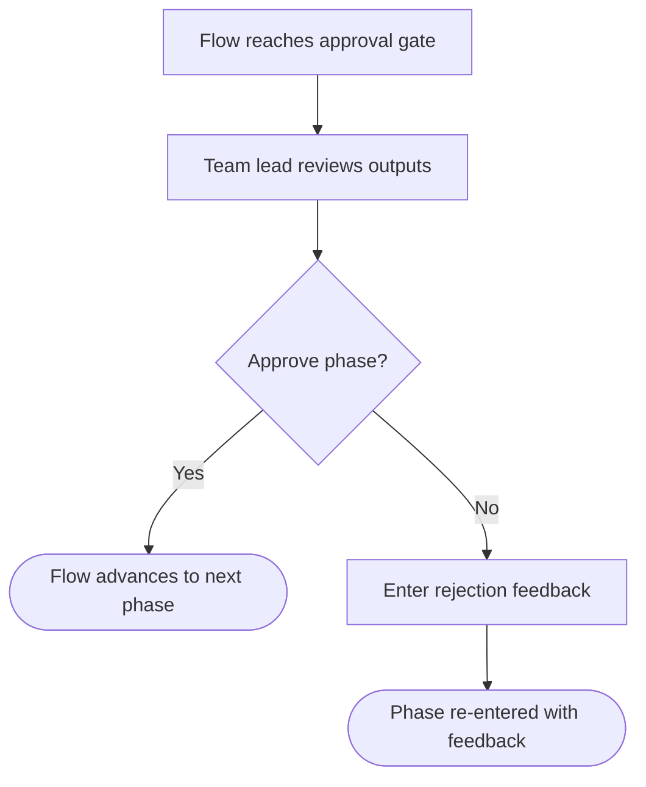

# Approve or Reject a Phase Transition

## Use Case

A team lead opens the Approval Queue in the desktop app to approve or reject a phase transition. The same operation is accessible via CLI (`specforge approve <run-id>`) for scripted/CI workflows.

## Interaction Flow

### Desktop App

```text
┌───────────┐     ┌───────────┐     ┌────────────┐
│ Team Lead │     │   Desktop App   │     │ FlowEngine │
└─────┬─────┘     └─────┬─────┘     └──────┬─────┘
      │                 │  ApprovalRequired │
      │                 │◄─────────────────│
      │ Notification:   │                  │
      │ review needed   │                  │
      │◄────────────────│                  │
      │                 │                  │
      │ Open phase      │                  │
      │ review          │                  │
      │────────────────►│                  │
      │ Phase outputs + │                  │
      │ metrics (133)   │                  │
      │◄────────────────│                  │
      │                 │                  │
      │  [if Approved]  │                  │
      │ Click "Approve" │                  │
      │────────────────►│                  │
      │                 │ approve() (123)  │
      │                 │─────────────────►│
      │                 │ PhaseAdvanced{3} │
      │                 │◄─────────────────│
      │ Proceeding to   │                  │
      │ phase 3         │                  │
      │◄────────────────│                  │
      │                 │                  │
      │  [else Rejected]│                  │
      │ Click "Reject"  │                  │
      │────────────────►│                  │
      │                 │ reject() (124)   │
      │                 │─────────────────►│
      │                 │ PhaseReentered{2}│
      │                 │◄─────────────────│
      │ Phase 2         │                  │
      │ re-entered      │                  │
      │◄────────────────│                  │
      │                 │                  │
```



### CLI

```text
┌───────────┐     ┌───────────┐     ┌────────────┐
│ Team Lead │     │ CLI │     │ FlowEngine │
└─────┬─────┘     └─────┬─────┘     └──────┬─────┘
      │                 │  ApprovalRequired │
      │                 │◄─────────────────│
      │ Notification:   │                  │
      │ review needed   │                  │
      │◄────────────────│                  │
      │                 │                  │
      │ Open phase      │                  │
      │ review          │                  │
      │────────────────►│                  │
      │ Phase outputs + │                  │
      │ metrics (133)   │                  │
      │◄────────────────│                  │
      │                 │                  │
      │  [if Approved]  │                  │
      │ Click "Approve" │                  │
      │────────────────►│                  │
      │                 │ approve() (123)  │
      │                 │─────────────────►│
      │                 │ PhaseAdvanced{3} │
      │                 │◄─────────────────│
      │ Proceeding to   │                  │
      │ phase 3         │                  │
      │◄────────────────│                  │
      │                 │                  │
      │  [else Rejected]│                  │
      │ Click "Reject"  │                  │
      │────────────────►│                  │
      │                 │ reject() (124)   │
      │                 │─────────────────►│
      │                 │ PhaseReentered{2}│
      │                 │◄─────────────────│
      │ Phase 2         │                  │
      │ re-entered      │                  │
      │◄────────────────│                  │
      │                 │                  │
```



## Steps

1. Open the Approval Queue in the desktop app
2. Team lead receives notification via CLI prompt or dashboard alert
3. Review the phase's outputs, agent findings, and convergence metrics (BEH-SF-133)
4. Approve: `specforge approve <run-id>` (flow proceeds to next phase) (BEH-SF-123)
5. Or reject with feedback: `specforge reject <run-id> "Insufficient coverage analysis"` (BEH-SF-124)
6. On rejection, flow re-enters the phase with the feedback as additional context
7. Approval/rejection decision is recorded in the audit trail

## Decision Paths

```text
┌─────────────────────────────┐
│ Flow reaches approval gate  │
└──────────────┬──────────────┘
               ▼
┌─────────────────────────────┐
│ Team lead reviews outputs   │
└──────────────┬──────────────┘
               ▼
         ╱ Approve  ╲
        ╱   phase?   ╲
       ╱               ╲
   Yes ╲               ╱ No
        ╲             ╱
    ┌────▼────┐  ┌────▼──────────────────┐
    │ Flow    │  │ Enter rejection       │
    │ advances│  │ feedback              │
    │ to next │  └───────────┬───────────┘
    │ phase   │              ▼
    └─────────┘  ┌───────────────────────┐
                 │ Phase re-entered      │
                 │ with feedback         │
                 └───────────────────────┘
```



## Traceability

| Behavior   | Feature     | Role in this capability                       |
| ---------- | ----------- | --------------------------------------------- |
| BEH-SF-123 | FEAT-SF-018 | Approval gate mechanics and phase advancement |
| BEH-SF-124 | FEAT-SF-018 | Rejection handling with feedback loop         |
| BEH-SF-133 | FEAT-SF-017 | Dashboard review interface for phase outputs  |
