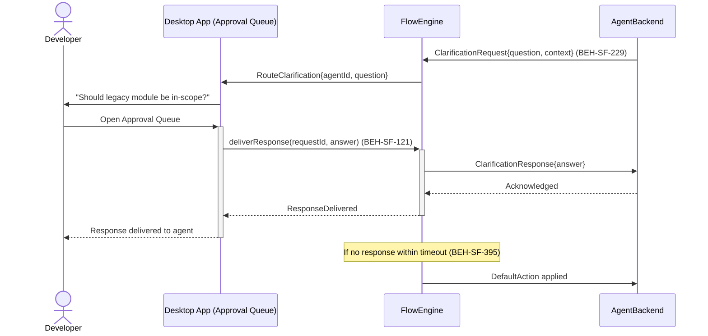
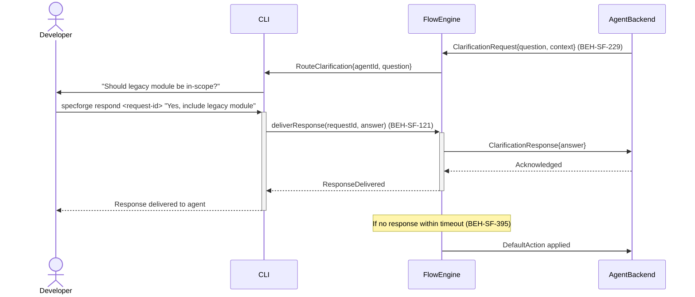

# Respond to Agent Clarification Request

## Use Case

A developer opens the Approval Queue in the desktop app. " The system routes the clarification request to the developer and pauses the agent until a response is received (with configurable timeout). The same operation is accessible via CLI for scripted/CI workflows.

## Interaction Flow

### Desktop App

```text
┌───────────┐  ┌─────────────────┐  ┌────────────┐  ┌──────────────┐
│ Developer │  │   Desktop App   │  │ FlowEngine │  │ AgentBackend │
└─────┬─────┘  └────────┬────────┘  └──────┬─────┘  └──────┬───────┘
      │            │            │  Clarification │
      │            │            │  Request (229) │
      │            │            │◄───────────────│
      │            │ RouteClarif│                │
      │            │◄───────────│                │
      │ "Should    │            │                │
      │ legacy be  │            │                │
      │ in-scope?" │            │                │
      │◄───────────│            │                │
      │            │            │                │
      │ Open Approval Queue
```



### CLI

```text
┌───────────┐  ┌─────┐  ┌────────────┐  ┌──────────────┐
│ Developer │  │ CLI │  │ FlowEngine │  │ AgentBackend │
└─────┬─────┘  └──┬──┘  └──────┬─────┘  └──────┬───────┘
      │            │            │  Clarification │
      │            │            │  Request (229) │
      │            │            │◄───────────────│
      │            │ RouteClarif│                │
      │            │◄───────────│                │
      │ "Should    │            │                │
      │ legacy be  │            │                │
      │ in-scope?" │            │                │
      │◄───────────│            │                │
      │            │            │                │
      │ specforge  │            │                │
      │ respond    │            │                │
      │───────────►│            │                │
      │            │ deliver    │                │
      │            │ Response() │                │
      │            │ (121)      │                │
      │            │───────────►│                │
      │            │            │ Clarification  │
      │            │            │ Response       │
      │            │            │───────────────►│
      │            │            │ Acknowledged   │
      │            │            │◄───────────────│
      │            │ Response   │                │
      │            │ Delivered  │                │
      │            │◄───────────│                │
      │ Delivered  │            │                │
      │ to agent   │            │                │
      │◄───────────│            │                │
      │            │            │                │
      │            │   [if timeout (395)]        │
      │            │            │ DefaultAction  │
      │            │            │───────────────►│
      │            │            │                │
```



## Steps

1. Open the Approval Queue in the desktop app
2. System routes the request to the developer's active surface (CLI or dashboard)
3. Developer sees the question with context about what the agent is working on
4. Developer responds via CLI input or dashboard reply (BEH-SF-121)
5. Response is delivered to the agent's session context
6. If no response within the timeout, system applies the default action (BEH-SF-395)
7. Agent continues execution with the clarification

## Traceability

| Behavior   | Feature     | Role in this capability                    |
| ---------- | ----------- | ------------------------------------------ |
| BEH-SF-121 | FEAT-SF-018 | Human response routing                     |
| BEH-SF-229 | FEAT-SF-005 | ACP messaging for clarification requests   |
| BEH-SF-395 | FEAT-SF-005 | Clarification timeout and default handling |
