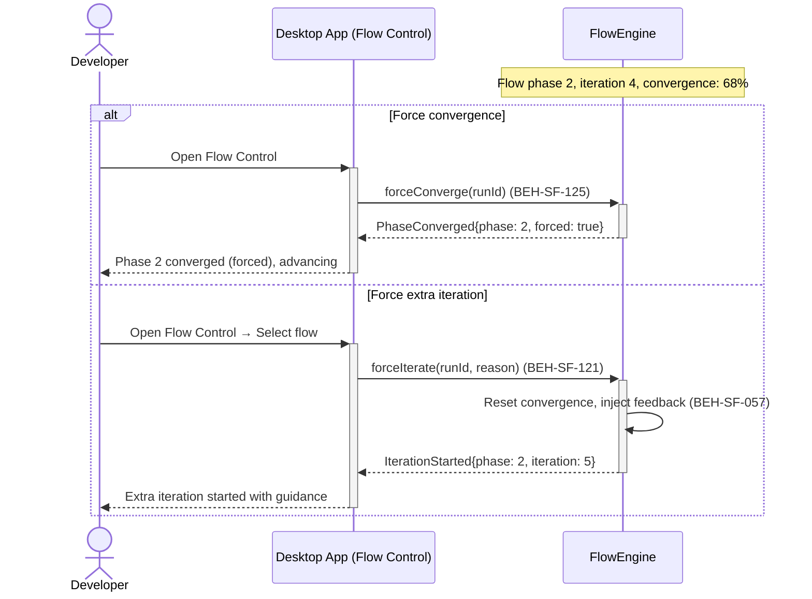
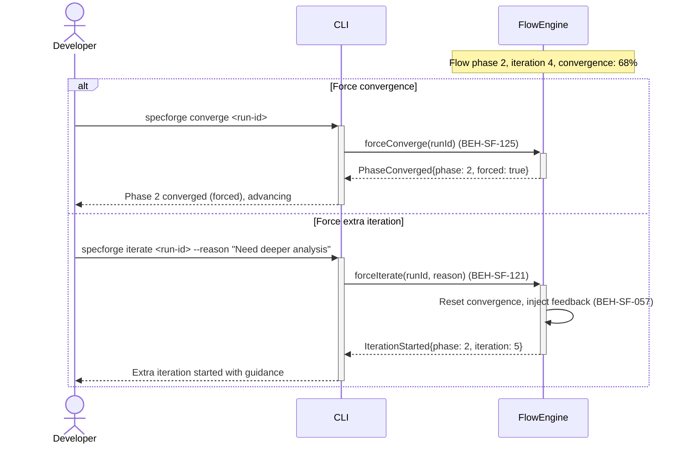

# Force Convergence or Extra Iteration

## Use Case

A developer opens the Flow Control in the desktop app. They can override the convergence decision — forcing the loop to terminate (accept current results) or mandating an additional iteration with optional guidance. The same operation is accessible via CLI (`specforge converge <run-id>`) for scripted/CI workflows.

else Force extra iteration

## Interaction Flow

### Desktop App

```text
┌───────────┐  ┌─────────────────┐  ┌────────────┐
│ Developer │  │   Desktop App   │  │ FlowEngine │
└─────┬─────┘  └────────┬────────┘  └──────┬─────┘
      │            │  [Phase 2, iter 4,
      │            │   convergence: 68%]
      │            │            │
      │  [if Force convergence] │
      │ Open Flow Control
```



### CLI

```text
┌───────────┐  ┌─────┐  ┌────────────┐
│ Developer │  │ CLI │  │ FlowEngine │
└─────┬─────┘  └──┬──┘  └──────┬─────┘
      │            │  [Phase 2, iter 4,
      │            │   convergence: 68%]
      │            │            │
      │  [if Force convergence] │
      │ specforge  │            │
      │ converge   │            │
      │───────────►│            │
      │            │ force      │
      │            │ Converge() │
      │            │ (125)      │
      │            │───────────►│
      │            │ PhaseConverged
      │            │ {forced}   │
      │            │◄───────────│
      │ Phase 2    │            │
      │ converged  │            │
      │◄───────────│            │
      │            │            │
      │  [else Force extra iteration]
      │ specforge  │            │
      │ iterate    │            │
      │───────────►│            │
      │            │ force      │
      │            │ Iterate()  │
      │            │ (121)      │
      │            │───────────►│
      │            │            │─┐ Reset &
      │            │            │ │ inject
      │            │            │◄┘ (057)
      │            │ Iteration  │
      │            │ Started{5} │
      │            │◄───────────│
      │ Extra iter │            │
      │ started    │            │
      │◄───────────│            │
      │            │            │
```



## Steps

1. Open the Flow Control in the desktop app
2. To force convergence: `specforge converge <run-id>` (BEH-SF-125)
3. System marks the phase as converged and advances to the next phase
4. To force extra iteration: `specforge iterate <run-id> --reason "Need deeper analysis"`
5. System resets convergence and runs another iteration (BEH-SF-057)
6. Developer feedback is injected as context for the extra iteration (BEH-SF-121)
7. Override decision is logged in the audit trail

## Traceability

| Behavior   | Feature     | Role in this capability                |
| ---------- | ----------- | -------------------------------------- |
| BEH-SF-121 | FEAT-SF-018 | Human override injection               |
| BEH-SF-125 | FEAT-SF-018 | Forced convergence/iteration mechanics |
| BEH-SF-057 | FEAT-SF-004 | Flow execution loop control            |
