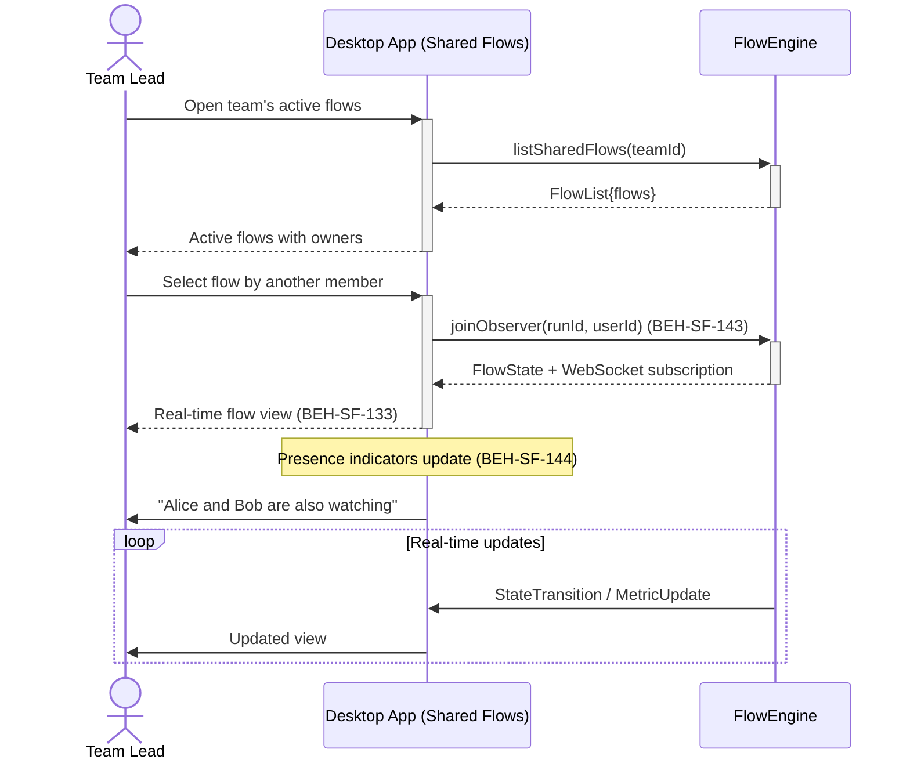

# Observe a Shared Flow with Team

## Use Case

A team lead opens the Shared Flows in the desktop app. Multiple team members can watch the same flow simultaneously, seeing the same real-time updates. Presence indicators show who else is viewing, enabling implicit coordination.

## Interaction Flow

```text
┌───────────┐     ┌───────────┐     ┌────────────┐
│ Team Lead │     │ Desktop App │     │ FlowEngine │
└─────┬─────┘     └─────┬─────┘     └──────┬─────┘
      │ Open active flows│                  │
      │────────────────►│                   │
      │                  │ listSharedFlows() │
      │                  │─────────────────►│
      │                  │  FlowList{flows}  │
      │                  │◄─────────────────│
      │ Active flows     │                  │
      │◄────────────────│                   │
      │                  │                  │
      │ Select flow      │                  │
      │────────────────►│                   │
      │                  │ joinObserver()    │
      │                  │─────────────────►│
      │                  │ FlowState+WS sub  │
      │                  │◄─────────────────│
      │ Real-time view   │                  │
      │◄────────────────│                   │
      │                  │                  │
      │    [Presence indicators update]     │
      │ "Alice and Bob   │                  │
      │  are watching"   │                  │
      │◄────────────────│                   │
      │                  │                  │
      │     [loop: Real-time updates]       │
      │                  │◄─────────────────│
      │                  │ StateTransition   │
      │◄────────────────│                   │
      │  Updated view    │                  │
      │     [end loop]   │                  │
      │                  │                  │
```



## Steps

1. Open the Shared Flows in the desktop app
2. Select a flow initiated by another team member (BEH-SF-143)
3. View real-time execution progress alongside other observers (BEH-SF-133)
4. Presence indicators show who else is watching (BEH-SF-144)
5. Optionally use the chat or comment features to discuss observations
6. All observers see the same state transitions and metrics updates

## Traceability

| Behavior   | Feature     | Role in this capability                         |
| ---------- | ----------- | ----------------------------------------------- |
| BEH-SF-143 | FEAT-SF-017 | Multi-user flow sharing and access control      |
| BEH-SF-144 | FEAT-SF-017 | Presence awareness and observer tracking        |
| BEH-SF-133 | FEAT-SF-007 | Dashboard real-time view with WebSocket updates |
