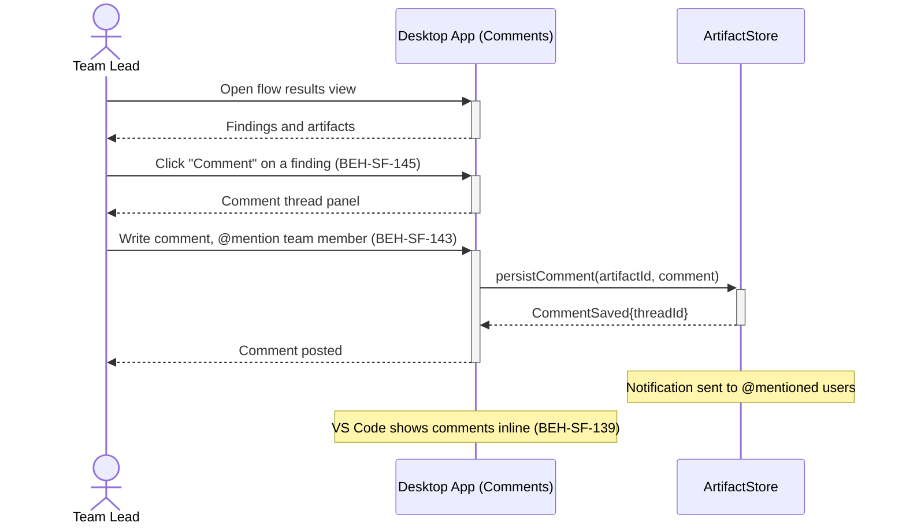

# Comment on Findings and Artifacts

## Use Case

A team lead opens the Comments in the desktop app. Comments are attached to specific artifacts or findings, creating threaded discussions that persist alongside the flow results.

## Interaction Flow

```text
┌───────────┐     ┌───────────┐     ┌───────────────┐
│ Team Lead │     │ Desktop App │     │ ArtifactStore │
└─────┬─────┘     └─────┬─────┘     └───────┬───────┘
      │ Open results     │                   │
      │────────────────►│                    │
      │ Findings/artifacts                   │
      │◄────────────────│                    │
      │                  │                   │
      │ Click "Comment"  │                   │
      │────────────────►│                    │
      │ Comment thread   │                   │
      │◄────────────────│                    │
      │                  │                   │
      │ Write + @mention │                   │
      │────────────────►│                    │
      │                  │ persistComment()   │
      │                  │──────────────────►│
      │                  │ CommentSaved       │
      │                  │◄──────────────────│
      │ Comment posted   │                   │
      │◄────────────────│                    │
      │                  │                   │
      │    [Notification sent to @mentioned] │
      │    [VS Code shows comments inline]   │
      │                  │                   │
```



## Steps

1. Open the Comments in the desktop app
2. Navigate to a specific finding or artifact
3. Click "Comment" to open the comment thread (BEH-SF-145)
4. Write a comment and optionally @mention team members (BEH-SF-143)
5. Comment is persisted and visible to all team members
6. VS Code extension shows comments inline alongside code references (BEH-SF-139)
7. Team members receive notifications for @mentions

## Traceability

| Behavior   | Feature     | Role in this capability                   |
| ---------- | ----------- | ----------------------------------------- |
| BEH-SF-143 | FEAT-SF-017 | Collaboration infrastructure and mentions |
| BEH-SF-145 | FEAT-SF-017 | Comment threading on artifacts            |
| BEH-SF-139 | FEAT-SF-007 | VS Code inline comment display            |
