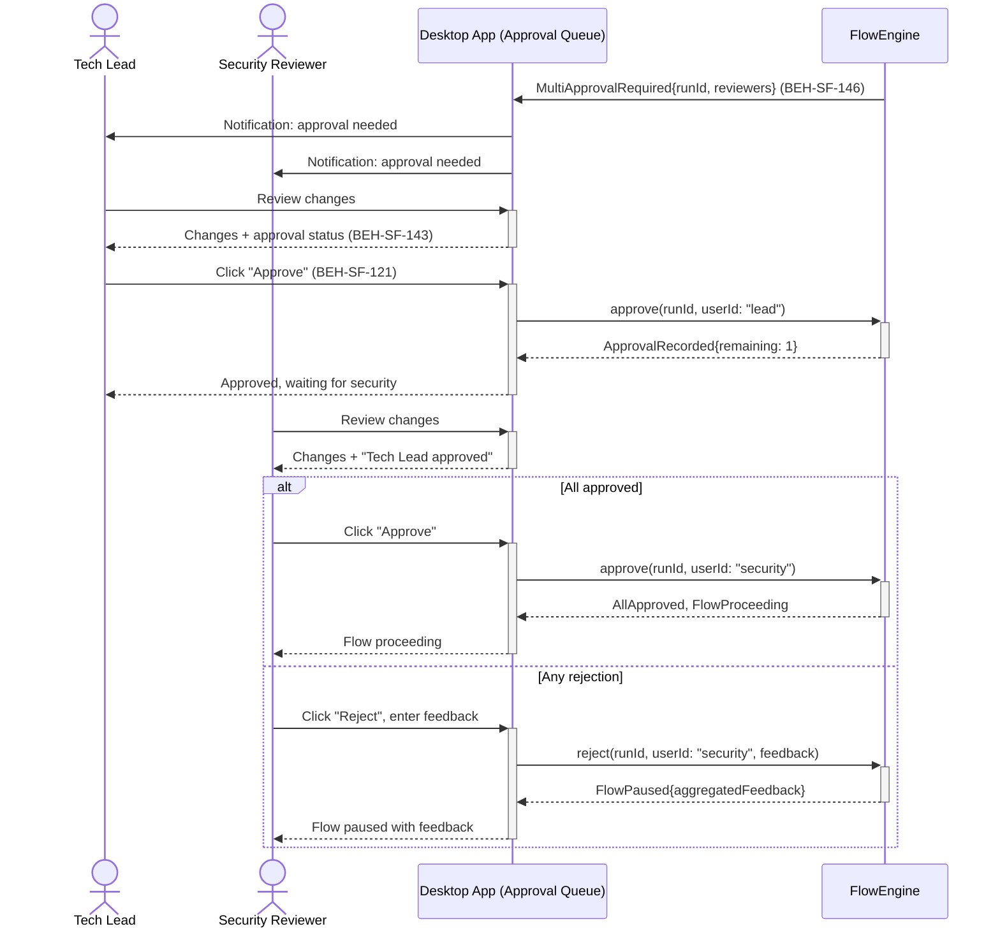
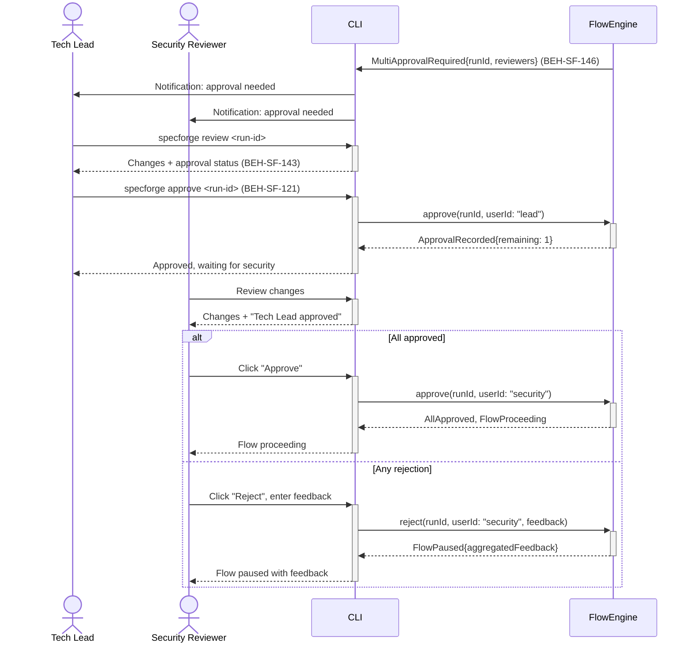
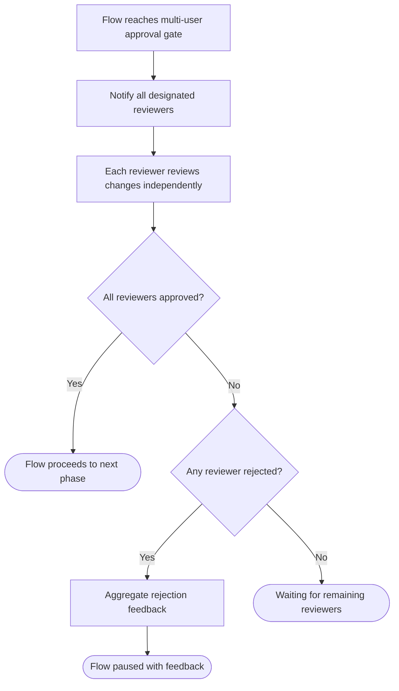

# Approve or Reject Agent Changes (Multi-User)

## Use Case

A team lead opens the Approval Queue in the desktop app (e.g., a code generation flow where both a tech lead and a security reviewer must sign off), the system routes approval requests to the designated reviewers. Each reviewer independently approves or rejects, and the flow proceeds only when all required approvals are collected. The same operation is accessible via CLI for scripted/CI workflows.

## Interaction Flow

### Desktop App

```text
┌───────────┐ ┌──────────┐ ┌───────────┐ ┌────────────┐
│ Tech Lead │ │ Security │ │   Desktop App   │ │ FlowEngine │
└─────┬─────┘ └────┬─────┘ └─────┬─────┘ └──────┬─────┘
      │             │             │◄──────────────│
      │             │             │ MultiApproval  │
      │◄────────────────────────│  Required       │
      │ Notification │            │               │
      │             │◄───────────│                │
      │             │ Notification│               │
      │             │             │               │
      │ Review changes            │               │
      │────────────────────────►│                 │
      │ Changes + status          │               │
      │◄────────────────────────│                 │
      │             │             │               │
      │ Click "Approve"          │                │
      │────────────────────────►│                 │
      │             │             │ approve(lead)  │
      │             │             │──────────────►│
      │             │             │ Recorded{1}    │
      │             │             │◄──────────────│
      │ Waiting for security     │                │
      │◄────────────────────────│                 │
      │             │             │               │
      │             │ Review      │               │
      │             │───────────►│                │
      │             │ "Lead ok"   │               │
      │             │◄───────────│                │
      │             │             │               │
      │  [if All approved]        │               │
      │             │ Approve     │               │
      │             │───────────►│                │
      │             │             │ approve(sec)   │
      │             │             │──────────────►│
      │             │             │ AllApproved    │
      │             │             │◄──────────────│
      │             │ Proceeding  │               │
      │             │◄───────────│                │
      │  [else Any rejection]     │               │
      │             │ Reject+note │               │
      │             │───────────►│                │
      │             │             │ reject(sec)    │
      │             │             │──────────────►│
      │             │             │ FlowPaused     │
      │             │             │◄──────────────│
      │             │ Paused      │               │
      │             │◄───────────│                │
      │             │             │               │
```



### CLI

```text
┌───────────┐ ┌──────────┐ ┌───────────┐ ┌────────────┐
│ Tech Lead │ │ Security │ │ CLI │ │ FlowEngine │
└─────┬─────┘ └────┬─────┘ └─────┬─────┘ └──────┬─────┘
      │             │             │◄──────────────│
      │             │             │ MultiApproval  │
      │◄────────────────────────│  Required       │
      │ Notification │            │               │
      │             │◄───────────│                │
      │             │ Notification│               │
      │             │             │               │
      │ Review changes            │               │
      │────────────────────────►│                 │
      │ Changes + status          │               │
      │◄────────────────────────│                 │
      │             │             │               │
      │ Click "Approve"          │                │
      │────────────────────────►│                 │
      │             │             │ approve(lead)  │
      │             │             │──────────────►│
      │             │             │ Recorded{1}    │
      │             │             │◄──────────────│
      │ Waiting for security     │                │
      │◄────────────────────────│                 │
      │             │             │               │
      │             │ Review      │               │
      │             │───────────►│                │
      │             │ "Lead ok"   │               │
      │             │◄───────────│                │
      │             │             │               │
      │  [if All approved]        │               │
      │             │ Approve     │               │
      │             │───────────►│                │
      │             │             │ approve(sec)   │
      │             │             │──────────────►│
      │             │             │ AllApproved    │
      │             │             │◄──────────────│
      │             │ Proceeding  │               │
      │             │◄───────────│                │
      │  [else Any rejection]     │               │
      │             │ Reject+note │               │
      │             │───────────►│                │
      │             │             │ reject(sec)    │
      │             │             │──────────────►│
      │             │             │ FlowPaused     │
      │             │             │◄──────────────│
      │             │ Paused      │               │
      │             │◄───────────│                │
      │             │             │               │
```



## Steps

1. Open the Approval Queue in the desktop app
2. System notifies all designated reviewers
3. Each reviewer accesses the changes via dashboard or CLI
4. Reviewers independently approve or reject with comments (BEH-SF-121)
5. Desktop app shows approval status: who has approved, who is pending (BEH-SF-143)
6. When all required approvals are collected, flow proceeds
7. If any reviewer rejects, flow pauses with aggregated feedback

## Decision Paths

```text
┌─────────────────────────────────────┐
│ Flow reaches multi-user approval    │
│ gate                                │
└──────────────────┬──────────────────┘
                   ▼
┌─────────────────────────────────────┐
│ Notify all designated reviewers     │
└──────────────────┬──────────────────┘
                   ▼
┌─────────────────────────────────────┐
│ Each reviewer reviews changes       │
│ independently                       │
└──────────────────┬──────────────────┘
                   ▼
            ╱             ╲
          ╱  All reviewers  ╲
         ╱   approved?       ╲
          ╲                 ╱
            ╲             ╱
         Yes │           │ No
             ▼           ▼
┌────────────────┐ ╱             ╲
│ Flow proceeds  │╱ Any reviewer   ╲
│ to next phase  │╲  rejected?     ╱
└────────────────┘  ╲            ╱
                      ╲        ╱
                  Yes │       │ No
                      ▼       ▼
          ┌────────────────┐ ┌──────────────┐
          │ Aggregate      │ │ Waiting for  │
          │ rejection      │ │ remaining    │
          │ feedback       │ │ reviewers    │
          └───────┬────────┘ └──────────────┘
                  ▼
          ┌────────────────┐
          │ Flow paused    │
          │ with feedback  │
          └────────────────┘
```



## Traceability

| Behavior   | Feature     | Role in this capability                        |
| ---------- | ----------- | ---------------------------------------------- |
| BEH-SF-143 | FEAT-SF-017 | Multi-user collaboration and approval tracking |
| BEH-SF-146 | FEAT-SF-017 | Multi-reviewer approval gate mechanics         |
| BEH-SF-121 | FEAT-SF-018 | Human approval/rejection handling              |
