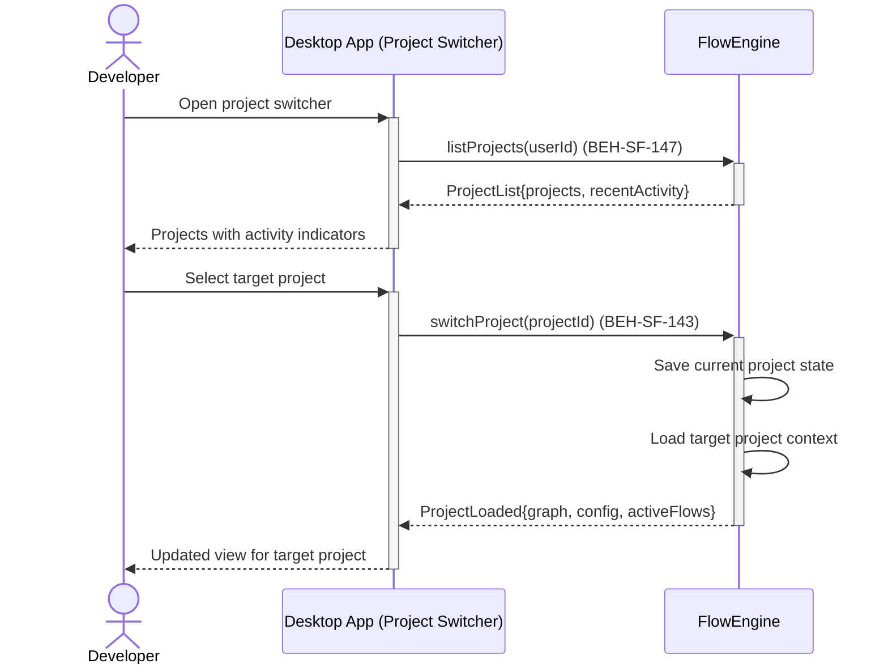

# Switch Between Projects

## Use Case

A developer opens the Project Switcher in the desktop app to switch context between them. Each project has its own knowledge graph, flows, and configuration. The system provides a project switcher that preserves session state and allows quick navigation between projects.

## Interaction Flow

```text
┌───────────┐     ┌───────────┐     ┌────────────┐
│ Developer │     │ Desktop App │     │ FlowEngine │
└─────┬─────┘     └─────┬─────┘     └──────┬─────┘
      │ Open switcher    │                  │
      │────────────────►│                   │
      │                  │ listProjects()    │
      │                  │─────────────────►│
      │                  │ ProjectList       │
      │                  │◄─────────────────│
      │ Projects + activity                 │
      │◄────────────────│                   │
      │                  │                  │
      │ Select project   │                  │
      │────────────────►│                   │
      │                  │ switchProject()   │
      │                  │─────────────────►│
      │                  │          ┌───────┤
      │                  │          │ Save  │
      │                  │          │ state │
      │                  │          ├───────┘
      │                  │          ┌───────┤
      │                  │          │ Load  │
      │                  │          │context│
      │                  │          ├───────┘
      │                  │ ProjectLoaded     │
      │                  │◄─────────────────│
      │ Updated view     │                  │
      │◄────────────────│                   │
      │                  │                  │
```



## Steps

1. Open the Project Switcher in the desktop app
2. View list of available projects with recent activity indicators (BEH-SF-147)
3. Select the target project
4. System loads the project's graph, configuration, and active flows (BEH-SF-143)
5. Previous project state is preserved for quick return
6. All surfaces update to reflect the selected project's context

## Traceability

| Behavior   | Feature     | Role in this capability                  |
| ---------- | ----------- | ---------------------------------------- |
| BEH-SF-143 | FEAT-SF-017 | Project-scoped collaboration context     |
| BEH-SF-147 | FEAT-SF-017 | Project switching and state preservation |
