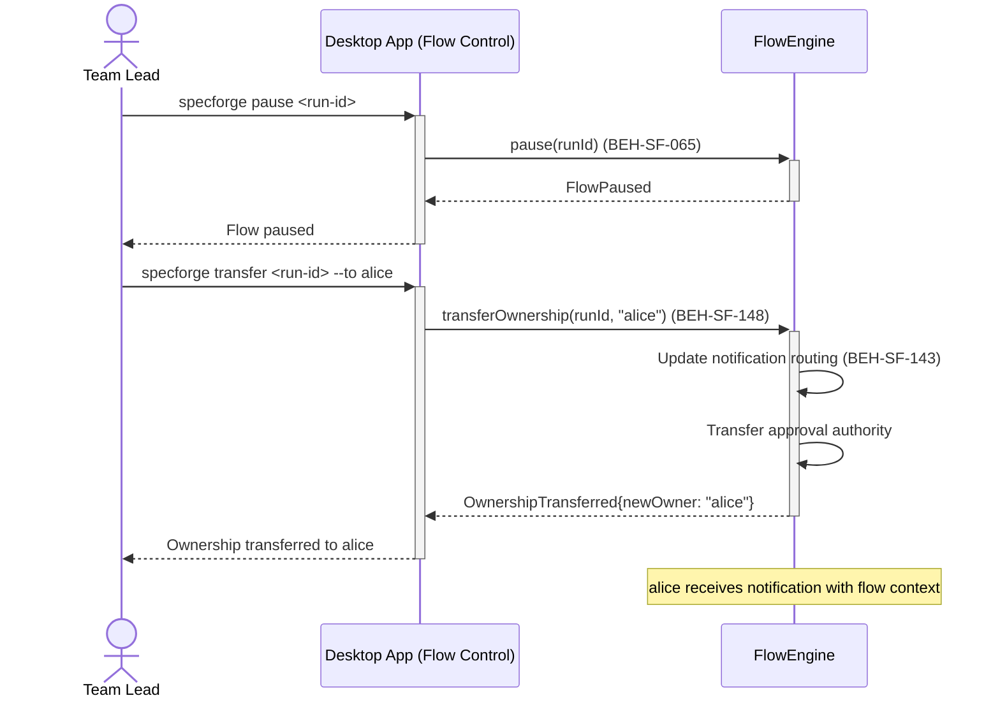
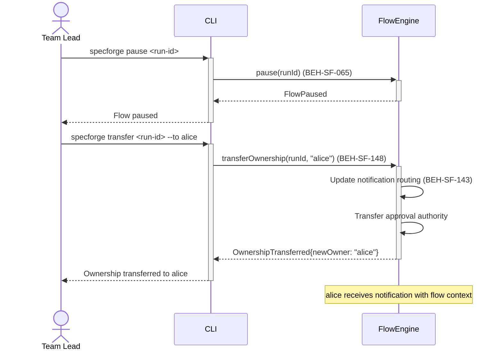

# Hand Off Flow Ownership

## Use Case

A team lead opens the Flow Control in the desktop app to transfer ownership of a running or paused flow to another team member. The handoff transfers notification routing, approval authority, and monitoring responsibility. The same operation is accessible via CLI (`specforge pause <run-id>`) for scripted/CI workflows.

## Related Capabilities

| Capability                                      | Relationship                                     |
| ----------------------------------------------- | ------------------------------------------------ |
| [UX-SF-021](./UX-SF-021-observe-shared-flow.md) | Enables — new owner can observe before accepting |

## Interaction Flow

### Desktop App

```text
┌───────────┐     ┌─────────────────┐     ┌────────────┐
│ Team Lead │     │   Desktop App   │     │ FlowEngine │
└─────┬─────┘     └────────┬────────┘     └──────┬─────┘
      │ pause <id>    │               │
      │──────────────►│               │
      │               │ pause(runId)   │
      │               │──────────────►│
      │               │ FlowPaused     │
      │               │◄──────────────│
      │ Flow paused   │               │
      │◄──────────────│               │
      │               │               │
      │ transfer --to alice           │
      │──────────────►│               │
      │               │ transferOwner()│
      │               │──────────────►│
      │               │       ┌───────┤
      │               │       │Update │
      │               │       │routing│
      │               │       ├───────┘
      │               │       ┌───────┤
      │               │       │Xfer   │
      │               │       │auth   │
      │               │       ├───────┘
      │               │ Transferred    │
      │               │◄──────────────│
      │ Transferred   │               │
      │◄──────────────│               │
      │               │               │
      │  [alice receives notification] │
      │               │               │
```



### CLI

```text
┌───────────┐     ┌─────┐     ┌────────────┐
│ Team Lead │     │ CLI │     │ FlowEngine │
└─────┬─────┘     └──┬──┘     └──────┬─────┘
      │ pause <id>    │               │
      │──────────────►│               │
      │               │ pause(runId)   │
      │               │──────────────►│
      │               │ FlowPaused     │
      │               │◄──────────────│
      │ Flow paused   │               │
      │◄──────────────│               │
      │               │               │
      │ transfer --to alice           │
      │──────────────►│               │
      │               │ transferOwner()│
      │               │──────────────►│
      │               │       ┌───────┤
      │               │       │Update │
      │               │       │routing│
      │               │       ├───────┘
      │               │       ┌───────┤
      │               │       │Xfer   │
      │               │       │auth   │
      │               │       ├───────┘
      │               │ Transferred    │
      │               │◄──────────────│
      │ Transferred   │               │
      │◄──────────────│               │
      │               │               │
      │  [alice receives notification] │
      │               │               │
```



## Steps

1. Open the Flow Control in the desktop app
2. Transfer ownership: `specforge transfer <run-id> --to <username>` (BEH-SF-148)
3. System updates notification routing and approval authority (BEH-SF-143)
4. New owner receives a notification with flow context and current state
5. New owner can resume the flow: `specforge resume <run-id>`
6. Handoff is recorded in the audit trail

## Related Capabilities

| Capability                                      | Relationship                                     |
| ----------------------------------------------- | ------------------------------------------------ |
| [UX-SF-021](./UX-SF-021-observe-shared-flow.md) | Enables — new owner can observe before accepting |

## Traceability

| Behavior   | Feature     | Role in this capability                    |
| ---------- | ----------- | ------------------------------------------ |
| BEH-SF-143 | FEAT-SF-017 | Collaboration infrastructure for ownership |
| BEH-SF-148 | FEAT-SF-017 | Ownership transfer mechanics               |
| BEH-SF-065 | FEAT-SF-004 | Flow pause for safe handoff                |
