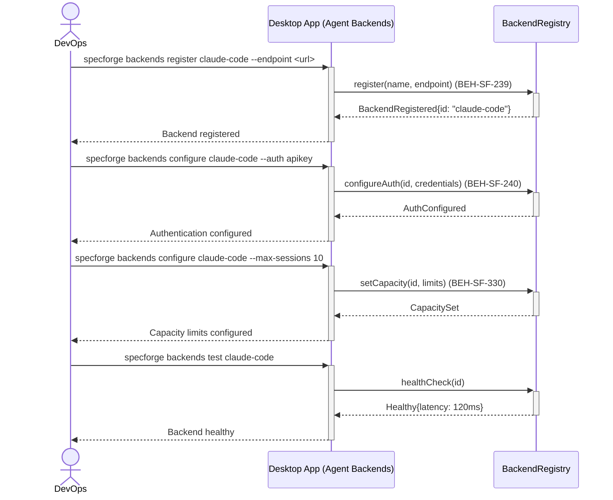
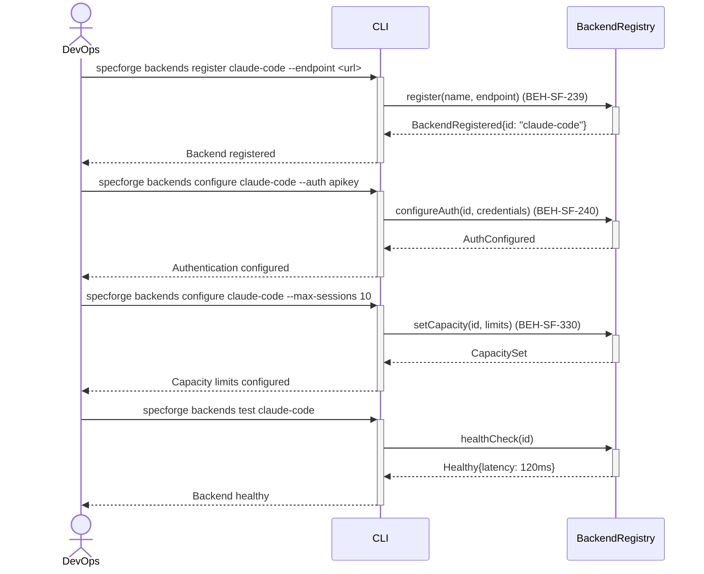

# Register and Configure Agent Backends

## Use Case

A devops engineer opens the Agent Backends in the desktop app (e.g., Claude Code instances, custom LLM endpoints) and configures their connection parameters, authentication, and capacity limits. This is required during initial setup and when scaling the system. The same operation is accessible via CLI (`specforge backends register claude-code --endpoint <url>`) for scripted/CI workflows.

## Interaction Flow

### Desktop App

```text
┌────────┐     ┌─────────────────┐     ┌─────────────────┐
│ DevOps │     │   Desktop App   │     │ BackendRegistry │
└───┬────┘     └────────┬────────┘     └────────┬────────┘
    │ Open Agent     │                │
    │─────────────►│                │
    │              │ register()      │
    │              │───────────────►│
    │              │ Registered      │
    │              │◄───────────────│
    │ Registered   │                │
    │◄─────────────│                │
    │              │                │
    │ Click    │                │
    │  --auth      │                │
    │─────────────►│                │
    │              │ configureAuth() │
    │              │───────────────►│
    │              │ AuthConfigured  │
    │              │◄───────────────│
    │ Auth done    │                │
    │◄─────────────│                │
    │              │                │
    │ configure    │                │
    │  --max 10    │                │
    │─────────────►│                │
    │              │ setCapacity()   │
    │              │───────────────►│
    │              │ CapacitySet     │
    │              │◄───────────────│
    │ Capacity set │                │
    │◄─────────────│                │
    │              │                │
    │ test         │                │
    │─────────────►│                │
    │              │ healthCheck()   │
    │              │───────────────►│
    │              │ Healthy{120ms}  │
    │              │◄───────────────│
    │ Healthy      │                │
    │◄─────────────│                │
    │              │                │
```



### CLI

```text
┌────────┐     ┌─────┐     ┌─────────────────┐
│ DevOps │     │ CLI │     │ BackendRegistry │
└───┬────┘     └──┬──┘     └────────┬────────┘
    │ register     │                │
    │─────────────►│                │
    │              │ register()      │
    │              │───────────────►│
    │              │ Registered      │
    │              │◄───────────────│
    │ Registered   │                │
    │◄─────────────│                │
    │              │                │
    │ configure    │                │
    │  --auth      │                │
    │─────────────►│                │
    │              │ configureAuth() │
    │              │───────────────►│
    │              │ AuthConfigured  │
    │              │◄───────────────│
    │ Auth done    │                │
    │◄─────────────│                │
    │              │                │
    │ configure    │                │
    │  --max 10    │                │
    │─────────────►│                │
    │              │ setCapacity()   │
    │              │───────────────►│
    │              │ CapacitySet     │
    │              │◄───────────────│
    │ Capacity set │                │
    │◄─────────────│                │
    │              │                │
    │ test         │                │
    │─────────────►│                │
    │              │ healthCheck()   │
    │              │───────────────►│
    │              │ Healthy{120ms}  │
    │              │◄───────────────│
    │ Healthy      │                │
    │◄─────────────│                │
    │              │                │
```



## Steps

1. Open the Agent Backends in the desktop app
2. Configure authentication credentials (API key or OAuth) (BEH-SF-240)
3. Set capacity limits: max concurrent sessions, token rate limits (BEH-SF-330)
4. Verify connectivity: `specforge backends test claude-code`
5. Backend appears in `specforge backends list` with status indicators
6. System begins routing agent sessions to the registered backend

## Traceability

| Behavior   | Feature     | Role in this capability                       |
| ---------- | ----------- | --------------------------------------------- |
| BEH-SF-239 | FEAT-SF-020 | Agent backend registration and lifecycle      |
| BEH-SF-240 | FEAT-SF-020 | Backend authentication configuration          |
| BEH-SF-330 | FEAT-SF-028 | Configuration management for backend settings |
