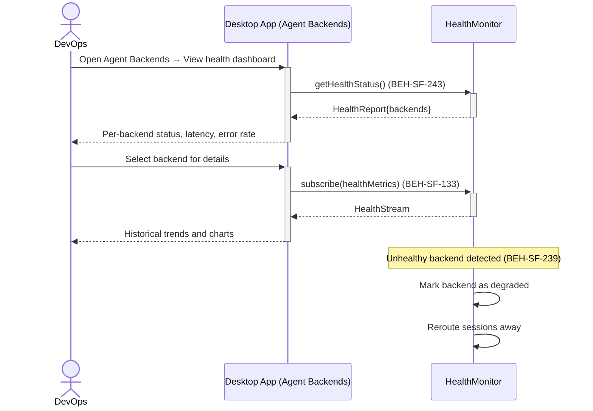
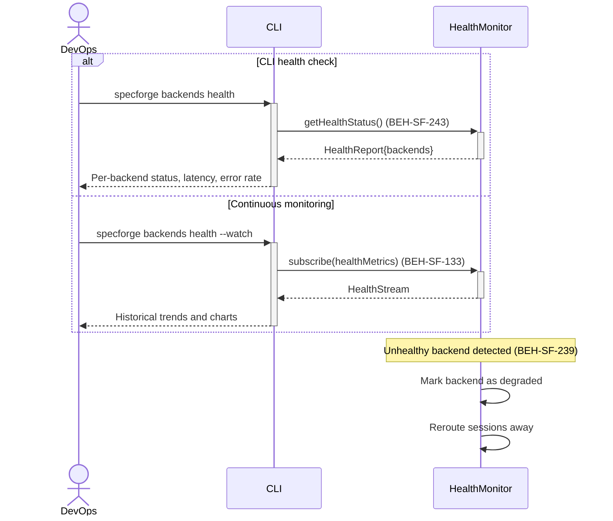

# Monitor Agent Backend Health

## Use Case

A devops engineer opens the Agent Backends in the desktop app. The system tracks availability, response times, error rates, and capacity utilization. Unhealthy backends are automatically marked degraded and excluded from new session routing. The same operation is accessible via CLI (`specforge backends health`) for scripted/CI workflows.

## Interaction Flow

### Desktop App

```text
┌────────┐  ┌─────────────────┐  ┌───────────┐  ┌───────────────┐
│ DevOps │  │   Desktop App   │  │   Desktop App   │  │ HealthMonitor │
└───┬────┘  └────────┬────────┘  └─────┬─────┘  └───────┬───────┘
    │          │            │                │
    │ [if CLI health check]                  │
    │ backends │            │                │
    │  health  │            │                │
    │─────────►│            │                │
    │          │ getHealthStatus()            │
    │          │────────────────────────────►│
    │          │ HealthReport                 │
    │          │◄────────────────────────────│
    │ Status   │            │                │
    │◄─────────│            │                │
    │          │            │                │
    │ [else Dashboard monitoring]            │
    │ Open health           │                │
    │──────────────────────►│                │
    │          │            │ subscribe()     │
    │          │            │───────────────►│
    │          │            │ HealthStream    │
    │          │            │◄───────────────│
    │ Trends + │            │                │
    │  charts  │            │                │
    │◄──────────────────────│                │
    │          │            │                │
    │   [Unhealthy backend detected]         │
    │          │            │        ┌───────┤
    │          │            │        │ Mark  │
    │          │            │        │degraded│
    │          │            │        ├───────┘
    │          │            │        ┌───────┤
    │          │            │        │Reroute│
    │          │            │        │away   │
    │          │            │        ├───────┘
    │          │            │                │
```



### CLI

```text
┌────────┐  ┌─────┐  ┌───────────┐  ┌───────────────┐
│ DevOps │  │ CLI │  │ HealthMonitor │
└───┬────┘  └──┬──┘  └─────┬─────┘  └───────┬───────┘
    │          │            │                │
    │ [if CLI health check]                  │
    │ backends │            │                │
    │  health  │            │                │
    │─────────►│            │                │
    │          │ getHealthStatus()            │
    │          │────────────────────────────►│
    │          │ HealthReport                 │
    │          │◄────────────────────────────│
    │ Status   │            │                │
    │◄─────────│            │                │
    │          │            │                │
    │ [else Dashboard monitoring]            │
    │ Open health           │                │
    │──────────────────────►│                │
    │          │            │ subscribe()     │
    │          │            │───────────────►│
    │          │            │ HealthStream    │
    │          │            │◄───────────────│
    │ Trends + │            │                │
    │  charts  │            │                │
    │◄──────────────────────│                │
    │          │            │                │
    │   [Unhealthy backend detected]         │
    │          │            │        ┌───────┤
    │          │            │        │ Mark  │
    │          │            │        │degraded│
    │          │            │        ├───────┘
    │          │            │        ┌───────┤
    │          │            │        │Reroute│
    │          │            │        │away   │
    │          │            │        ├───────┘
    │          │            │                │
```



## Steps

1. Open the Agent Backends in the desktop app
2. System shows per-backend metrics: status, latency, error rate, active sessions (BEH-SF-243)
3. Desktop app displays historical health trends with charts (BEH-SF-133)
4. Unhealthy backends are flagged with degraded status (BEH-SF-239)
5. DevOps can manually mark a backend as maintenance mode
6. System automatically reroutes sessions away from unhealthy backends

## Traceability

| Behavior   | Feature     | Role in this capability                      |
| ---------- | ----------- | -------------------------------------------- |
| BEH-SF-239 | FEAT-SF-020 | Backend lifecycle and status management      |
| BEH-SF-243 | FEAT-SF-025 | Health check execution and metric collection |
| BEH-SF-133 | FEAT-SF-025 | Dashboard health visualization               |
