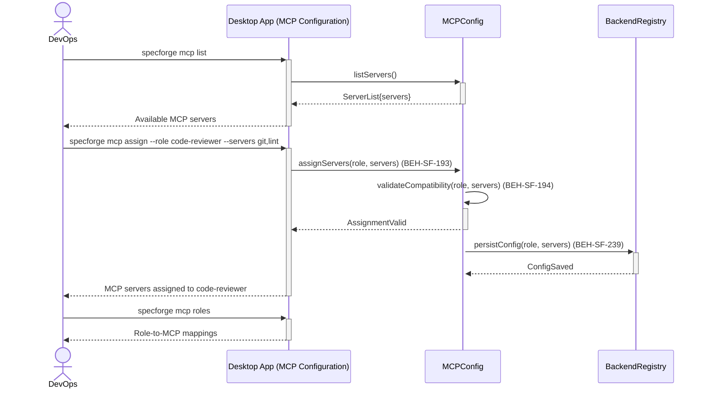
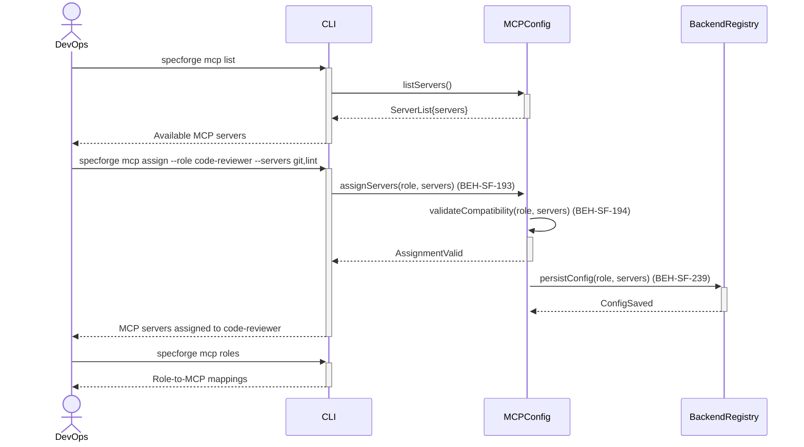

# Configure MCP Servers per Agent Role

## Use Case

A devops engineer opens the MCP Configuration in the desktop app. For example, a code-review agent might have access to a Git MCP server and a linting MCP server, while a spec-writing agent has access to a documentation MCP server. This enables fine-grained tool provisioning per role. The same operation is accessible via CLI (`specforge mcp list`) for scripted/CI workflows.

## Interaction Flow

### Desktop App

```text
┌────────┐  ┌─────────────────┐  ┌───────────┐  ┌─────────────────┐
│ DevOps │  │   Desktop App   │  │ MCPConfig │  │ BackendRegistry │
└───┬────┘  └────────┬────────┘  └─────┬─────┘  └────────┬────────┘
    │ mcp list  │           │                 │
    │──────────►│           │                 │
    │           │listServers│                 │
    │           │──────────►│                 │
    │           │ServerList │                 │
    │           │◄──────────│                 │
    │ Servers   │           │                 │
    │◄──────────│           │                 │
    │           │           │                 │
    │ mcp assign│           │                 │
    │  --role   │           │                 │
    │──────────►│           │                 │
    │           │assign()   │                 │
    │           │──────────►│                 │
    │           │   ┌───────┤                 │
    │           │   │validat│                 │
    │           │   │compat.│                 │
    │           │   ├───────┘                 │
    │           │Valid      │                 │
    │           │◄──────────│                 │
    │           │           │ persistConfig()  │
    │           │           │────────────────►│
    │           │           │ ConfigSaved      │
    │           │           │◄────────────────│
    │ Assigned  │           │                 │
    │◄──────────│           │                 │
    │           │           │                 │
    │ mcp roles │           │                 │
    │──────────►│           │                 │
    │ Mappings  │           │                 │
    │◄──────────│           │                 │
    │           │           │                 │
```



### CLI

```text
┌────────┐  ┌─────┐  ┌───────────┐  ┌─────────────────┐
│ DevOps │  │ CLI │  │ MCPConfig │  │ BackendRegistry │
└───┬────┘  └──┬──┘  └─────┬─────┘  └────────┬────────┘
    │ mcp list  │           │                 │
    │──────────►│           │                 │
    │           │listServers│                 │
    │           │──────────►│                 │
    │           │ServerList │                 │
    │           │◄──────────│                 │
    │ Servers   │           │                 │
    │◄──────────│           │                 │
    │           │           │                 │
    │ mcp assign│           │                 │
    │  --role   │           │                 │
    │──────────►│           │                 │
    │           │assign()   │                 │
    │           │──────────►│                 │
    │           │   ┌───────┤                 │
    │           │   │validat│                 │
    │           │   │compat.│                 │
    │           │   ├───────┘                 │
    │           │Valid      │                 │
    │           │◄──────────│                 │
    │           │           │ persistConfig()  │
    │           │           │────────────────►│
    │           │           │ ConfigSaved      │
    │           │           │◄────────────────│
    │ Assigned  │           │                 │
    │◄──────────│           │                 │
    │           │           │                 │
    │ mcp roles │           │                 │
    │──────────►│           │                 │
    │ Mappings  │           │                 │
    │◄──────────│           │                 │
    │           │           │                 │
```



## Steps

1. Open the MCP Configuration in the desktop app
2. Assign MCP servers to a role: `specforge mcp assign --role code-reviewer --servers git,lint` (BEH-SF-193)
3. System validates server availability and compatibility (BEH-SF-194)
4. Configuration is persisted in the project config (BEH-SF-239)
5. When an agent session starts for the role, assigned MCP servers are activated
6. View current role-to-MCP mappings: `specforge mcp roles`

## Traceability

| Behavior   | Feature     | Role in this capability                         |
| ---------- | ----------- | ----------------------------------------------- |
| BEH-SF-193 | FEAT-SF-013 | MCP server composition per role                 |
| BEH-SF-194 | FEAT-SF-013 | MCP server validation and compatibility         |
| BEH-SF-239 | FEAT-SF-020 | Agent backend configuration for MCP integration |
