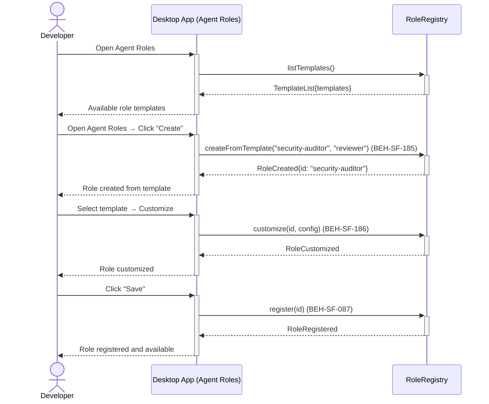
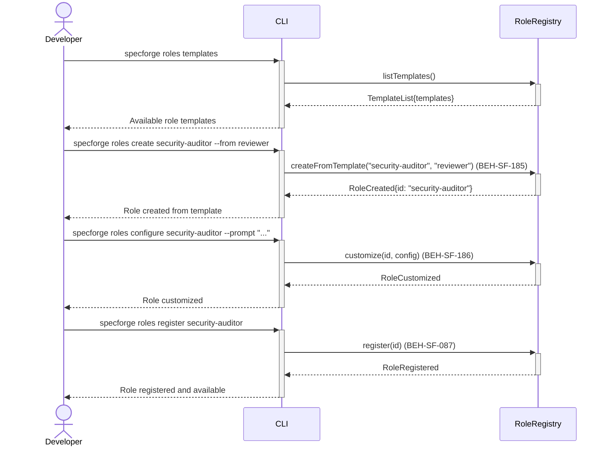

# Create Dynamic Agent Roles from Templates

## Use Case

A developer opens the Agent Roles in the desktop app. For example, creating a "security-auditor" role from the "reviewer" template, adding security-specific system prompts and MCP tool access. Dynamic roles are registered alongside built-in roles. The same operation is accessible via CLI (`specforge roles templates`) for scripted/CI workflows.

## Interaction Flow

### Desktop App

```text
┌───────────┐     ┌─────────────────┐     ┌──────────────┐
│ Developer │     │   Desktop App   │     │ RoleRegistry │
└─────┬─────┘     └────────┬────────┘     └──────┬───────┘
      │ roles         │              │
      │  templates    │              │
      │──────────────►│              │
      │               │listTemplates()
      │               │─────────────►│
      │               │TemplateList  │
      │               │◄─────────────│
      │ Templates     │              │
      │◄──────────────│              │
      │               │              │
      │ Open Agent  │              │
      │  --from       │              │
      │──────────────►│              │
      │               │createFrom()  │
      │               │─────────────►│
      │               │RoleCreated   │
      │               │◄─────────────│
      │ Created       │              │
      │◄──────────────│              │
      │               │              │
      │ roles         │              │
      │  configure    │              │
      │──────────────►│              │
      │               │customize()   │
      │               │─────────────►│
      │               │RoleCustomized│
      │               │◄─────────────│
      │ Customized    │              │
      │◄──────────────│              │
      │               │              │
      │ roles         │              │
      │  register     │              │
      │──────────────►│              │
      │               │register()    │
      │               │─────────────►│
      │               │Registered    │
      │               │◄─────────────│
      │ Available     │              │
      │◄──────────────│              │
      │               │              │
```



### CLI

```text
┌───────────┐     ┌─────┐     ┌──────────────┐
│ Developer │     │ CLI │     │ RoleRegistry │
└─────┬─────┘     └──┬──┘     └──────┬───────┘
      │ roles         │              │
      │  templates    │              │
      │──────────────►│              │
      │               │listTemplates()
      │               │─────────────►│
      │               │TemplateList  │
      │               │◄─────────────│
      │ Templates     │              │
      │◄──────────────│              │
      │               │              │
      │ roles create  │              │
      │  --from       │              │
      │──────────────►│              │
      │               │createFrom()  │
      │               │─────────────►│
      │               │RoleCreated   │
      │               │◄─────────────│
      │ Created       │              │
      │◄──────────────│              │
      │               │              │
      │ roles         │              │
      │  configure    │              │
      │──────────────►│              │
      │               │customize()   │
      │               │─────────────►│
      │               │RoleCustomized│
      │               │◄─────────────│
      │ Customized    │              │
      │◄──────────────│              │
      │               │              │
      │ roles         │              │
      │  register     │              │
      │──────────────►│              │
      │               │register()    │
      │               │─────────────►│
      │               │Registered    │
      │               │◄─────────────│
      │ Available     │              │
      │◄──────────────│              │
      │               │              │
```



## Steps

1. Open the Agent Roles in the desktop app
2. Create a role from template: `specforge roles create security-auditor --from reviewer` (BEH-SF-185)
3. Customize the role definition: system prompt, tool access, model preferences (BEH-SF-186)
4. Register the role via the hook pipeline (BEH-SF-087)
5. Role appears in `specforge roles list`
6. Use the role in flow definitions or ad-hoc sessions

## Traceability

| Behavior   | Feature     | Role in this capability              |
| ---------- | ----------- | ------------------------------------ |
| BEH-SF-185 | FEAT-SF-003 | Dynamic role creation from templates |
| BEH-SF-186 | FEAT-SF-003 | Role customization and validation    |
| BEH-SF-087 | FEAT-SF-011 | Hook pipeline for role registration  |
