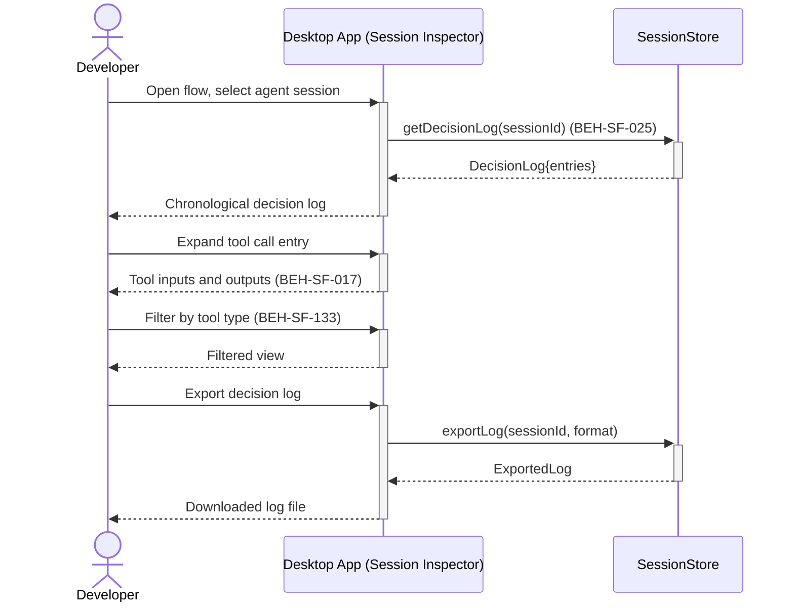

# View Agent Decision Log and Tool Calls

## Use Case

A developer opens the Session Inspector in the desktop app. This is essential for debugging unexpected agent behavior and building trust in agent outputs.

## Interaction Flow

```text
┌───────────┐     ┌───────────┐     ┌──────────────┐
│ Developer │     │ Desktop App │     │ SessionStore │
└─────┬─────┘     └─────┬─────┘     └──────┬───────┘
      │ Open flow +      │                  │
      │  select session  │                  │
      │────────────────►│                   │
      │                  │ getDecisionLog()  │
      │                  │─────────────────►│
      │                  │ DecisionLog       │
      │                  │◄─────────────────│
      │ Decision log     │                  │
      │◄────────────────│                   │
      │                  │                  │
      │ Expand tool call │                  │
      │────────────────►│                   │
      │ Inputs + outputs │                  │
      │◄────────────────│                   │
      │                  │                  │
      │ Filter by type   │                  │
      │────────────────►│                   │
      │ Filtered view    │                  │
      │◄────────────────│                   │
      │                  │                  │
      │ Export log       │                  │
      │────────────────►│                   │
      │                  │ exportLog()       │
      │                  │─────────────────►│
      │                  │ ExportedLog       │
      │                  │◄─────────────────│
      │ Downloaded file  │                  │
      │◄────────────────│                   │
      │                  │                  │
```



## Steps

1. Open the Session Inspector in the desktop app
2. Select an agent session from the session list
3. View the chronological decision log: prompts, responses, tool calls (BEH-SF-025)
4. Expand individual tool calls to see inputs and outputs (BEH-SF-017)
5. Filter by tool type, timestamp, or decision outcome (BEH-SF-133)
6. Identify decision points where the agent changed approach
7. Export the decision log for external analysis if needed

## Traceability

| Behavior   | Feature     | Role in this capability                           |
| ---------- | ----------- | ------------------------------------------------- |
| BEH-SF-017 | FEAT-SF-003 | Agent role behavior and tool usage tracking       |
| BEH-SF-025 | FEAT-SF-035 | Session lifecycle data including decision history |
| BEH-SF-133 | FEAT-SF-035 | Dashboard session detail view                     |
