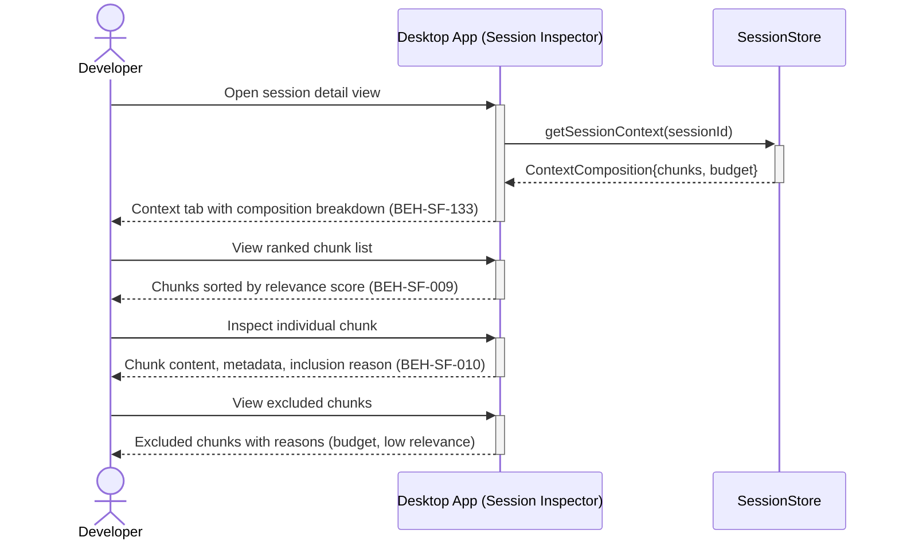

# Inspect Session Context and Composed Chunks

## Use Case

A developer opens the Session Inspector in the desktop app to understand what context was assembled for an agent session. This helps diagnose issues where an agent missed relevant context or received too much noise.

## Interaction Flow

```text
┌───────────┐  ┌───────────┐  ┌──────────────┐
│ Developer │  │ Desktop App │  │ SessionStore │
└─────┬─────┘  └─────┬─────┘  └──────┬───────┘
      │               │               │
      │ Open session  │               │
      │──────────────►│               │
      │               │ getSession    │
      │               │  Context()    │
      │               │──────────────►│
      │               │ Context       │
      │               │  Composition  │
      │               │◄──────────────│
      │ Context tab   │               │
      │◄──────────────│               │
      │               │               │
      │ View ranked   │               │
      │  chunk list   │               │
      │──────────────►│               │
      │ Chunks sorted │               │
      │  by relevance │               │
      │◄──────────────│               │
      │               │               │
      │ Inspect chunk │               │
      │──────────────►│               │
      │ Chunk content │               │
      │  & metadata   │               │
      │◄──────────────│               │
      │               │               │
      │ View excluded │               │
      │──────────────►│               │
      │ Excluded with │               │
      │  reasons      │               │
      │◄──────────────│               │
      │               │               │
```



## Steps

1. Open the Session Inspector in the desktop app
2. Select the "Context" tab to see the composition breakdown (BEH-SF-133)
3. View the ranked list of chunks that were considered (BEH-SF-009)
4. See which chunks were included vs. excluded and why (budget, relevance score)
5. Inspect individual chunk content and metadata (BEH-SF-010)
6. Compare the composed context against the session's actual output
7. Identify context gaps that may have affected agent behavior

## Traceability

| Behavior   | Feature     | Role in this capability                   |
| ---------- | ----------- | ----------------------------------------- |
| BEH-SF-009 | FEAT-SF-002 | Session chunk materialization and ranking |
| BEH-SF-010 | FEAT-SF-002 | Chunk embedding and composition pipeline  |
| BEH-SF-133 | FEAT-SF-035 | Dashboard context inspection view         |
