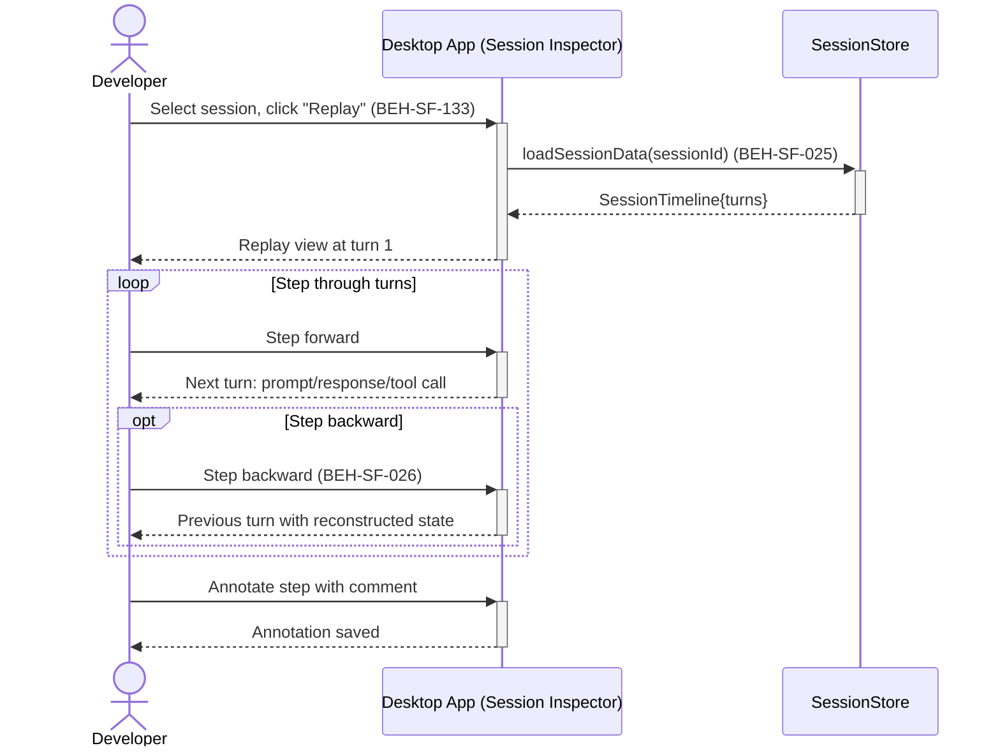

# Replay a Completed Session Step-by-Step

## Use Case

A developer opens the Session Inspector in the desktop app. The replay shows each turn (prompt, response, tool call, result) in sequence, allowing the developer to step forward and backward through the session like a debugger.

## Interaction Flow

```text
┌───────────┐  ┌───────────┐  ┌──────────────┐
│ Developer │  │ Desktop App │  │ SessionStore │
└─────┬─────┘  └─────┬─────┘  └──────┬───────┘
      │               │               │
      │ Click Replay  │               │
      │──────────────►│               │
      │               │ loadSession   │
      │               │  Data()       │
      │               │──────────────►│
      │               │ Session       │
      │               │  Timeline     │
      │               │◄──────────────│
      │ Replay view   │               │
      │  at turn 1    │               │
      │◄──────────────│               │
      │               │               │
      │ [loop: Step through turns]    │
      │ Step forward  │               │
      │──────────────►│               │
      │ Next turn     │               │
      │◄──────────────│               │
      │               │               │
      │   [opt: Step backward]        │
      │   Step back   │               │
      │──────────────►│               │
      │   Previous    │               │
      │    turn       │               │
      │◄──────────────│               │
      │   [end opt]   │               │
      │ [end loop]    │               │
      │               │               │
      │ Annotate step │               │
      │──────────────►│               │
      │ Annotation    │               │
      │  saved        │               │
      │◄──────────────│               │
      │               │               │
```



## Steps

1. Open the Session Inspector in the desktop app
2. Select an agent session and click "Replay" (BEH-SF-133)
3. Replay starts at the first turn, showing the initial prompt
4. Step forward through each turn: agent response, tool call, tool result (BEH-SF-025)
5. Step backward to review previous turns (BEH-SF-026)
6. Inspect state at each step: context, pending decisions, metrics
7. Annotate specific steps with comments for team review

## Traceability

| Behavior   | Feature     | Role in this capability                   |
| ---------- | ----------- | ----------------------------------------- |
| BEH-SF-025 | FEAT-SF-035 | Session data capture for replay           |
| BEH-SF-026 | FEAT-SF-035 | Session state reconstruction at each step |
| BEH-SF-133 | FEAT-SF-035 | Dashboard replay interface                |
