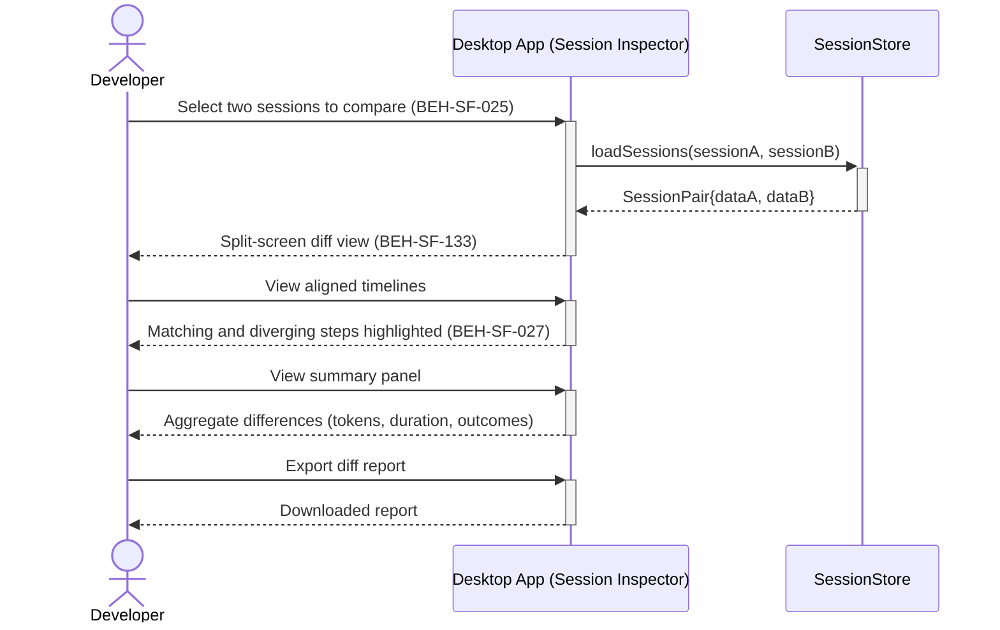

# Diff Two Sessions Side-by-Side

## Use Case

A developer opens the Session Inspector in the desktop app. The diff view highlights differences in tool usage, token consumption, and outcomes.

## Interaction Flow

```text
┌───────────┐  ┌───────────┐  ┌──────────────┐
│ Developer │  │ Desktop App │  │ SessionStore │
└─────┬─────┘  └─────┬─────┘  └──────┬───────┘
      │               │               │
      │ Select two    │               │
      │  sessions     │               │
      │──────────────►│               │
      │               │ loadSessions  │
      │               │  (A, B)       │
      │               │──────────────►│
      │               │ SessionPair   │
      │               │◄──────────────│
      │ Split-screen  │               │
      │  diff view    │               │
      │◄──────────────│               │
      │               │               │
      │ View aligned  │               │
      │  timelines    │               │
      │──────────────►│               │
      │ Matching &    │               │
      │  diverging    │               │
      │◄──────────────│               │
      │               │               │
      │ View summary  │               │
      │──────────────►│               │
      │ Aggregate     │               │
      │  differences  │               │
      │◄──────────────│               │
      │               │               │
      │ Export diff   │               │
      │──────────────►│               │
      │ Downloaded    │               │
      │  report       │               │
      │◄──────────────│               │
      │               │               │
```



## Steps

1. Open the Session Inspector in the desktop app
2. Select two sessions to compare (BEH-SF-025)
3. Activate the diff view, which splits the screen (BEH-SF-133)
4. View aligned timelines showing matching and diverging steps (BEH-SF-027)
5. Differences in tool calls, responses, and metrics are highlighted
6. Summary panel shows aggregate differences (token usage, duration, outcomes)
7. Export the diff as a report for team review

## Traceability

| Behavior   | Feature     | Role in this capability              |
| ---------- | ----------- | ------------------------------------ |
| BEH-SF-025 | FEAT-SF-035 | Session data for comparison          |
| BEH-SF-027 | FEAT-SF-035 | Session diff algorithm and alignment |
| BEH-SF-133 | FEAT-SF-035 | Dashboard diff visualization         |
