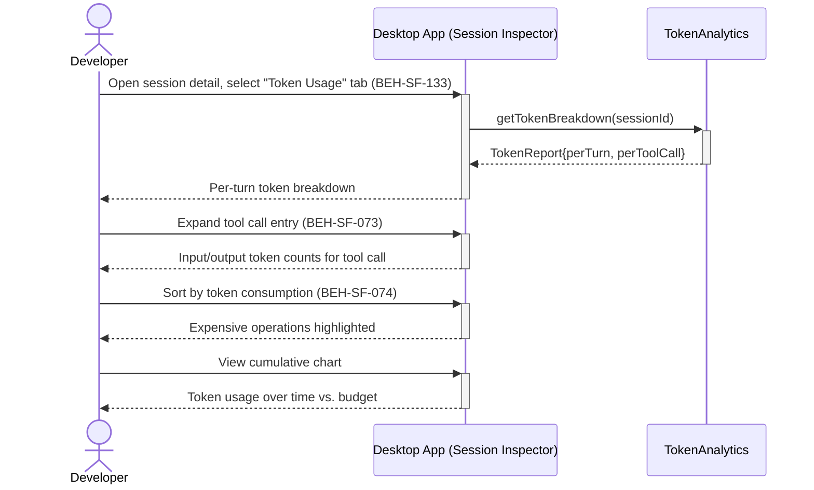

# View Token Usage Breakdown per Tool Call

## Use Case

A developer opens the Session Inspector in the desktop app. This reveals which tools are consuming the most tokens (e.g., a large file read vs. a simple API call) and helps optimize prompts, tool configurations, and session composition.

## Interaction Flow

```text
┌───────────┐  ┌───────────┐  ┌────────────────┐
│ Developer │  │ Desktop App │  │ TokenAnalytics │
└─────┬─────┘  └─────┬─────┘  └───────┬────────┘
      │               │               │
      │ Select Token  │               │
      │  Usage tab    │               │
      │──────────────►│               │
      │               │ getToken      │
      │               │  Breakdown()  │
      │               │──────────────►│
      │               │ TokenReport   │
      │               │◄──────────────│
      │ Per-turn      │               │
      │  breakdown    │               │
      │◄──────────────│               │
      │               │               │
      │ Expand tool   │               │
      │  call entry   │               │
      │──────────────►│               │
      │ Input/output  │               │
      │  token counts │               │
      │◄──────────────│               │
      │               │               │
      │ Sort by token │               │
      │  consumption  │               │
      │──────────────►│               │
      │ Expensive ops │               │
      │  highlighted  │               │
      │◄──────────────│               │
      │               │               │
      │ View chart    │               │
      │──────────────►│               │
      │ Token usage   │               │
      │  vs. budget   │               │
      │◄──────────────│               │
      │               │               │
```



## Steps

1. Open the Session Inspector in the desktop app
2. Select the "Token Usage" tab (BEH-SF-133)
3. View per-turn token breakdown: input tokens, output tokens, tool call tokens
4. Expand individual tool calls to see their token contribution (BEH-SF-073)
5. Sort by token consumption to identify expensive operations (BEH-SF-074)
6. View cumulative token chart over the session timeline
7. Compare against the session's budget allocation

## Traceability

| Behavior   | Feature     | Role in this capability             |
| ---------- | ----------- | ----------------------------------- |
| BEH-SF-073 | FEAT-SF-010 | Token budget tracking per operation |
| BEH-SF-074 | FEAT-SF-010 | Token usage analytics and breakdown |
| BEH-SF-133 | FEAT-SF-035 | Dashboard token usage visualization |
