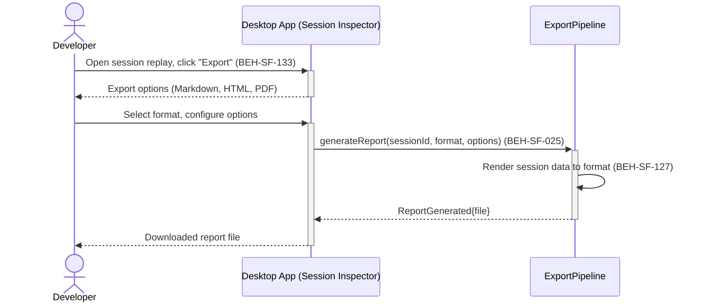

# Export Session Replay as Report

## Use Case

A developer opens the Session Inspector in the desktop app. The report includes the full session timeline, tool call details, metrics, and any annotations added during review.

## Interaction Flow

```text
┌───────────┐  ┌───────────┐  ┌────────────────┐
│ Developer │  │ Desktop App │  │ ExportPipeline │
└─────┬─────┘  └─────┬─────┘  └───────┬────────┘
      │               │               │
      │ Click Export  │               │
      │──────────────►│               │
      │ Export opts   │               │
      │  (MD,HTML,PDF)│               │
      │◄──────────────│               │
      │               │               │
      │ Select format │               │
      │──────────────►│               │
      │               │ generate      │
      │               │  Report()     │
      │               │──────────────►│
      │               │               │──┐ Render
      │               │               │  │ session
      │               │               │◄─┘ data
      │               │ Report        │
      │               │  Generated    │
      │               │◄──────────────│
      │ Downloaded    │               │
      │  report file  │               │
      │◄──────────────│               │
      │               │               │
```



## Steps

1. Open the Session Inspector in the desktop app
2. Click "Export" and select format (Markdown, HTML, PDF) (BEH-SF-133)
3. Configure export options: include/exclude tool call details, metrics, annotations
4. System generates the report from session data (BEH-SF-025)
5. Export pipeline renders the report in the selected format (BEH-SF-127)
6. Report is downloaded or saved to the project directory
7. Report includes traceability links back to the flow and session IDs

## Traceability

| Behavior   | Feature     | Role in this capability              |
| ---------- | ----------- | ------------------------------------ |
| BEH-SF-025 | FEAT-SF-035 | Session data for report generation   |
| BEH-SF-127 | FEAT-SF-012 | Export pipeline for report rendering |
| BEH-SF-133 | FEAT-SF-035 | Dashboard export interface           |
