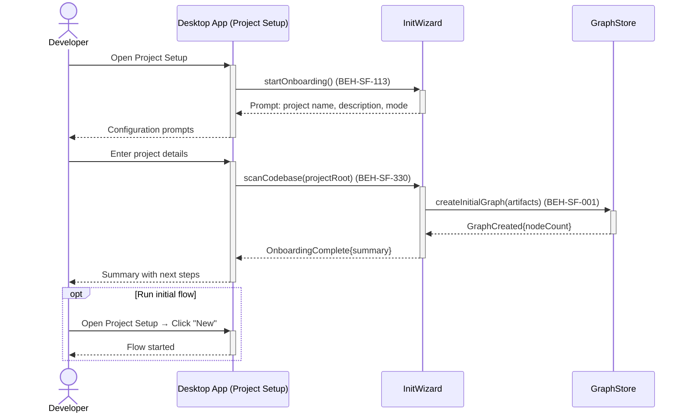
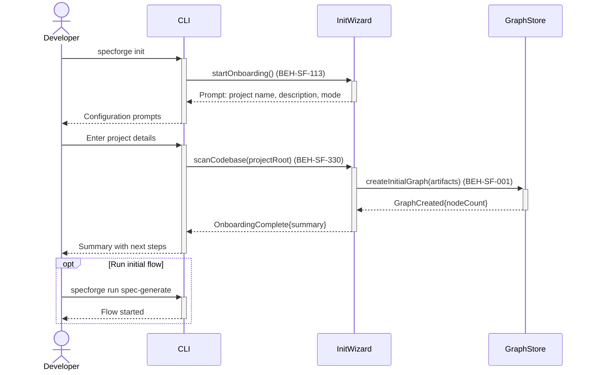

# Onboard a New Project

## Use Case

A developer opens the Project Setup in the desktop app. The onboarding wizard scans the codebase, creates the initial knowledge graph, generates a default configuration, and optionally runs an initial spec-generation flow. This is the first-time setup experience. The same operation is accessible via CLI (`specforge init`) for scripted/CI workflows.

## Related Capabilities

| Capability                                            | Relationship                              |
| ----------------------------------------------------- | ----------------------------------------- |
| [UX-SF-037](./UX-SF-037-configure-deployment-mode.md) | Follows — configure deployment after init |
| [UX-SF-038](./UX-SF-038-set-token-budgets.md)         | Follows — set budgets after init          |
| [UX-SF-039](./UX-SF-039-manage-cli-settings.md)       | Follows — customize CLI after init        |

## Interaction Flow

### Desktop App

```text
┌───────────┐  ┌─────────────────┐  ┌────────────┐  ┌────────────┐
│ Developer │  │   Desktop App   │  │ InitWizard │  │ GraphStore │
└─────┬─────┘  └────────┬────────┘  └─────┬──────┘  └─────┬──────┘
      │            │           │               │
      │ Open Project Setup
```



### CLI

```text
┌───────────┐  ┌─────┐  ┌────────────┐  ┌────────────┐
│ Developer │  │ CLI │  │ InitWizard │  │ GraphStore │
└─────┬─────┘  └──┬──┘  └─────┬──────┘  └─────┬──────┘
      │            │           │               │
      │ specforge  │           │               │
      │  init      │           │               │
      │───────────►│           │               │
      │            │ start     │               │
      │            │ Onboard() │               │
      │            │──────────►│               │
      │            │ Prompt:   │               │
      │            │ name,desc │               │
      │            │◄──────────│               │
      │ Config     │           │               │
      │  prompts   │           │               │
      │◄───────────│           │               │
      │            │           │               │
      │ Enter      │           │               │
      │  details   │           │               │
      │───────────►│           │               │
      │            │ scan      │               │
      │            │ Codebase()│               │
      │            │──────────►│               │
      │            │           │ createInitial │
      │            │           │  Graph()      │
      │            │           │──────────────►│
      │            │           │ GraphCreated  │
      │            │           │◄──────────────│
      │            │ Onboard   │               │
      │            │ Complete  │               │
      │            │◄──────────│               │
      │ Summary    │           │               │
      │◄───────────│           │               │
      │            │           │               │
      │ [opt: Run initial flow]│               │
      │ specforge  │           │               │
      │  run       │           │               │
      │───────────►│           │               │
      │ Flow       │           │               │
      │  started   │           │               │
      │◄───────────│           │               │
      │ [end opt]  │           │               │
      │            │           │               │
```



## Steps

1. Open the Project Setup in the desktop app
2. Wizard prompts for project name, description, and deployment mode
3. System scans the codebase for existing specs, tests, and documentation (BEH-SF-330)
4. Initial knowledge graph is created from discovered artifacts (BEH-SF-001)
5. Default configuration file (`.specforge.yaml`) is generated
6. Optionally run the initial spec-generation flow
7. CLI displays onboarding summary with next steps

## Related Capabilities

| Capability                                            | Relationship                              |
| ----------------------------------------------------- | ----------------------------------------- |
| [UX-SF-037](./UX-SF-037-configure-deployment-mode.md) | Follows — configure deployment after init |
| [UX-SF-038](./UX-SF-038-set-token-budgets.md)         | Follows — set budgets after init          |
| [UX-SF-039](./UX-SF-039-manage-cli-settings.md)       | Follows — customize CLI after init        |

## Traceability

| Behavior   | Feature     | Role in this capability                     |
| ---------- | ----------- | ------------------------------------------- |
| BEH-SF-001 | FEAT-SF-001 | Initial graph population from codebase scan |
| BEH-SF-113 | FEAT-SF-009 | CLI init wizard                             |
| BEH-SF-330 | FEAT-SF-028 | Configuration generation and project setup  |
