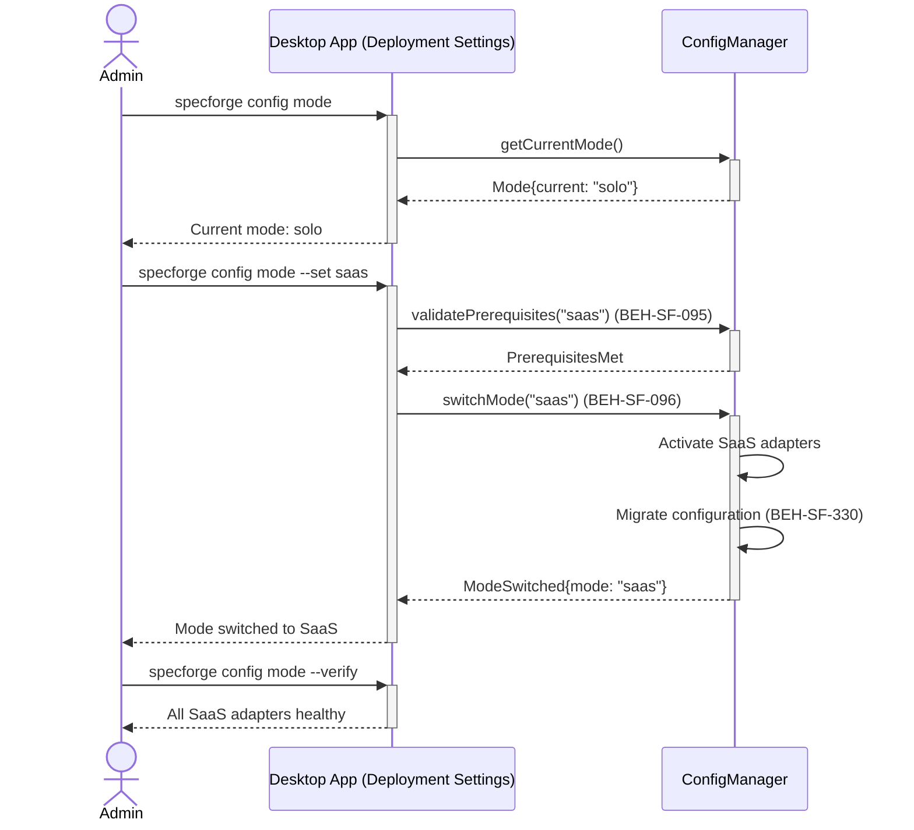
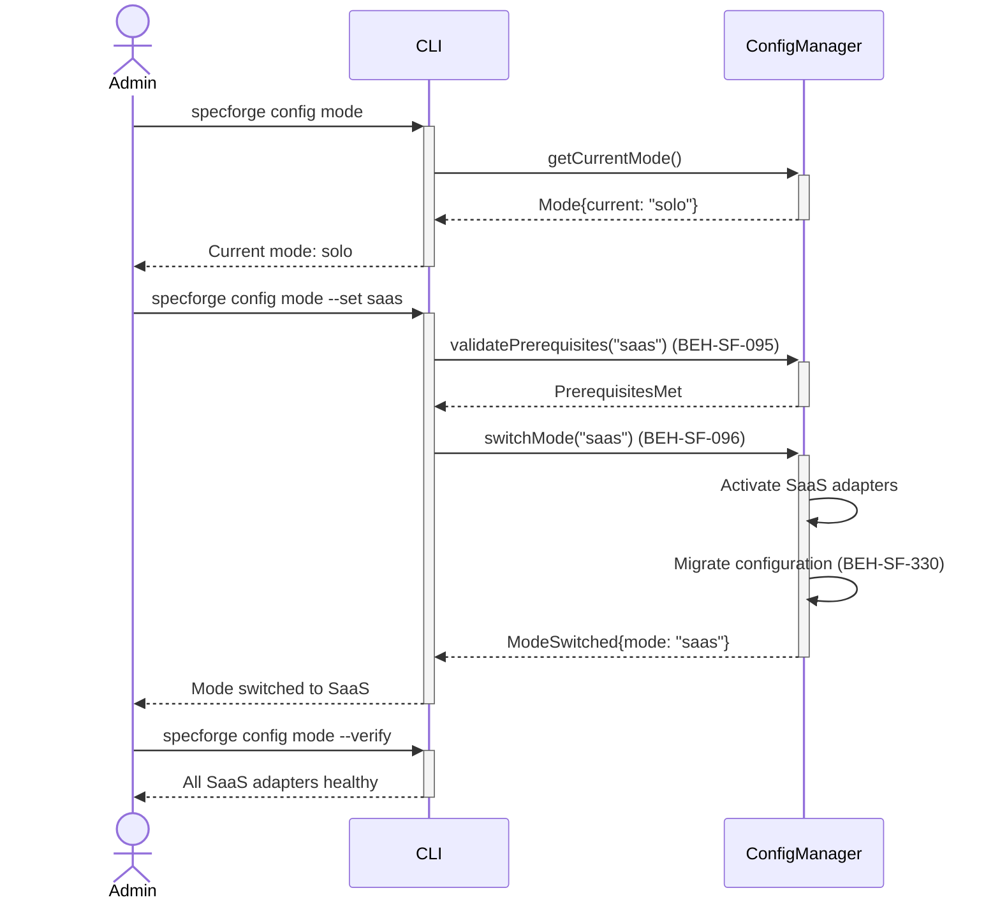

# Configure Deployment Mode

## Use Case

An admin opens the Deployment Settings in the desktop app. The deployment mode determines which adapters are activated (local file system vs. cloud API, embedded Neo4j vs. managed instance) without changing feature availability. The same operation is accessible via CLI (`specforge config mode`) for scripted/CI workflows.

## Interaction Flow

### Desktop App

```text
┌─────────┐  ┌─────────────────┐  ┌───────────────┐
│  Admin  │  │   Desktop App   │  │ ConfigManager │
└────┬────┘  └────────┬────────┘  └──────┬────────┘
     │          │             │
     │ config   │             │
     │  mode    │             │
     │─────────►│             │
     │          │ getCurrent  │
     │          │  Mode()     │
     │          │────────────►│
     │          │ Mode{solo}  │
     │          │◄────────────│
     │ Current  │             │
     │  mode:   │             │
     │  solo    │             │
     │◄─────────│             │
     │          │             │
     │ config   │             │
     │  mode    │             │
     │  --set   │             │
     │  saas    │             │
     │─────────►│             │
     │          │ validate    │
     │          │ Prereqs()   │
     │          │────────────►│
     │          │ Prereqs Met │
     │          │◄────────────│
     │          │ switchMode  │
     │          │  ("saas")   │
     │          │────────────►│
     │          │             │──┐ Activate
     │          │             │  │ SaaS
     │          │             │◄─┘ adapters
     │          │             │──┐ Migrate
     │          │             │  │ config
     │          │             │◄─┘
     │          │ Mode        │
     │          │  Switched   │
     │          │◄────────────│
     │ Mode     │             │
     │ switched │             │
     │  to SaaS │             │
     │◄─────────│             │
     │          │             │
     │ config   │             │
     │  mode    │             │
     │  --verify│             │
     │─────────►│             │
     │ All SaaS │             │
     │ adapters │             │
     │ healthy  │             │
     │◄─────────│             │
     │          │             │
```



### CLI

```text
┌─────────┐  ┌─────┐  ┌───────────────┐
│  Admin  │  │ CLI │  │ ConfigManager │
└────┬────┘  └──┬──┘  └──────┬────────┘
     │          │             │
     │ config   │             │
     │  mode    │             │
     │─────────►│             │
     │          │ getCurrent  │
     │          │  Mode()     │
     │          │────────────►│
     │          │ Mode{solo}  │
     │          │◄────────────│
     │ Current  │             │
     │  mode:   │             │
     │  solo    │             │
     │◄─────────│             │
     │          │             │
     │ config   │             │
     │  mode    │             │
     │  --set   │             │
     │  saas    │             │
     │─────────►│             │
     │          │ validate    │
     │          │ Prereqs()   │
     │          │────────────►│
     │          │ Prereqs Met │
     │          │◄────────────│
     │          │ switchMode  │
     │          │  ("saas")   │
     │          │────────────►│
     │          │             │──┐ Activate
     │          │             │  │ SaaS
     │          │             │◄─┘ adapters
     │          │             │──┐ Migrate
     │          │             │  │ config
     │          │             │◄─┘
     │          │ Mode        │
     │          │  Switched   │
     │          │◄────────────│
     │ Mode     │             │
     │ switched │             │
     │  to SaaS │             │
     │◄─────────│             │
     │          │             │
     │ config   │             │
     │  mode    │             │
     │  --verify│             │
     │─────────►│             │
     │ All SaaS │             │
     │ adapters │             │
     │ healthy  │             │
     │◄─────────│             │
     │          │             │
```



## Steps

1. Open the Deployment Settings in the desktop app
2. Switch mode: `specforge config mode --set saas` (BEH-SF-330)
3. System validates prerequisites for the target mode (BEH-SF-095)
4. Mode-specific adapters are activated (BEH-SF-096)
5. System migrates configuration to the new mode's requirements
6. Verify the mode switch: `specforge config mode --verify`
7. All features remain available; only underlying adapters change

## Traceability

| Behavior   | Feature     | Role in this capability                       |
| ---------- | ----------- | --------------------------------------------- |
| BEH-SF-095 | FEAT-SF-016 | Deployment mode definitions and prerequisites |
| BEH-SF-096 | FEAT-SF-016 | Mode-switched adapter activation              |
| BEH-SF-330 | FEAT-SF-028 | Configuration management for mode settings    |
