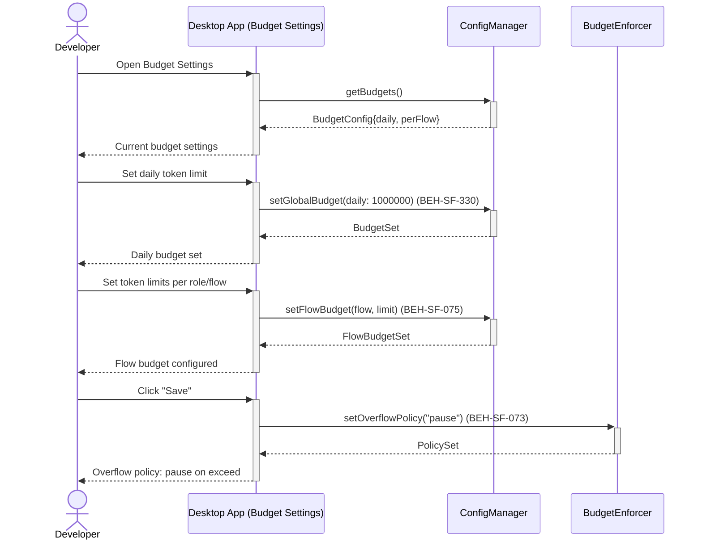
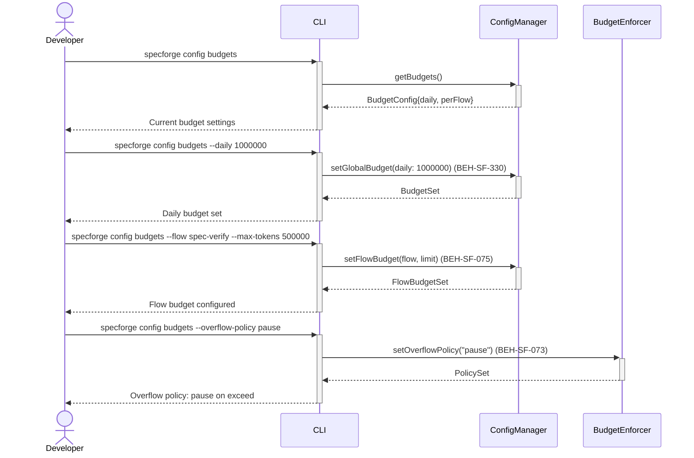

# Set Token Budgets and Cost Limits

## Use Case

A developer opens the Budget Settings in the desktop app. Budgets can be set per-flow, per-phase, per-session, or globally. When a budget is approached, the system warns; when exceeded, it either pauses the flow for human decision or applies the configured overflow policy. The same operation is accessible via CLI (`specforge config budgets`) for scripted/CI workflows.

## Interaction Flow

### Desktop App

```text
┌───────────┐ ┌─────────────────┐ ┌─────────────┐ ┌────────────────┐
│ Developer │ │   Desktop App   │ │ ConfigMgr   │ │ BudgetEnforcer │
└─────┬─────┘ └────────┬────────┘ └──────┬──────┘ └───────┬────────┘
      │           │           │                │
      │ config    │           │                │
      │  budgets  │           │                │
      │──────────►│           │                │
      │           │ get       │                │
      │           │ Budgets() │                │
      │           │──────────►│                │
      │           │ Budget    │                │
      │           │  Config   │                │
      │           │◄──────────│                │
      │ Current   │           │                │
      │  settings │           │                │
      │◄──────────│           │                │
      │           │           │                │
      │ Set daily   │           │                │
      │  1000000  │           │                │
      │──────────►│           │                │
      │           │ setGlobal │                │
      │           │  Budget() │                │
      │           │──────────►│                │
      │           │ BudgetSet │                │
      │           │◄──────────│                │
      │ Daily     │           │                │
      │  budget   │           │                │
      │◄──────────│           │                │
      │           │           │                │
      │ Set flow    │           │                │
      │  spec-    │           │                │
      │  verify   │           │                │
      │──────────►│           │                │
      │           │ setFlow   │                │
      │           │  Budget() │                │
      │           │──────────►│                │
      │           │ FlowBudg  │                │
      │           │  etSet    │                │
      │           │◄──────────│                │
      │ Flow      │           │                │
      │  budget   │           │                │
      │◄──────────│           │                │
      │           │           │                │
      │ Set overflow│           │                │
      │  -policy  │           │                │
      │  pause    │           │                │
      │──────────►│           │                │
      │           │ setOverflowPolicy()        │
      │           │───────────────────────────►│
      │           │ PolicySet                  │
      │           │◄───────────────────────────│
      │ Overflow  │           │                │
      │  policy:  │           │                │
      │  pause    │           │                │
      │◄──────────│           │                │
      │           │           │                │
```



### CLI

```text
┌───────────┐ ┌─────┐ ┌─────────────┐ ┌────────────────┐
│ Developer │ │ CLI │ │ ConfigMgr   │ │ BudgetEnforcer │
└─────┬─────┘ └──┬──┘ └──────┬──────┘ └───────┬────────┘
      │           │           │                │
      │ config    │           │                │
      │  budgets  │           │                │
      │──────────►│           │                │
      │           │ get       │                │
      │           │ Budgets() │                │
      │           │──────────►│                │
      │           │ Budget    │                │
      │           │  Config   │                │
      │           │◄──────────│                │
      │ Current   │           │                │
      │  settings │           │                │
      │◄──────────│           │                │
      │           │           │                │
      │ --daily   │           │                │
      │  1000000  │           │                │
      │──────────►│           │                │
      │           │ setGlobal │                │
      │           │  Budget() │                │
      │           │──────────►│                │
      │           │ BudgetSet │                │
      │           │◄──────────│                │
      │ Daily     │           │                │
      │  budget   │           │                │
      │◄──────────│           │                │
      │           │           │                │
      │ --flow    │           │                │
      │  spec-    │           │                │
      │  verify   │           │                │
      │──────────►│           │                │
      │           │ setFlow   │                │
      │           │  Budget() │                │
      │           │──────────►│                │
      │           │ FlowBudg  │                │
      │           │  etSet    │                │
      │           │◄──────────│                │
      │ Flow      │           │                │
      │  budget   │           │                │
      │◄──────────│           │                │
      │           │           │                │
      │ --overflow│           │                │
      │  -policy  │           │                │
      │  pause    │           │                │
      │──────────►│           │                │
      │           │ setOverflowPolicy()        │
      │           │───────────────────────────►│
      │           │ PolicySet                  │
      │           │◄───────────────────────────│
      │ Overflow  │           │                │
      │  policy:  │           │                │
      │  pause    │           │                │
      │◄──────────│           │                │
      │           │           │                │
```



## Steps

1. Open the Budget Settings in the desktop app
2. Set a global daily limit: `specforge config budgets --daily 1000000` (BEH-SF-330)
3. Set per-flow limits: `specforge config budgets --flow spec-verify --max-tokens 500000`
4. Configure overflow policy: warn, pause, or cancel (BEH-SF-073)
5. System enforces budgets during flow execution (BEH-SF-075)
6. View budget utilization: `specforge config budgets --usage`
7. Adjust limits based on observed usage patterns

## Traceability

| Behavior   | Feature     | Role in this capability                        |
| ---------- | ----------- | ---------------------------------------------- |
| BEH-SF-073 | FEAT-SF-010 | Token budget enforcement and overflow policies |
| BEH-SF-075 | FEAT-SF-010 | Budget zone allocation and tracking            |
| BEH-SF-330 | FEAT-SF-028 | Configuration storage for budget settings      |
