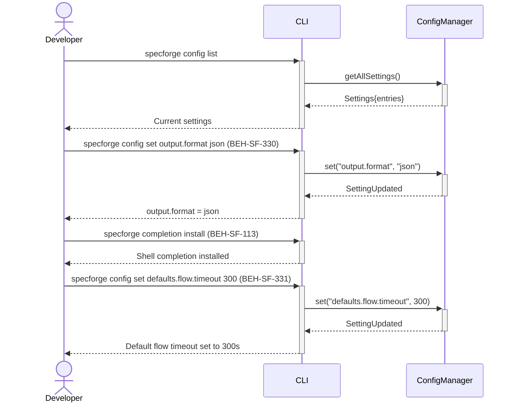

# Manage CLI Settings

## Use Case

A developer configures CLI behavior — output format preferences (table, JSON, plain), default flow parameters, shell completion, color themes, and verbose/quiet modes. Settings are persisted in the project or user configuration and apply to all subsequent CLI invocations.

## Interaction Flow

```text
┌───────────┐  ┌─────┐  ┌───────────────┐
│ Developer │  │ CLI │  │ ConfigManager │
└─────┬─────┘  └──┬──┘  └──────┬────────┘
      │            │            │
      │ config     │            │
      │  list      │            │
      │───────────►│            │
      │            │ getAll     │
      │            │ Settings() │
      │            │───────────►│
      │            │ Settings   │
      │            │◄───────────│
      │ Current    │            │
      │  settings  │            │
      │◄───────────│            │
      │            │            │
      │ config set │            │
      │ output.    │            │
      │ format json│            │
      │───────────►│            │
      │            │ set()      │
      │            │───────────►│
      │            │ Setting    │
      │            │  Updated   │
      │            │◄───────────│
      │ output.    │            │
      │ format=json│            │
      │◄───────────│            │
      │            │            │
      │ completion │            │
      │  install   │            │
      │───────────►│            │
      │ Shell      │            │
      │ completion │            │
      │  installed │            │
      │◄───────────│            │
      │            │            │
      │ config set │            │
      │ defaults.  │            │
      │ flow.      │            │
      │ timeout 300│            │
      │───────────►│            │
      │            │ set()      │
      │            │───────────►│
      │            │ Setting    │
      │            │  Updated   │
      │            │◄───────────│
      │ Timeout    │            │
      │  set: 300s │            │
      │◄───────────│            │
      │            │            │
```



## Steps

1. View current settings: `specforge config list`
2. Set a preference: `specforge config set output.format json` (BEH-SF-330)
3. Configure shell completion: `specforge completion install` (BEH-SF-113)
4. Set default flow parameters: `specforge config set defaults.flow.timeout 300` (BEH-SF-331)
5. Toggle verbose mode: `specforge config set cli.verbose true`
6. Settings apply immediately to subsequent commands
7. Reset to defaults: `specforge config reset`

## Traceability

| Behavior   | Feature     | Role in this capability                  |
| ---------- | ----------- | ---------------------------------------- |
| BEH-SF-113 | FEAT-SF-009 | CLI infrastructure and shell integration |
| BEH-SF-330 | FEAT-SF-028 | Configuration get/set operations         |
| BEH-SF-331 | FEAT-SF-028 | Default parameter configuration          |
