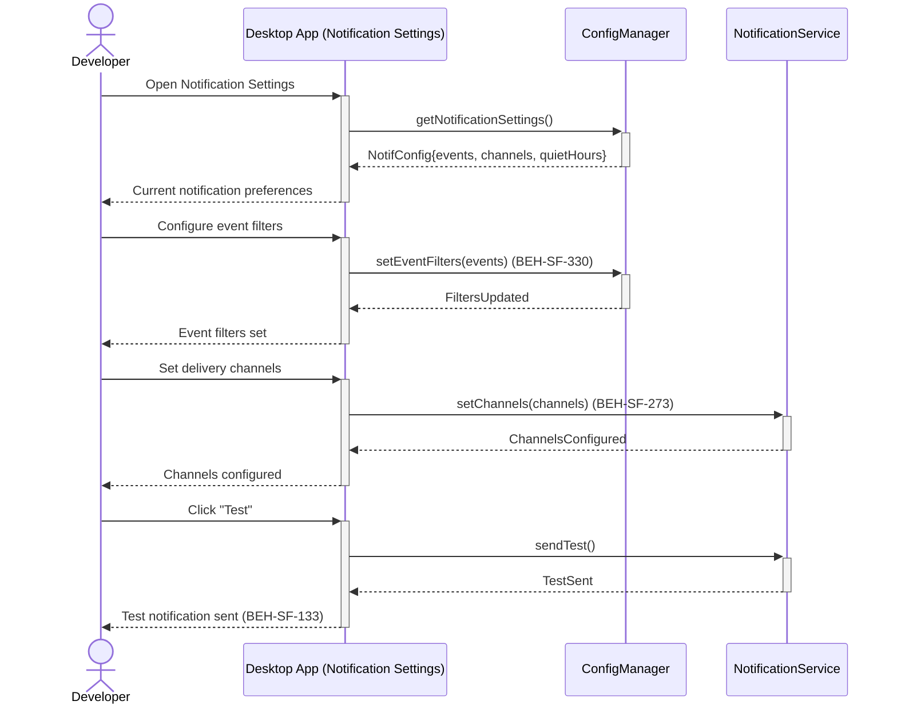
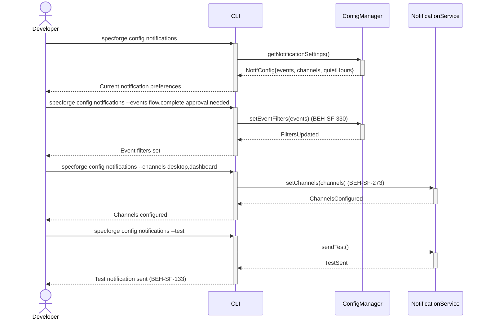

# Configure Notification Preferences

## Use Case

A developer opens the Notification Settings in the desktop app. This prevents notification fatigue while ensuring critical events are never missed. The same operation is accessible via CLI (`specforge config notifications`) for scripted/CI workflows.

## Interaction Flow

### Desktop App

```text
┌───────────┐ ┌─────────────────┐ ┌─────────────┐ ┌─────────────────┐
│ Developer │ │   Desktop App   │ │ ConfigMgr   │ │ NotificationSvc │
└─────┬─────┘ └────────┬────────┘ └──────┬──────┘ └────────┬────────┘
      │           │           │                 │
      │ config    │           │                 │
      │ notifs    │           │                 │
      │──────────►│           │                 │
      │           │ getNotif  │                 │
      │           │ Settings()│                 │
      │           │──────────►│                 │
      │           │ NotifCfg  │                 │
      │           │◄──────────│                 │
      │ Current   │           │                 │
      │  prefs    │           │                 │
      │◄──────────│           │                 │
      │           │           │                 │
      │ Configure  │           │                 │
      │ flow.     │           │                 │
      │ complete  │           │                 │
      │──────────►│           │                 │
      │           │ setEvent  │                 │
      │           │ Filters() │                 │
      │           │──────────►│                 │
      │           │ Filters   │                 │
      │           │  Updated  │                 │
      │           │◄──────────│                 │
      │ Event     │           │                 │
      │ filters   │           │                 │
      │  set      │           │                 │
      │◄──────────│           │                 │
      │           │           │                 │
      │ Set│           │                 │
      │ desktop,  │           │                 │
      │ dashboard │           │                 │
      │──────────►│           │                 │
      │           │ setChannels()               │
      │           │────────────────────────────►│
      │           │ ChannelsConfigured          │
      │           │◄────────────────────────────│
      │ Channels  │           │                 │
      │  config'd │           │                 │
      │◄──────────│           │                 │
      │           │           │                 │
      │ Click    │           │                 │
      │──────────►│           │                 │
      │           │ sendTest()                  │
      │           │────────────────────────────►│
      │           │ TestSent                    │
      │           │◄────────────────────────────│
      │ Test      │           │                 │
      │ notif     │           │                 │
      │  sent     │           │                 │
      │◄──────────│           │                 │
      │           │           │                 │
```



### CLI

```text
┌───────────┐ ┌─────┐ ┌─────────────┐ ┌─────────────────┐
│ Developer │ │ CLI │ │ ConfigMgr   │ │ NotificationSvc │
└─────┬─────┘ └──┬──┘ └──────┬──────┘ └────────┬────────┘
      │           │           │                 │
      │ config    │           │                 │
      │ notifs    │           │                 │
      │──────────►│           │                 │
      │           │ getNotif  │                 │
      │           │ Settings()│                 │
      │           │──────────►│                 │
      │           │ NotifCfg  │                 │
      │           │◄──────────│                 │
      │ Current   │           │                 │
      │  prefs    │           │                 │
      │◄──────────│           │                 │
      │           │           │                 │
      │ --events  │           │                 │
      │ flow.     │           │                 │
      │ complete  │           │                 │
      │──────────►│           │                 │
      │           │ setEvent  │                 │
      │           │ Filters() │                 │
      │           │──────────►│                 │
      │           │ Filters   │                 │
      │           │  Updated  │                 │
      │           │◄──────────│                 │
      │ Event     │           │                 │
      │ filters   │           │                 │
      │  set      │           │                 │
      │◄──────────│           │                 │
      │           │           │                 │
      │ --channels│           │                 │
      │ desktop,  │           │                 │
      │ dashboard │           │                 │
      │──────────►│           │                 │
      │           │ setChannels()               │
      │           │────────────────────────────►│
      │           │ ChannelsConfigured          │
      │           │◄────────────────────────────│
      │ Channels  │           │                 │
      │  config'd │           │                 │
      │◄──────────│           │                 │
      │           │           │                 │
      │ --test    │           │                 │
      │──────────►│           │                 │
      │           │ sendTest()                  │
      │           │────────────────────────────►│
      │           │ TestSent                    │
      │           │◄────────────────────────────│
      │ Test      │           │                 │
      │ notif     │           │                 │
      │  sent     │           │                 │
      │◄──────────│           │                 │
      │           │           │                 │
```



## Steps

1. Open the Notification Settings in the desktop app
2. Configure event filters: `specforge config notifications --events flow.complete,approval.needed`
3. Set channels: `specforge config notifications --channels desktop,dashboard` (BEH-SF-330)
4. Configure quiet hours: `specforge config notifications --quiet 22:00-08:00`
5. Desktop app respects native notification settings (BEH-SF-273)
6. Desktop app shows unread notification count badge (BEH-SF-133)
7. Test notifications: `specforge config notifications --test`

## Traceability

| Behavior   | Feature     | Role in this capability         |
| ---------- | ----------- | ------------------------------- |
| BEH-SF-133 | FEAT-SF-026 | Dashboard notification display  |
| BEH-SF-273 | FEAT-SF-026 | Desktop native notifications    |
| BEH-SF-330 | FEAT-SF-028 | Notification preference storage |
