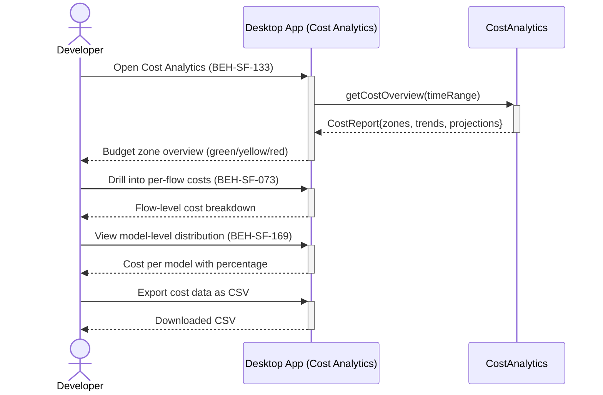

# View Cost Analytics and Budget Zones

## Use Case

A developer opens the Cost Analytics in the desktop app. The dashboard displays budget zone utilization (green/yellow/red), historical spending trends, cost-per-flow comparisons, and projections. This enables data-driven decisions about model routing and budget allocation.

## Interaction Flow

```text
┌───────────┐     ┌───────────┐     ┌───────────────┐
│ Developer │     │ Desktop App │     │ CostAnalytics │
└─────┬─────┘     └─────┬─────┘     └───────┬───────┘
      │                 │                    │
      │ Open Cost       │                    │
      │ Analytics       │                    │
      │────────────────►│                    │
      │                 │ getCostOverview    │
      │                 │ (timeRange)        │
      │                 │───────────────────►│
      │                 │  CostReport{zones, │
      │                 │  trends,projections}
      │                 │◄───────────────────│
      │ Budget zone     │                    │
      │ overview        │                    │
      │◄────────────────│                    │
      │                 │                    │
      │ Drill into      │                    │
      │ per-flow costs  │                    │
      │────────────────►│                    │
      │ Flow-level cost │                    │
      │ breakdown       │                    │
      │◄────────────────│                    │
      │                 │                    │
      │ View model-level│                    │
      │ distribution    │                    │
      │────────────────►│                    │
      │ Cost per model  │                    │
      │ with percentage │                    │
      │◄────────────────│                    │
      │                 │                    │
      │ Export cost     │                    │
      │ data as CSV     │                    │
      │────────────────►│                    │
      │ Downloaded CSV  │                    │
      │◄────────────────│                    │
      │                 │                    │
```



## Steps

1. Open the Cost Analytics in the desktop app
2. View the budget zone overview: green (under budget), yellow (approaching), red (exceeded)
3. Drill into per-flow cost breakdown (BEH-SF-073)
4. View model-level cost distribution (which models consumed the most) (BEH-SF-169)
5. Compare costs across time periods (daily, weekly, monthly)
6. View cost projections based on current usage trends
7. Export cost data as CSV for external reporting

## Traceability

| Behavior   | Feature     | Role in this capability                 |
| ---------- | ----------- | --------------------------------------- |
| BEH-SF-073 | FEAT-SF-010 | Token budget zones and utilization data |
| BEH-SF-169 | FEAT-SF-010 | Cost optimization analytics             |
| BEH-SF-133 | FEAT-SF-007 | Dashboard cost analytics views          |
