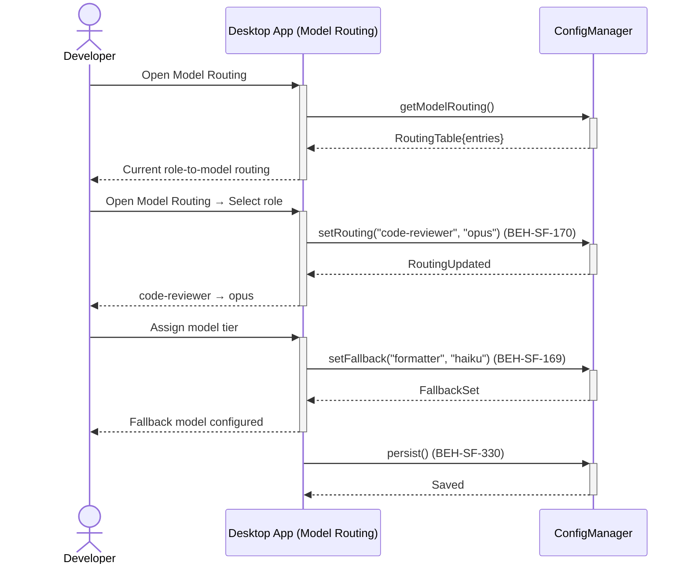
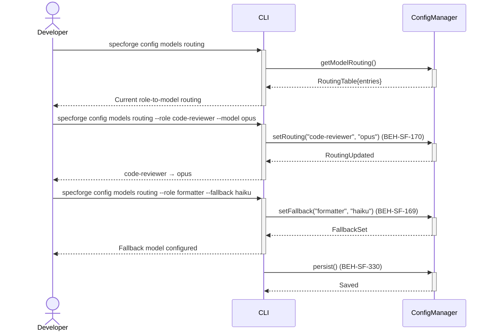

# Configure Model Routing per Role

## Use Case

A developer opens the Model Routing in the desktop app. Model routing optimizes cost while maintaining quality where it matters. The same operation is accessible via CLI (`specforge config models routing`) for scripted/CI workflows.

## Interaction Flow

### Desktop App

```text
┌───────────┐     ┌─────────────────┐     ┌───────────────┐
│ Developer │     │   Desktop App   │     │ ConfigManager │
└─────┬─────┘     └────────┬────────┘     └───────┬───────┘
      │               │               │
      │ Open Models │               │
      │ routing       │               │
      │──────────────►│               │
      │               │ getModel      │
      │               │ Routing()     │
      │               │──────────────►│
      │               │ RoutingTable  │
      │               │ {entries}     │
      │               │◄──────────────│
      │ Current role- │               │
      │ to-model      │               │
      │◄──────────────│               │
      │               │               │
      │ --role code-  │               │
      │ reviewer      │               │
      │ --model opus  │               │
      │──────────────►│               │
      │               │ setRouting    │
      │               │("code-       │
      │               │ reviewer",   │
      │               │ "opus")      │
      │               │──────────────►│
      │               │ RoutingUpdated│
      │               │◄──────────────│
      │ code-reviewer │               │
      │ → opus        │               │
      │◄──────────────│               │
      │               │               │
      │ --role        │               │
      │ formatter     │               │
      │ --fallback    │               │
      │ haiku         │               │
      │──────────────►│               │
      │               │ setFallback   │
      │               │("formatter", │
      │               │ "haiku")     │
      │               │──────────────►│
      │               │ FallbackSet   │
      │               │◄──────────────│
      │ Fallback model│               │
      │ configured    │               │
      │◄──────────────│               │
      │               │               │
      │               │ persist()     │
      │               │──────────────►│
      │               │ Saved         │
      │               │◄──────────────│
      │               │               │
```



### CLI

```text
┌───────────┐     ┌─────┐     ┌───────────────┐
│ Developer │     │ CLI │     │ ConfigManager │
└─────┬─────┘     └──┬──┘     └───────┬───────┘
      │               │               │
      │ config models │               │
      │ routing       │               │
      │──────────────►│               │
      │               │ getModel      │
      │               │ Routing()     │
      │               │──────────────►│
      │               │ RoutingTable  │
      │               │ {entries}     │
      │               │◄──────────────│
      │ Current role- │               │
      │ to-model      │               │
      │◄──────────────│               │
      │               │               │
      │ --role code-  │               │
      │ reviewer      │               │
      │ --model opus  │               │
      │──────────────►│               │
      │               │ setRouting    │
      │               │("code-       │
      │               │ reviewer",   │
      │               │ "opus")      │
      │               │──────────────►│
      │               │ RoutingUpdated│
      │               │◄──────────────│
      │ code-reviewer │               │
      │ → opus        │               │
      │◄──────────────│               │
      │               │               │
      │ --role        │               │
      │ formatter     │               │
      │ --fallback    │               │
      │ haiku         │               │
      │──────────────►│               │
      │               │ setFallback   │
      │               │("formatter", │
      │               │ "haiku")     │
      │               │──────────────►│
      │               │ FallbackSet   │
      │               │◄──────────────│
      │ Fallback model│               │
      │ configured    │               │
      │◄──────────────│               │
      │               │               │
      │               │ persist()     │
      │               │──────────────►│
      │               │ Saved         │
      │               │◄──────────────│
      │               │               │
```



## Steps

1. Open the Model Routing in the desktop app
2. Set routing: `specforge config models routing --role code-reviewer --model opus` (BEH-SF-170)
3. Configure fallback models for when the primary is unavailable (BEH-SF-169)
4. Set escalation rules: auto-escalate to a better model on repeated failures
5. Persist routing configuration (BEH-SF-330)
6. View estimated cost impact of routing changes
7. Routing takes effect on the next flow execution

## Traceability

| Behavior   | Feature     | Role in this capability                     |
| ---------- | ----------- | ------------------------------------------- |
| BEH-SF-169 | FEAT-SF-010 | Cost optimization and model selection logic |
| BEH-SF-170 | FEAT-SF-010 | Role-to-model routing configuration         |
| BEH-SF-330 | FEAT-SF-028 | Configuration persistence                   |
